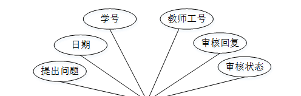

ssm+Vue计算机毕业设计在线学习系统的设计与开发（程序+LW文档）

**项目运行**

**环境配置：**

**Jdk1.8 + Tomcat7.0 + Mysql + HBuilderX** **（Webstorm也行）+ Eclispe（IntelliJ
IDEA,Eclispe,MyEclispe,Sts都支持）。**

**项目技术：**

**SSM + mybatis + Maven + Vue** **等等组成，B/S模式 + Maven管理等等。**

**环境需要**

**1.** **运行环境：最好是java jdk 1.8，我们在这个平台上运行的。其他版本理论上也可以。**

**2.IDE** **环境：IDEA，Eclipse,Myeclipse都可以。推荐IDEA;**

**3.tomcat** **环境：Tomcat 7.x,8.x,9.x版本均可**

**4.** **硬件环境：windows 7/8/10 1G内存以上；或者 Mac OS；**

**5.** **是否Maven项目: 否；查看源码目录中是否包含pom.xml；若包含，则为maven项目，否则为非maven项目**

**6.** **数据库：MySql 5.7/8.0等版本均可；**

**毕设帮助，指导，本源码分享，调试部署** **(** **见文末** **)**

总体设计

根据在线学习系统的功能需求，进行系统设计。

前台功能：学生进入系统可以实现首页、课程信息、 在线讨论、在线测试、公告信息、个人中心、后台管理等进行操作；

后台主要是管理员和教师，管理员功能包括个人中心、学生管理、教师管理、课程信息管理、选课记录管理、在线答疑管理、在线讨论、系统管理；教师功能包括个人中心、课程信息管理、选课记录管理、在线答疑管理、测试试题管理、在线测试管理、测试管理等；系统对这些功能进行整合，产生的功能结构图如下：

图3-1 系统总体结构图

3.4 数据库设计与实现

在每一个系统中数据库有着非常重要的作用，数据库的设计得好将会增加系统的效率以及系统各逻辑功能的实现。所以数据库的设计我们要从系统的实际需要出发，才能使其更为完美的符合系统功能的实现。

#### 3.4.1 数据库概念结构设计

数据库的E-R图反映了实体、实体的属性和实体之间的联系。下面是各个实体以及实体的属性。

课程信息实体属性图如下所示：

图3-2 课程信息实体属性图

在线答疑实体属性图如下所示：

图3-3在线答疑实体属性图

学生信息实体属性图如下所示：

图3-4学生信息实体属性图

### 系统功能模块

在线学习系统，用户进入到网站首页，可以查看首页、课程信息、 在线讨论、在线测试、公告信息、个人中心、后台管理等内容进行操作，如图4-1所示。

图4-1网站首页界面图

学生注册，学生通过输入学号、姓名、密码、手机、班级等内容进行注册，如图4-2所

图4-2学生注册界面图

学生登录，学生注册完成后通过输入账号、密码进行登录进入系统，如图4-3所示。

图4-3学生登录界面图

个人中心，学生可在个人中心页面通过输入学号、密码、姓名、性别、上传图片、手机、班级等内容进行更新信息或查看我的发布、考试记录、错题本等内容，如图4-4所示。

图4-4个人中心界面图

课程信息，学生可在课程信息页面查看课程名称、课程公告、封面、教师工号、教师姓名、课程资料等内容，还可进行选课或在线答疑等操作，如图4-5所示。

图4-5课程信息界面图

在线测试，学生可在在线测试页面查看在线测试名称、测试时长、创建时间等内容，还可进行考试等操作，如图4-6所示。

图4-6在线测试界面图

后台管理，学生进入系统后台可查看个人中心、选课记录管理、在线答疑管理、测试管理等内容，如图4-7所示。

图4-7学生后台功能界面图

选课记录管理，学生可在选课记录管理页面查看课程名称、课程图片、教师工号、教师姓名、选课备注、学号、姓名、审核回复、审核状态等内容，如图4-8所示。

图4-8选课记录管理界面图

在线答疑管理，学生可在在线答疑管理页面查看提出问题、教师工号、日期、学号、审核回复、审核状态等内容，如图4-9所示。

图4-9在线答疑管理界面图

4.2教师功能模块

教师通过登录进入在线学习系统可查看个人中心、课程信息管理、选课记录管理、在线答疑管理、测试试题管理、在线测试管理、测试管理等内容，如图4-10所示。

图4-10教师功能界面图

课程信息管理，教师可在课程信息管理页面查看课程名称、课程图片、课程视频、课程资料、教师工号、教师姓名等内容，还可进行新增、修改或删除等操作，如图4-11所示。

图4-11课程信息管理界面图

在线答疑管理，教师可在在线答疑管理页面查看提出问题、教师工号、日期、学号、审核回复、审核状态等内容，还可进行审核等操作，如图4-12所示。

图4-12在线答疑管理界面图

#### **JAVA** **毕设帮助，指导，源码分享，调试部署**

