ssm+Vue计算机毕业设计在线学习系统（程序+LW文档）

**项目运行**

**环境配置：**

**Jdk1.8 + Tomcat7.0 + Mysql + HBuilderX** **（Webstorm也行）+ Eclispe（IntelliJ
IDEA,Eclispe,MyEclispe,Sts都支持）。**

**项目技术：**

**SSM + mybatis + Maven + Vue** **等等组成，B/S模式 + Maven管理等等。**

**环境需要**

**1.** **运行环境：最好是java jdk 1.8，我们在这个平台上运行的。其他版本理论上也可以。**

**2.IDE** **环境：IDEA，Eclipse,Myeclipse都可以。推荐IDEA;**

**3.tomcat** **环境：Tomcat 7.x,8.x,9.x版本均可**

**4.** **硬件环境：windows 7/8/10 1G内存以上；或者 Mac OS；**

**5.** **是否Maven项目: 否；查看源码目录中是否包含pom.xml；若包含，则为maven项目，否则为非maven项目**

**6.** **数据库：MySql 5.7/8.0等版本均可；**

**毕设帮助，指导，本源码分享，调试部署** **(** **见文末** **)**

### 系统体系结构

在线学习系统的结构图4-1所示：

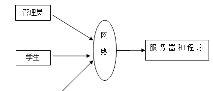

图4-1 系统结构

登录系统结构图，如图4-2所示：

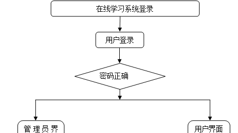

图4-2 登录结构图

管理员结构图，如图4-3所示。

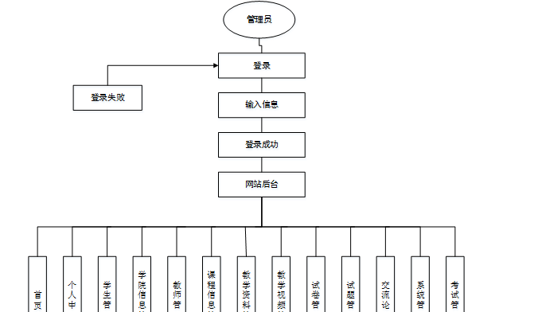

图4-3 管理员结构图

### 数据库设计原则

学习编程，我们都知道数据库设计是基于需要设计的系统功能，我们需要建立一个数据库关系模型，用于存储数据信息，这样当我们在程序中时，就没有必要为程序页面添加数据，从而提高系统的效率。数据库存储了很多信息，可以说是信息管理系统的核心和基础，数据库还提供了添加、删除、修改和检查，使系统能够快速找到自己想要的信息，而不是在程序代码中找到。数据库中信息表的每个部分根据一定的关系精确地组合，排列和组合成数据表。

通过在线学习系统的功能进行规划分成几个实体信息，实体信息将通过ER图进行说明，本系统的主要实体图如下：

管理员信息属性图如图4-5所示。

图4-5 管理员信息实体属性图

学生注册实体属性图如图4-6所示。

图4-6学生注册属性图

管理员系统菜单实体属性图如图4-7所示。

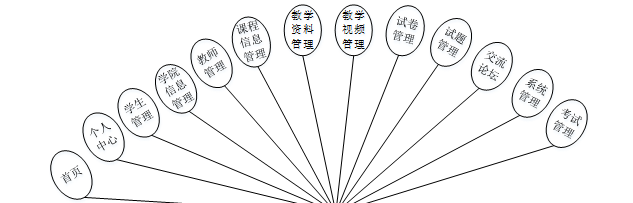

图4-7管理员系统菜单实体属性图

教学视频管理实体属性图如图4-8所示。

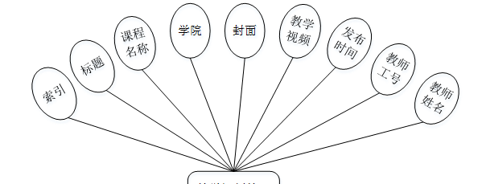

图4-8教学视频管理实体属性图

### 系统功能模块

在线学习系统，在系统首页可以查看首页、教学资料、教学视频、交流论坛、试卷列表、校园公告、个人中心、后台管理等内容，如图5-1所示。

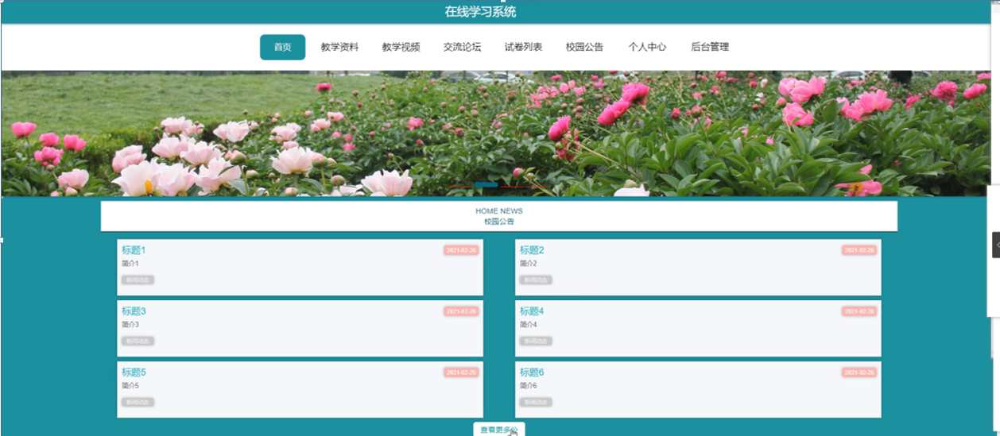

图5-1系统首页界面图

学生注册，在学生注册页面通过填写学生账号、学生姓名、密码、专业、联系电话、邮箱等信息完成学生注册，如图5-2所示。

图5-2 学生注册界面图

教学资料，在教学资料页面中可以查看标题、课程名称、学院、图片、附件、教师工号、教师姓名、发布时间等信息，如图5-3所示。

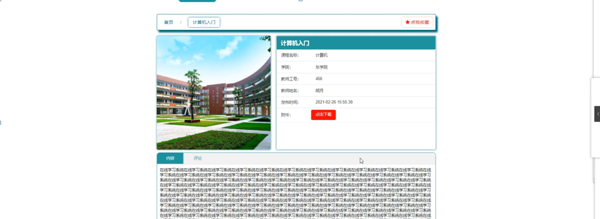

图5-3教学资料界面图

教学视频，在教学视频页面中可以查看标题、课程名称、学院、封面、教学视频、发布时间、教师工号、教师姓名等信息，如图5-4所示。

图5-4教学视频界面图

交流论坛，在交流论坛页面中通过填写标题、类型、内容等信息进行发布帖子，如图5-5所示。

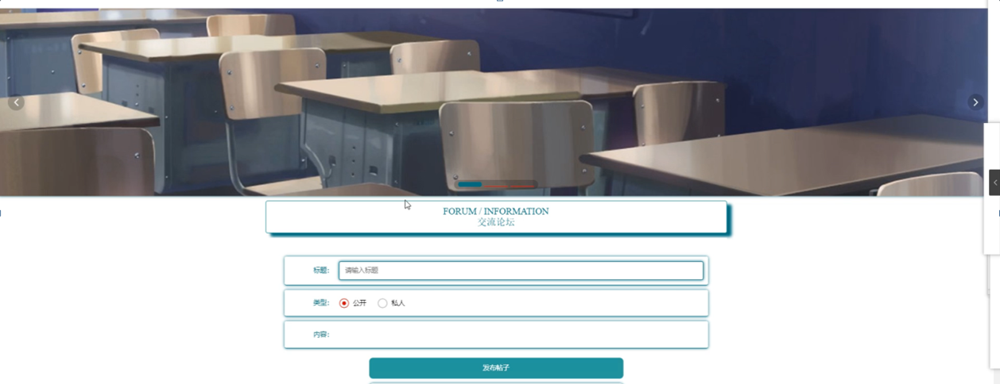

图5-5交流论坛界面图

个人中心，在个人中心页面中通过填写学生账号、学生姓名、密码、性别、专业、联系电话、邮箱、学院等信息进行更新信息，并可对我的发布、考试记录、错题本、我的收藏等信息作出相对应的操作，如图5-6所示。

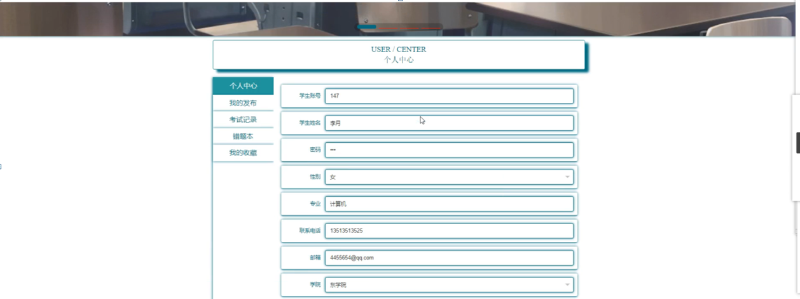

图5-6个人中心界面图

### 5.2管理员功能模块

管理员登录，通过填写注册时输入的用户名、密码、角色进行登录，如图5-7所示。

图5-7管理员登录界面图

管理员登录进入在线学习系统可以查看首页、个人中心、学生管理、学院信息管理、教师管理、课程信息管理、教学资料管理、教学视频管理、试卷管理、试题管理、交流论坛、系统管理、考试管理等信息，如图5-8所示。

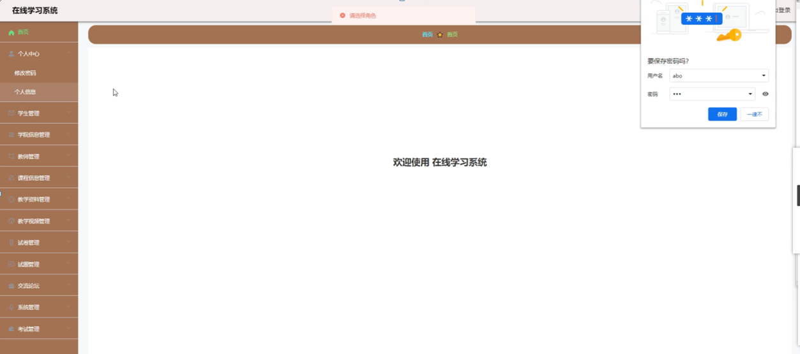

图5-8管理员功能界面图

学生管理，在学生管理页面中可以查看索引、学生账号、学生姓名、密码、性别、专业、联系电话、邮箱、学院等信息，并可根据需要进行修改或删除等详细操作，如图5-9所示。

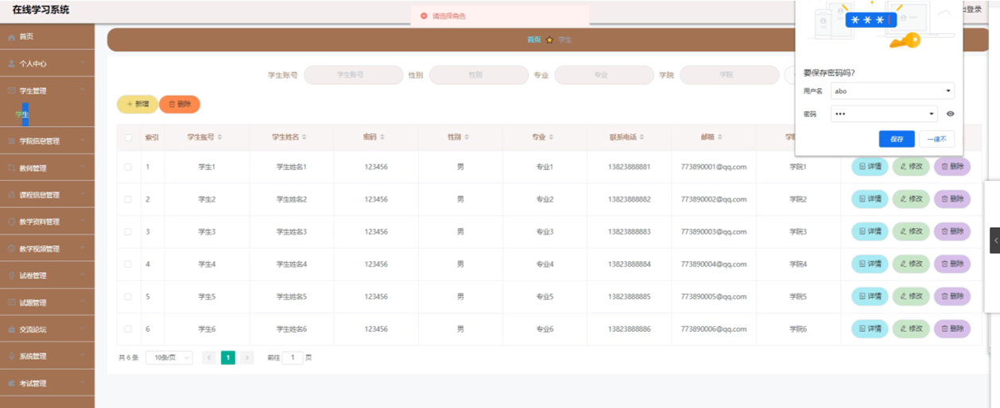

图5-9学生管理界面图

学院信息管理，在学院信息管理页面中可以查看索引、学院等信息，并可根据需要进行修改或删除等详细操作，如图5-10所示。

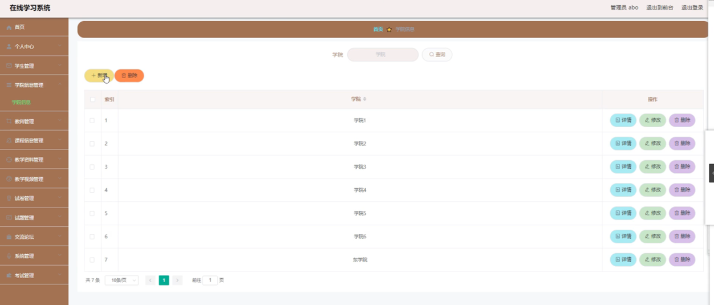

图5-10学院信息管理界面图

教师管理，在教师管理页面中可以查看索引、教师工号、教师姓名、密码、性别、职称、联系电话、教师邮箱、学院等信息，并可根据需要进行修改或删除等详细操作，如图5-11所示。

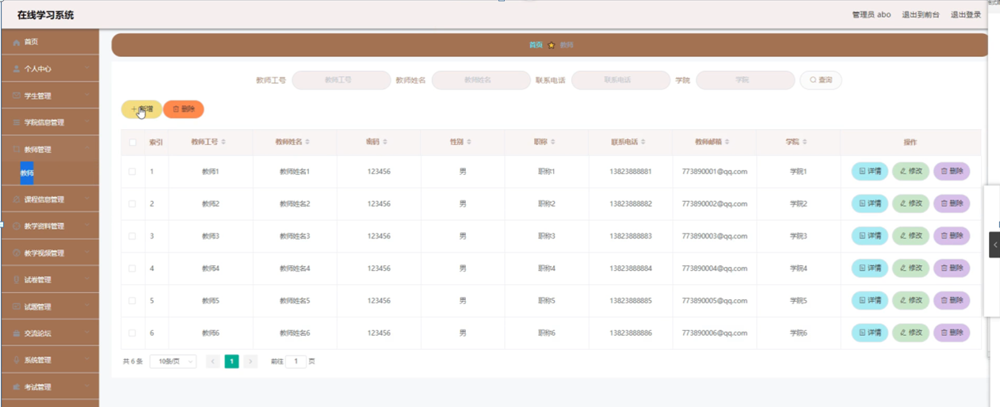

图5-11教师管理界面图

课程信息管理，在课程信息管理页面中可以查看索引、课程名称、学院等信息，并可根据需要进行修改或删除等详细操作，如图5-12所示。

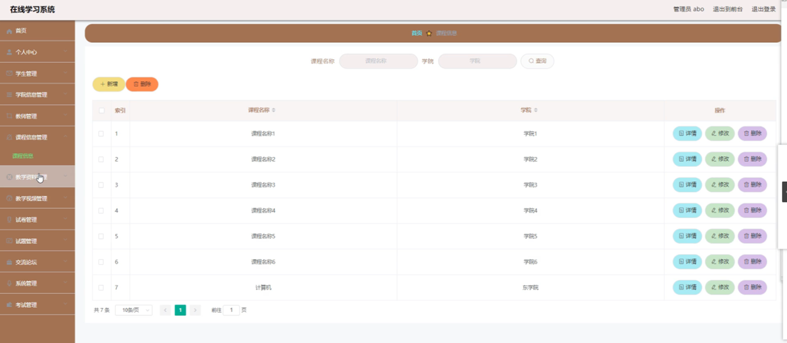

图5-12课程信息管理界面图

**JAVA** **毕设帮助，指导，源码分享，调试部署**

