ssm+Vue计算机毕业设计在线实验室器材设备借用管理系统（程序+LW文档）

**项目运行**

**环境配置：**

**Jdk1.8 + Tomcat7.0 + Mysql + HBuilderX** **（Webstorm也行）+ Eclispe（IntelliJ
IDEA,Eclispe,MyEclispe,Sts都支持）。**

**项目技术：**

**SSM + mybatis + Maven + Vue** **等等组成，B/S模式 + Maven管理等等。**

**环境需要**

**1.** **运行环境：最好是java jdk 1.8，我们在这个平台上运行的。其他版本理论上也可以。**

**2.IDE** **环境：IDEA，Eclipse,Myeclipse都可以。推荐IDEA;**

**3.tomcat** **环境：Tomcat 7.x,8.x,9.x版本均可**

**4.** **硬件环境：windows 7/8/10 1G内存以上；或者 Mac OS；**

**5.** **是否Maven项目: 否；查看源码目录中是否包含pom.xml；若包含，则为maven项目，否则为非maven项目**

**6.** **数据库：MySql 5.7/8.0等版本均可；**

**毕设帮助，指导，本源码分享，调试部署** **(** **见文末** **)**

### 系统功能设计

系统的功能设计是整个系统的运行基础，是一个把设计需求替换成以计算机系统的形式表示出来。通过对在线实验室器材设备借用管理系统的调查、分析和研究，得出了该系统的总体规划，这是开发设计系统的初步核心。

系统功能结构图如图4-1所示。

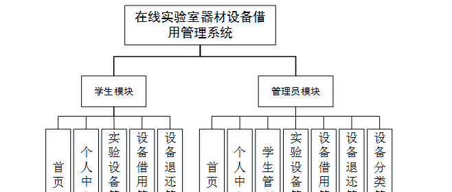

图4-1系统功能结构图

### 4.2数据库设计

在整个系统来说，数据库的设计是相当重要的，需要非常仔细去设计。

本系统中涉及的各级权限分别是：

（1）学生登录权限，可以查看实验设备，对实验设备借用或退还操作，并能修改个人资料等。

（2）管理员权限，管理员有系统的所有权限，包括学生的管理，可以添加、修改和删除任意权限的用户。

#### 4.2.1概念结构设计

根据分析系统的数据需求，得到系统的实体属性图。

(1) 学生注册E-R图，如图4-2所示：

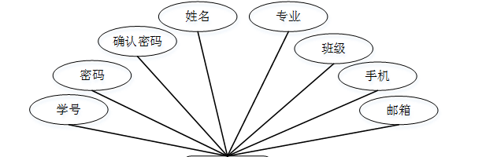

图4-2学生注册E-R图

(2) 实验设备E-R图，如图4-3所示：

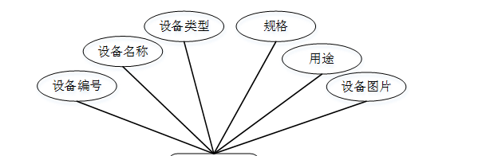

图4-3实验设备E-R图

### 系统登录注册

系统登录，管理员和学生进入系统前在登录页面根据要求填写用户名和密码，选择角色等信息，点击登录进行登录操作，如图5-1所示。

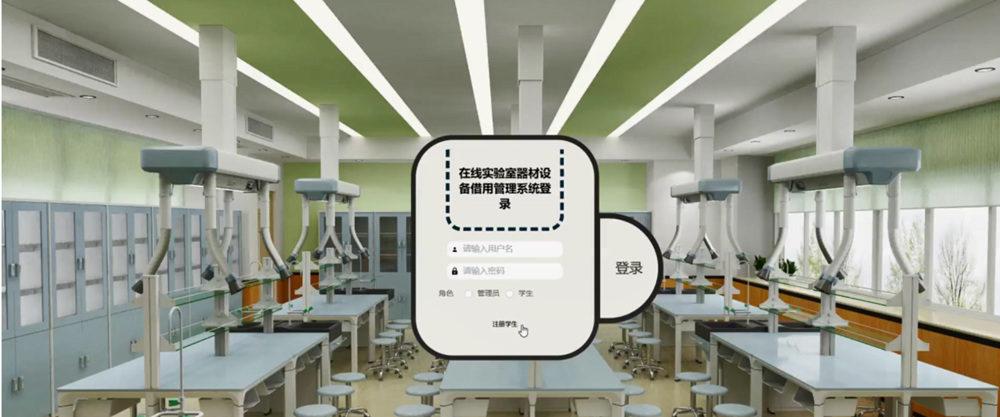

图5-1系统登录界面图

学生注册，在学生注册页面通过填写学号,密码,确认密码,姓名,专业,班级,手机,邮箱等内容完成学生注册，如图5-2所示。

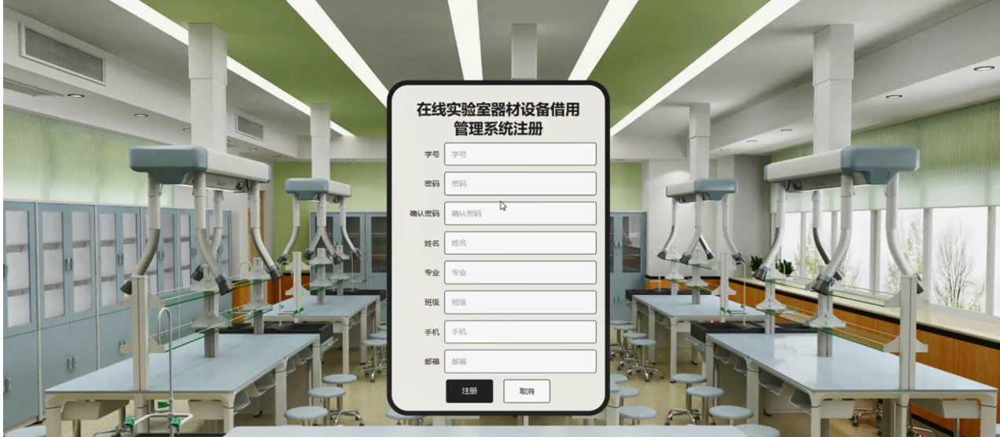

图5-2学生注册界面图

### 5.2管理员功能模块

管理员登录系统后，可以对首页,个人中心,学生管理,实验设备管理,设备借用管理,设备退还管理,设备分类管理等功能进行相应的操作管理，如图5-3所示。

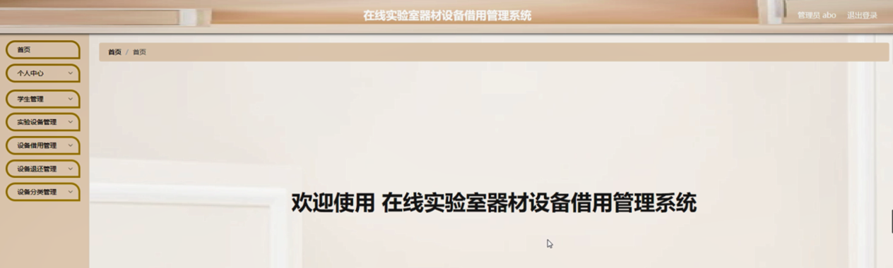

图5-3管理员功能界面图

学生管理，在学生管理页面可以对索引,学号,姓名,性别,专业,班级,手机,邮箱等内容进行详情，修改和删除等操作，如图5-4所示。

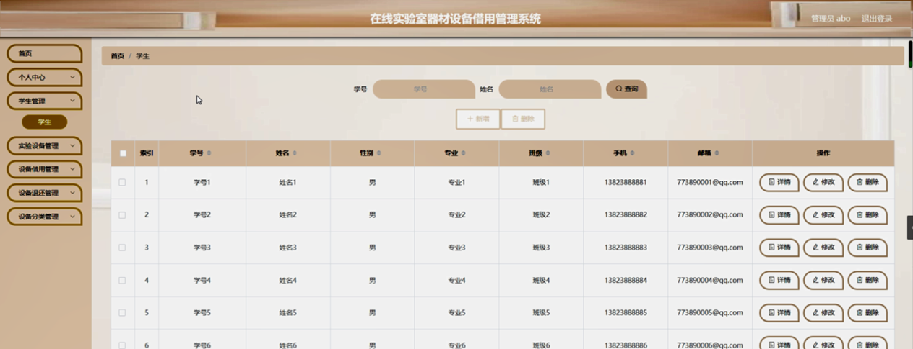

图5-4学生管理界面图

实验设备管理，在实验设备管理页面可以对索引,设备编号,设备名称,设备类型,规格,用途,设备图片等内容进行详情，修改和删除等操作，如图5-5所示。

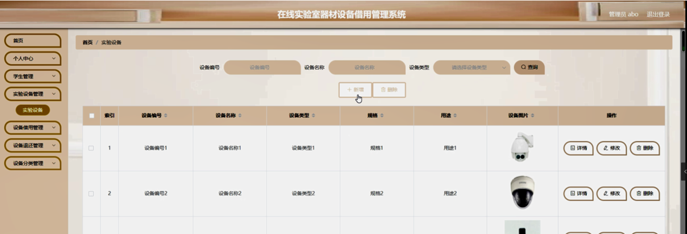

图5-5实验设备管理界面图

设备借用管理，在设备借用管理页面可以对索引,设备编号,设备名称,设备类型,规格,借用时间,备注,学号,姓名,审核回复,审核状态,审核等内容进行详情或删除操作，如图5-6所示。

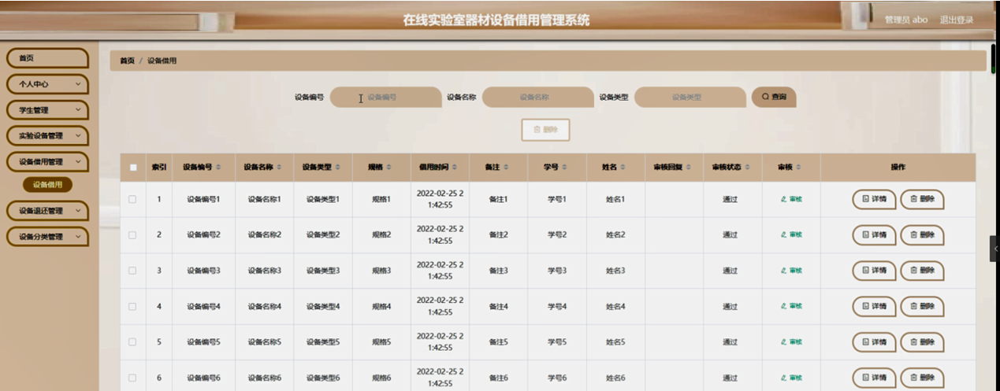

图5-6设备借用管理界面图

设备退还管理，在设备退还管理页面可以对索引,设备编号,设备名称,设备类型,规格,借用时间,退还时间,学号,姓名,审核回复,审核状态,审核等内容进行详情或删除操作，如图5-7所示。

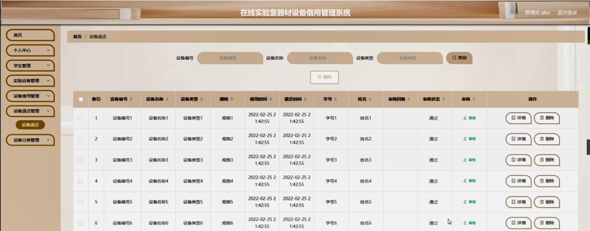

图5-7设备退还管理界面图

设备分类管理，在设备分类管理页面可以对索引,类型等内容进行修改和删除操作，如图5-8所示。

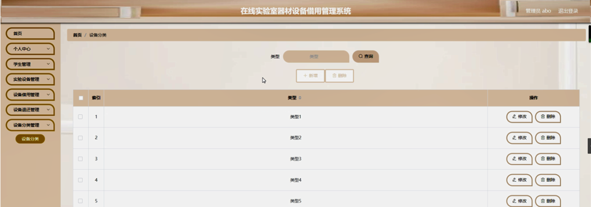

图5-8设备分类管理界面图

### 5.3学生功能模块

学生登录进入系统可以对首页,个人中心,实验设备管理,设备借用管理,设备退还管理等功能进行相应的操作，如图5-9所示。

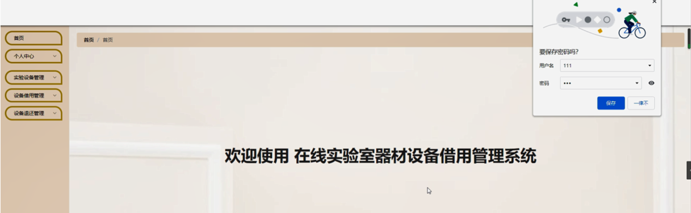

图5-9学生功能界面图

个人中心，在个人信息页面通过填写学号,姓名,性别,专业,班级,手机,邮箱等内容对个人信息进行修改操作，如图5-10所示。

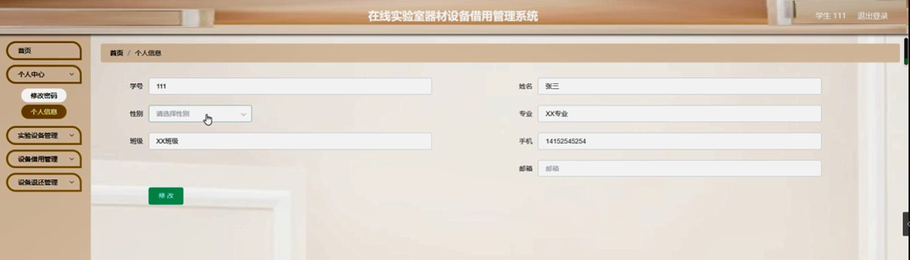

图5-10个人中心界面图

实验设备管理，在实验设备管理页面可以对索引,设备编号,设备名称,设备类型,规格,用途,设备图片等内容进行详情和借用操作，如图5-11所示。

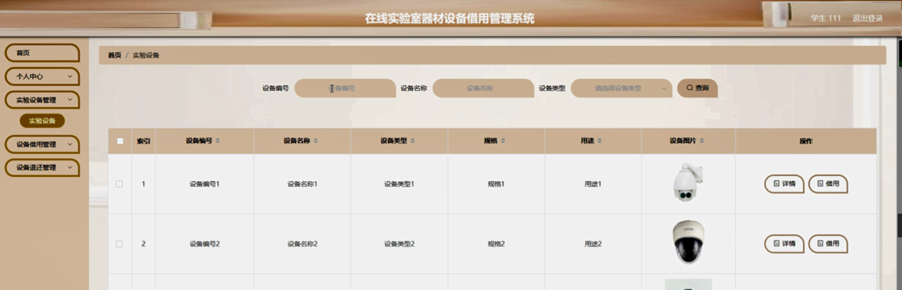

图5-11实验设备管理界面图

设备借用管理，在设备借用管理页面可以对索引,设备编号,设备名称,设备类型,规格,借用时间,备注,学号,姓名,审核回复,审核状态等内容进行详情和退还操作，如图5-12所示。

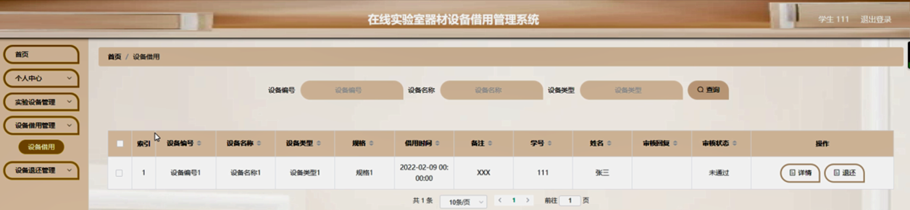

图5-12设备借用管理界面图

**JAVA** **毕设帮助，指导，源码分享，调试部署**

