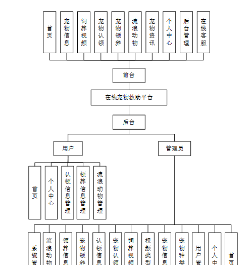
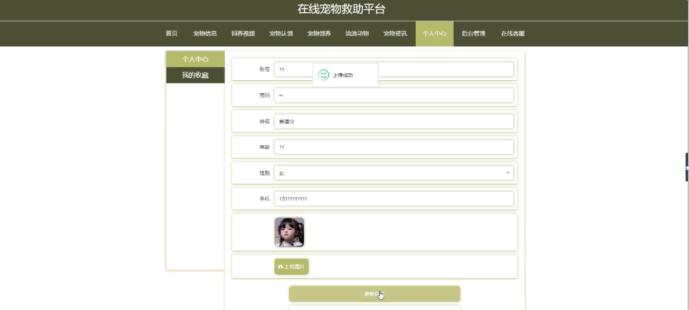

ssm+Vue计算机毕业设计在线宠物救助平台（程序+LW文档）

**项目运行**

**环境配置：**

**Jdk1.8 + Tomcat7.0 + Mysql + HBuilderX** **（Webstorm也行）+ Eclispe（IntelliJ
IDEA,Eclispe,MyEclispe,Sts都支持）。**

**项目技术：**

**SSM + mybatis + Maven + Vue** **等等组成，B/S模式 + Maven管理等等。**

**环境需要**

**1.** **运行环境：最好是java jdk 1.8，我们在这个平台上运行的。其他版本理论上也可以。**

**2.IDE** **环境：IDEA，Eclipse,Myeclipse都可以。推荐IDEA;**

**3.tomcat** **环境：Tomcat 7.x,8.x,9.x版本均可**

**4.** **硬件环境：windows 7/8/10 1G内存以上；或者 Mac OS；**

**5.** **是否Maven项目: 否；查看源码目录中是否包含pom.xml；若包含，则为maven项目，否则为非maven项目**

**6.** **数据库：MySql 5.7/8.0等版本均可；**

**毕设帮助，指导，本源码分享，调试部署** **(** **见文末** **)**

### **功能结构**

为了更好的去理清本系统整体思路，对该系统以结构图的形式表达出来，设计实现该在线宠物救助平台的功能结构图如下所示：

图4-1 系统总体结构图

### **4.2** **数据库设计**

#### **4.2.1** **数据库** **E/R** **图**

ER图是由实体及其关系构成的图，通过E/R图可以清楚地描述系统涉及到的实体之间的相互关系。在系统中对一些主要的几个关键实体如下图：

(1)用户管理E/R图如下所示：

图4-2用户管理E/R图

(2)宠物信息管理E/R图如下所示：

图4-3宠物信息管理E/R图

(4)饲养视频管理E/R图如下所示：

图4-4饲养视频管理E/R图

### **系统功能模块**

在线宠物救助平台，在平台首页可以查看首页，宠物信息，饲养视频，宠物认领，宠物领养，流浪动物，宠物资讯，个人中心，后台管理，在线客服等内容，并进行详细操作；如图5-1所示。

图5-1平台首页界面图

用户注册，在用户注册页面通过填写账号，密码，确认密码，姓名，年龄，手机等信息进行注册操作，如图5-2所示。

图5-2用户注册界面图

宠物信息，在宠物信息页面可以查看宠物名称，宠物种类，性别，年龄，是否绝育，发布日期，救助原因，点击次数等内容，并进行宠物详情，评论操作，如图5-3所示。

图5-3宠物信息界面图

个人中心，在个人中心页面通过填写账号，密码，姓名，年龄，性别，手机，照片等内容进行更新信息操作，并根据需要对我的收藏进行详细操作；如图5-4所示。

图5-4个人中心界面图

### **5.2** **后台登录模块**

后台登录，管理员，用户进入系统前在登录页面根据要求填写账号，密码，选择角色等信息，点击登录进行登录操作，如图5-5所示。

图5-5后台登录界面图

#### **5.2.1** **管理员功能**

管理员登陆系统后，可以查看首页，个人中心，用户管理，宠物种类管理，宠物信息管理，视频类型管理，饲养视频管理，宠物认领管理，认领信息管理，宠物领养管理，领养信息管理，流浪动物管理，系统管理等功能，还能对每个功能逐一进行相应操作，如图5-6所示。

图5-6管理员功能界面图

用户管理，在用户管理页面可以对索引，账号，姓名，年龄，性别，手机，照片等内容进行详情，修改，删除操作，如图5-7所示。

图5-7用户管理界面图

宠物种类管理，在宠物种类管理页面可以对索引，宠物种类等内容进行详情，修改和删除等操作，如图5-8所示。

图5-8宠物种类管理界面图

宠物信息管理，在宠物信息管理页面可以对索引，宠物名称，宠物种类，性别，图片，年龄，是否绝育，发布日期等内容进行详情，修改，查看评论，删除等操作，如图5-9所示。

图5-9宠物信息管理界面图

饲养视频管理，在饲养视频管理页面可以对索引，视频名称，视频类型，封面，视频，发布日期等内容进行详情，修改，查看评论，删除等操作，如图5-10所示。

图5-10饲养视频管理界面图

宠物认领管理，在宠物认领管理页面可以对索引，宠物名称，宠物种类，性别，图片，年龄，是否绝育，发布日期等内容进行详情，修改和删除等操作，如图5-11所示。

图5-11宠物认领管理界面图

认领信息管理，在认领信息管理页面可以对索引，宠物名称，宠物种类，认领证明，认领时间，账号，姓名，手机，丢失时间，丢失地点，审核回复，审核状态，审核等内容进行详情，删除操作，如图5-12所示。

图5-12认领信息管理界面图

**JAVA** **毕设帮助，指导，源码分享，调试部署**

