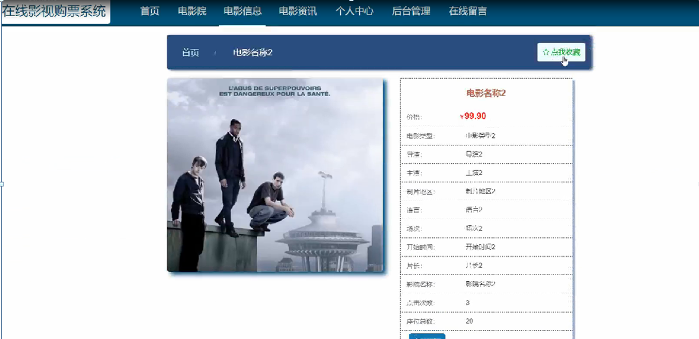
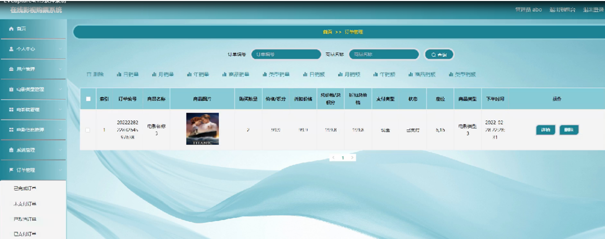

ssm+Vue计算机毕业设计在线影视购票系统（程序+LW文档）

**项目运行**

**环境配置：**

**Jdk1.8 + Tomcat7.0 + Mysql + HBuilderX** **（Webstorm也行）+ Eclispe（IntelliJ
IDEA,Eclispe,MyEclispe,Sts都支持）。**

**项目技术：**

**SSM + mybatis + Maven + Vue** **等等组成，B/S模式 + Maven管理等等。**

**环境需要**

**1.** **运行环境：最好是java jdk 1.8，我们在这个平台上运行的。其他版本理论上也可以。**

**2.IDE** **环境：IDEA，Eclipse,Myeclipse都可以。推荐IDEA;**

**3.tomcat** **环境：Tomcat 7.x,8.x,9.x版本均可**

**4.** **硬件环境：windows 7/8/10 1G内存以上；或者 Mac OS；**

**5.** **是否Maven项目: 否；查看源码目录中是否包含pom.xml；若包含，则为maven项目，否则为非maven项目**

**6.** **数据库：MySql 5.7/8.0等版本均可；**

**毕设帮助，指导，本源码分享，调试部署** **(** **见文末** **)**

### 系统结构设计

系统设计是把本系统的各项功能需求进行细化，而转换为软件系统表示的一个设计过程，在对目标系统的研究分析之后，做出整个系统平台的总体规划，进而对用例中各个对象进一步地合理精细设计。为降低整个系统的复杂度，而使其更加便于修改，提高代码的可读性，我们会将系统模块化，模块间保持相对独立，且每个模块只完成一个子功能，并且与其他模块通过简单的接口链接，即高内聚低耦合原则，而使整个系统能够拥有一个高性能的结构，这边是系统概要设计最重要的目的。在之前的需求分析的基础上，本在线影视购票系统结构，如下图4-1所示。

图4-1 系统结构功能图

### 4.2数据库设计

在查询时，应保证所有满足条件的记录都能查到。数据库记录通常在几百条以上，如有遗漏将会对客户的统计造成影响。一般操作的响应时间应该在1-2秒内。本文中将通过E-
R图来设计并展示数据的概念模型，

用户注册实体属性图如图4-2所示。

图4-2用户注册实体属性图

电影信息实体E-R图如图4-3所示。

图4-3电影信息实体E-R图

### 系统功能模块

在线影视购票系统，在系统首页可以查看首页，电影院，电影信息，电影资讯，个人中心，后台管理，在线留言等内容，并进行详细操作，如图5-1所示。

图5-1系统首页界面图

用户注册，在用户注册页面可以通过填写用户账号，用户姓名，密码，确认密码，年龄，联系电话等信息进行注册操作，如图5-2所示。

图5-2用户注册界面图

电影信息，在电影信息页面可以查看电影名称，价格，电影类型，导演，主演，制片地区，语言，场次，开始时间，片长，影院名称，点击次数，座位总数等内容，并进行立即预定，评论，选座，点我收藏等操作，如图5-3所示。

图5-3电影信息界面图

个人中心，在个人中心页面通过填写用户账号，用户姓名，密码，性别，年龄，联系电话等内容进行更新信息，可以对余额进行点我充值操作，还可以根据需要对我的订单，我的收藏进行相对应操作，如图5-4所示。

图5-4个人中心界面图

### 5.2管理员功能模块

管理员登录，进入系统前在登录页面根据要求填写用户名和密码，选择角色等信息，点击登录进行登录操作，如图5-5所示。

图5-5管理员界面图

管理员登录系统后，可以对首页，个人中心，用户管理，电影类型管理，电影院管理，电影信息管理，系统管理，订单管理等功能进行相应的操作管理，如图5-6所示。

图5-6管理员功能界面图

用户管理，在用户管理页面可以对索引，用户账号，用户姓名，性别，年龄，联系电话等内容进行详情，修改和删除等操作，如图5-7所示。

图5-7用户管理界面图

电影类型管理，在电影类型管理页面可以对索引，电影类型等信息进行详情，修改和删除等操作，如图5-8所示。

图5-8电影类型管理界面图

电影院管理，在电影院管理页面可以对索引，影院名称，影院规格，图片，影院地址，咨询电话等内容进行详情，修改，查看评论和删除等操作，如图5-9所示。

图5-9电影院管理界面图

电影信息管理，在电影信息管理页面可以对索引，电影名称，电影类型，海报，导演，主演，制片地区，语言，场次，开始时间，片长，影院名称，价格，座位总数等内容进行详情，修改，查看评论和删除等操作，如图5-10所示。

图5-10电影信息管理界面图

订单管理，在订单管理页面可以对索引，订单编号，商品名称，商品图片，购买数量，价格，折扣价格，总价格，总折扣价格，支付类型，状态，座位，商品类型，下单时间等内容进行详情和删除操作，如图5-11所示。

图5-11订单管理界面图

### 5.3用户后台管理模块

用户登录进入系统后台可以对主页、个人中心等功能进行相应操作，如图5-12所示。

图5-12用户管理界面图

**JAVA** **毕设帮助，指导，源码分享，调试部署**

