ssm+Vue计算机毕业设计在线影评系统（程序+LW文档）

**项目运行**

**环境配置：**

**Jdk1.8 + Tomcat7.0 + Mysql + HBuilderX** **（Webstorm也行）+ Eclispe（IntelliJ
IDEA,Eclispe,MyEclispe,Sts都支持）。**

**项目技术：**

**SSM + mybatis + Maven + Vue** **等等组成，B/S模式 + Maven管理等等。**

**环境需要**

**1.** **运行环境：最好是java jdk 1.8，我们在这个平台上运行的。其他版本理论上也可以。**

**2.IDE** **环境：IDEA，Eclipse,Myeclipse都可以。推荐IDEA;**

**3.tomcat** **环境：Tomcat 7.x,8.x,9.x版本均可**

**4.** **硬件环境：windows 7/8/10 1G内存以上；或者 Mac OS；**

**5.** **是否Maven项目: 否；查看源码目录中是否包含pom.xml；若包含，则为maven项目，否则为非maven项目**

**6.** **数据库：MySql 5.7/8.0等版本均可；**

**毕设帮助，指导，本源码分享，调试部署** **(** **见文末** **)**

### 软件功能模块设计

网站整功能如下图所示：

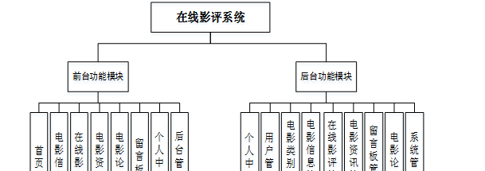

**图 4-1** **在线影评系统总体功能模块图**

### 4.2 数据库设计

#### 4.2.1 概念模型设计

数据可设计要遵循职责分离原则，即在设计时应该要考虑系统独立性，即每个系统之间互不干预不能混乱数据表和系统关系。

数据库命名也要遵循一定规范，否则容易混淆，数据库字段名要尽量做到与表名类似，多使用小写英文字母和下划线来命名并尽量使用简单单词。

用户信息实体图如图4-2所示：

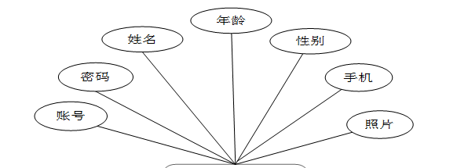

图4-2用户信息实体图

在线影评信息实体图如图4-3所示：

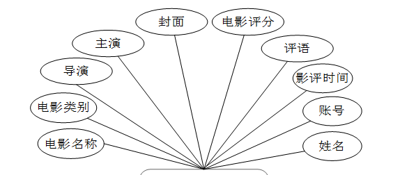

图4-3在线影评信息实体图

电影信息实体图如图4-4所示：

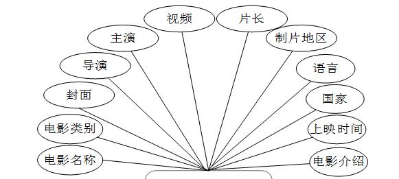

图4-4电影信息实体图

### 系统功能模块

在在线影评系统的网站首页可以查看首页、电影信息、在线影评、电影资讯、电影论坛、留言板、个人中心、后台管理等内容，如图5-1所示。

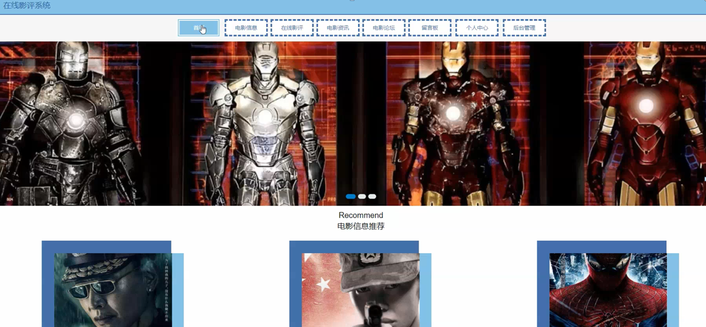

图5-1网站首页界面图

个人中心，在个人中心页面，通过填写账号、密码、姓名、年龄、性别、手机、上传图片等进行更新信息，还能对我的发布、我的收藏进行相应操作，如图5-2所示。

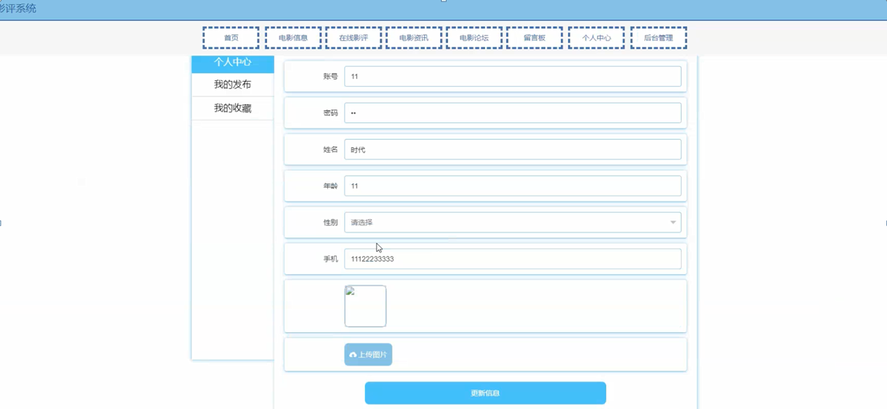

图5-2个人中心界面图

电影信息，在电影信息页面可以查看电影名称、电影类别、封面、导演、主演、片长、制片地区、语言、国家、上映时间、点击次数、视频、电影介绍等信息，并进行收藏、评论、赞、踩或在线影评等操作，如图5-3所示。

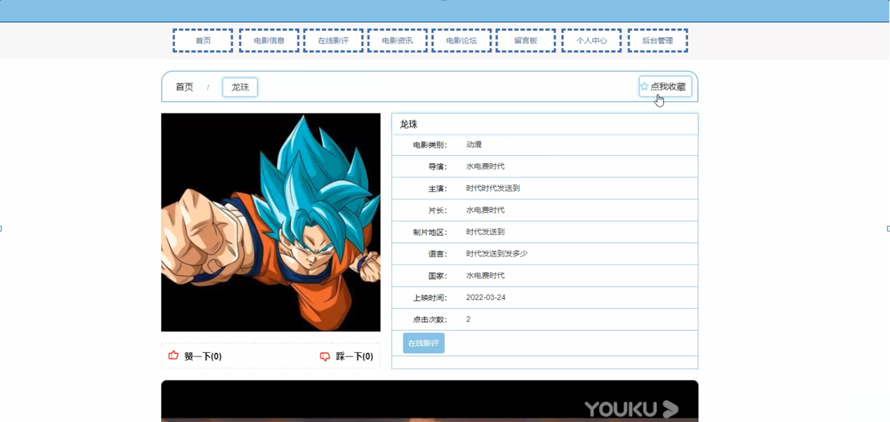

图5-3电影信息界面图

在电影信息页面，点击在线影评，通过输入电影名称、电影类别、导演、主演、封面、电影评分、影评时间、账号、姓名、详情等信息，点击提交进行在线影评，如图5-4所示。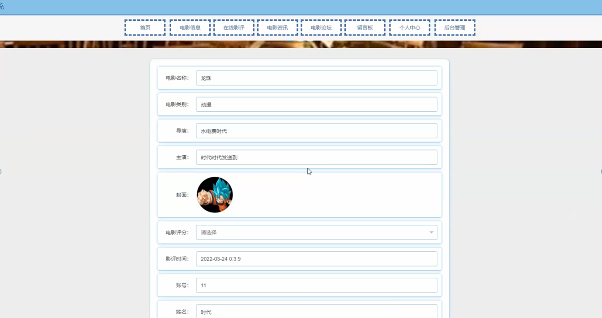

图5-4在线影评添加界面图

在在线影评页面，用户可以查看电影名称、电影类别、导演、主演、封面、电影评分、影评时间、账号、姓名、评语等信息；用户也可以通过输入电影名称、电影类别、主演来搜索相关影评信息，在线影评页面如图5-5所示。

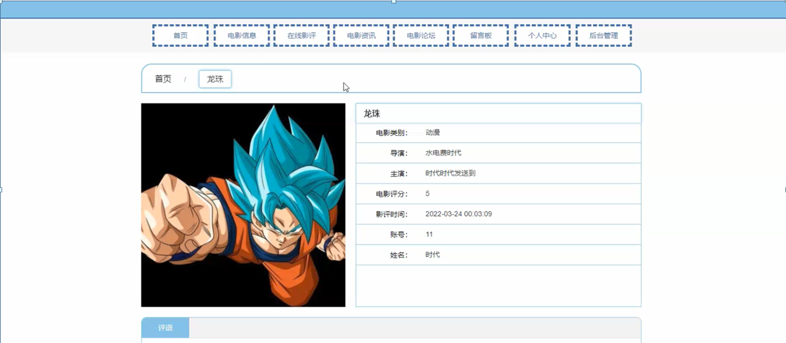

图5-5在线影评界面图

在系统前台，用户还可以查看电影资讯、电影论坛、留言板信息等，也可以发布帖子、进行在线留言、修改个人信息等。

### 5.2管理员功能模块

管理员进行登录，进入系统前在登录页面根据要求填写账号和密码，选择角色等信息，点击登录进行登录操作，如图5-6所示。

图5-6管理员登录界面图

管理员登录系统后，可以对个人中心、用户管理、电影类别管理、电影信息管理、在线影评管理、电影资讯管理、留言板管理、电影论坛、系统管理等进行相应的操作管理，如图5-7所示。

图5-7管理员功能界面图

用户管理，在用户管理页面，可以对账号、姓名、年龄、性别、手机、照片等进行详情、修改、删除或新增等操作。如图5-8所示。

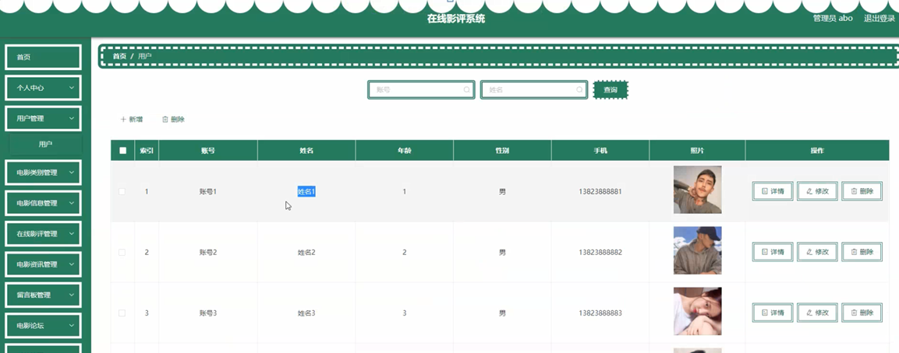

图5-8用户管理界面图

电影类别管理，在电影类别管理页面可以对索引、电影类别进行修改、删除或新增等操作，如图5-9所示。

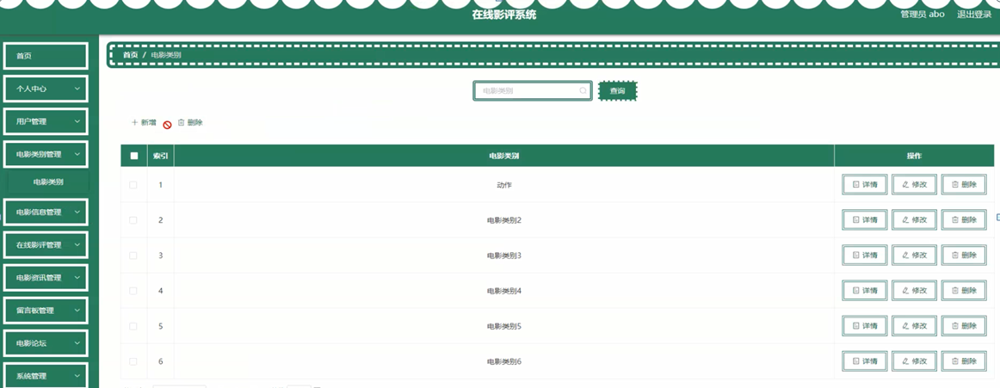

图5-9电影类别管理界面图

电影信息管理，在电影信息管理页面可以对索引、电影名称、电影类别、封面、导演、主演、视频、片长、制片地区、语言、国家、上映时间等内容进行查看、修改、删除或查看评论、新增等操作，如图5-10所示。

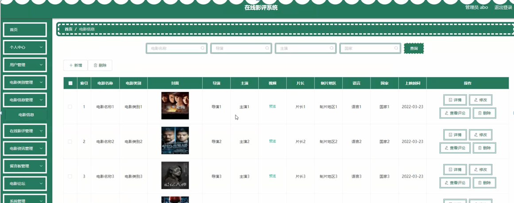

图5-10电影信息管理界面图

在线影评管理，在在线影评管理页面可以对索引、电影名称、电影类别、导演、主演、封面、电影评分、影评时间、账号、姓名等内容进行详情、修改、删除等操作，如图5-11所示。

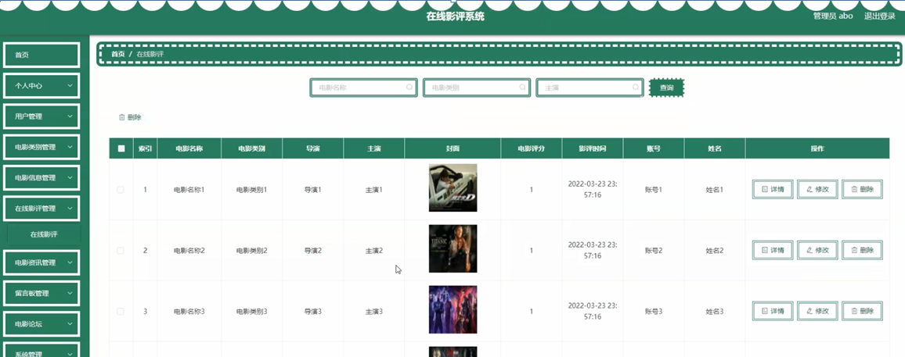

图5-11在线影评管理界面图

在系统管理页面，管理员可以对轮播图的值和名称进行修改或删除的操作，如图5-12所示。

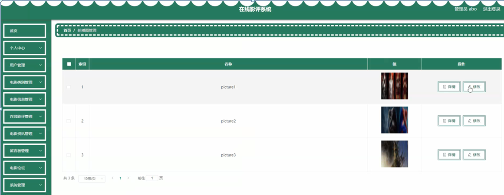

图5-12系统管理界面图

#### **JAVA** **毕设帮助，指导，源码分享，调试部署**

