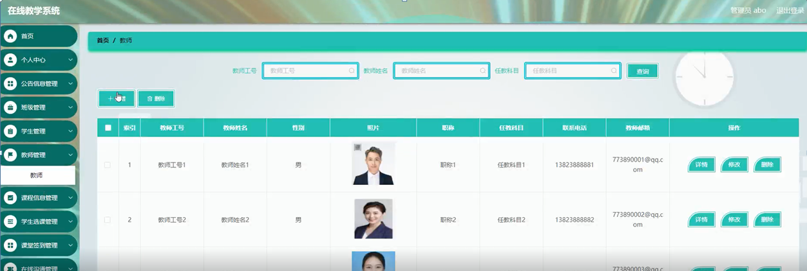

ssm+Vue计算机毕业设计在线教学系统（程序+LW文档）

**项目运行**

**环境配置：**

**Jdk1.8 + Tomcat7.0 + Mysql + HBuilderX** **（Webstorm也行）+ Eclispe（IntelliJ
IDEA,Eclispe,MyEclispe,Sts都支持）。**

**项目技术：**

**SSM + mybatis + Maven + Vue** **等等组成，B/S模式 + Maven管理等等。**

**环境需要**

**1.** **运行环境：最好是java jdk 1.8，我们在这个平台上运行的。其他版本理论上也可以。**

**2.IDE** **环境：IDEA，Eclipse,Myeclipse都可以。推荐IDEA;**

**3.tomcat** **环境：Tomcat 7.x,8.x,9.x版本均可**

**4.** **硬件环境：windows 7/8/10 1G内存以上；或者 Mac OS；**

**5.** **是否Maven项目: 否；查看源码目录中是否包含pom.xml；若包含，则为maven项目，否则为非maven项目**

**6.** **数据库：MySql 5.7/8.0等版本均可；**

**毕设帮助，指导，本源码分享，调试部署** **(** **见文末** **)**

### 系统结构

在线教学系统
,它是一个由人、电脑及其他组件构成的，一种能够收集、存储、加工、传送信息的系统。该系统可以帮助决策者找出当前急需解决的问题，然后将信息快速的反馈，使管理人员能够以最快的时间知道目前的现状，进行更进一步的计划。

当前MIS系统结构目前存在两种较为流行的结构:C/S和B/S两种。

C/S结构的系统：C/S结构就是客户机服务器结构，它可以法派任务到Client端和Server端来进行，充分利用两端硬件环境的优势，来降低系统的通讯的花费。客户端主要作用是处理人机交互，执行客户端应用程序，收集数据以及向服务器发送任务请求。服务器基本作用是执行后台程序，它主要对客户机的请求申请进行反馈，除此之外，它的作用还包括：数据服务预约储系统的共享管理、通讯管理、文件管理等等。

B/S结构的系统：这种网络结构简化了客户端，并把系统功能实现的中心集中到服务器上，在这种模式中，只需要一个浏览器就可以了。这种结构将很多的工作交于WEB服务器，只通过浏览器请求WEB服务，随后根据请求返回信息。

通常在只在学校网内部使用，采用C/S。而使用不仅限于内网的情况下使用B/S。考虑到本管理系统的一系列需求，所以，该系统开发使用B/S结构开发。其主要功能结构如下图所示。

图4-1 系统总体功能结构图

###  4.2数据库设计

数据库设计是指为系统提供最优化的数据库模式，使得应用程序能够有效的存储数据，满足学生的各类需求。

#### 4.2.1 数据库概念结构设计

概念结构设计是根据学生需求形成的。用最常的E-R方法描述数据模型进行数据库的概念设计，首先设计局部的E-
R模式，最后各局部ER模式综合成一个全局模式。然后再把概念模式转换成逻辑模式。将概念设计从设计过程中独立开来，设计复杂程度降低，不受特定DBMS的限制。

1.所有实体和属性的定义如下所示。

管理员信息属性图如下图4-2所示。

图4-2 管理员信息实体属性图

学生信息实体属性图，如图4-3所示：

图4-3学生信息实体属性图

课堂签到信息实体属性图，如图4-4所示：

图4-4课堂签到信息实体属性图

在线沟通信息实体属性图，如图4-5所示：

图4-5在线沟通信息实体属性图

### 管理员功能模块

管理员登录，管理员通过登录页面输入用户名，密码，选择角色等信息即可进行系统登录，如图5-1所示。

图5-1管理员登录界面图

管理员登录进入在线教学系统可以查看首页、个人中心、公告信息管理、班级管理、学生管理、教师管理、课程信息管理、学生选课管理、课堂签到管理、在线沟通管理、试卷管理、试题管理、测试管理等内容进行详细操作，如图5-2所示。

图5-2管理员功能界面图

学生管理，在学生管理页面可以查看学号、学生姓名、性别、头像、班级、手机、邮箱等信息，并可根据需要对学生管理进行修改或删除等操作，如图5-3所示。

图5-3学生管理界面图

公告信息管理，在公告信息管理页面可以新增公告标题、图片、发布日期等信息，并可根据需要对公告信息管理进行修改或删除等操作，如图5-4所示。

图5-4公告信息管理界面图

教师管理，在教师管理页面可以查看教师工号、教师姓名、性别、照片、职称、任教科目、联系电话、教师邮箱等信息，并可根据需要对教师管理进行修改或删除等操作，如图5-5所示。

图5-5教师管理界面图

课程信息管理，在课程信息管理页面可以查看课程名称、课程类型、图片、班级、发布日期、教师工号、教师姓名等信息，并可根据需要对课程信息管理进行修改或删除等操作，如图5-6所示。

图5-6课程信息管理界面图

学生选课管理，在学生选课管理页面可以查看课程名称、课程类型、班级、选课日期、教师工号、教师姓名、学号、学生姓名、备注、审核回复、审核状态等信息，并可根据需要对学生选课管理进行修改或删除等操作，如图5-7所示。

图5-7学生选课管理界面图

课堂签到管理，在课堂签到管理页面可以查看课程名称、课程类型、班级、签到时间、学号、学生姓名、教师工号、教师姓名等信息，并可根据需要对课堂签到管理进行修改或删除等操作，如图5-8所示。

图5-8课堂签到管理界面图

### 5.2学生功能模块

学生登录，学生通过登录页面输入用户名，密码，选择角色等信息即可进行系统登录，如图5-9所示。

图5-9学生登录界面图

学生登录到在线教学系统后台后，可以对首页、个人中心、公告信息管理、课程信息管理、学生选课管理、课堂签到管理、在线沟通管理、测试管理等功能进行相应操作，如图5-10所示。

图5-10学生功能界面图

个人中心，在个人中心页面，学生通过输入学号、学生姓名、性别、头像、班级、手机、邮箱等信息进行个人信息修改，并且也可以修改密码，如图5-11所示。

图5-11个人中心界面图

公告信息管理，在公告信息管理页面可以查看公告标题、图片、发布日期等信息，并可根据需要对公告信息管理进行详情等操作如图5-12所示。

图5-12公告信息管理界面图

**JAVA** **毕设帮助，指导，源码分享，调试部署**

