ssm+Vue计算机毕业设计在线电影推荐系统（程序+LW文档）

**项目运行**

**环境配置：**

**Jdk1.8 + Tomcat7.0 + Mysql + HBuilderX** **（Webstorm也行）+ Eclispe（IntelliJ
IDEA,Eclispe,MyEclispe,Sts都支持）。**

**项目技术：**

**SSM + mybatis + Maven + Vue** **等等组成，B/S模式 + Maven管理等等。**

**环境需要**

**1.** **运行环境：最好是java jdk 1.8，我们在这个平台上运行的。其他版本理论上也可以。**

**2.IDE** **环境：IDEA，Eclipse,Myeclipse都可以。推荐IDEA;**

**3.tomcat** **环境：Tomcat 7.x,8.x,9.x版本均可**

**4.** **硬件环境：windows 7/8/10 1G内存以上；或者 Mac OS；**

**5.** **是否Maven项目: 否；查看源码目录中是否包含pom.xml；若包含，则为maven项目，否则为非maven项目**

**6.** **数据库：MySql 5.7/8.0等版本均可；**

**毕设帮助，指导，本源码分享，调试部署** **(** **见文末** **)**

### 总体设计

根据在线电影推荐系统的功能需求，进行系统设计。

前台功能：用户登录注册后进入系统首页，可以实现首页.电影信息.电影论坛.电影资讯.个人中心.后台管理等功能等内容进行详细操作；

后台主要是管理员，管理员功能包括首页.个人中心.用户管理.电影分类管理.电影信息管理.电影论坛.系统管理等；

系统对这些功能进行整合，产生的功能结构图如下图所示：

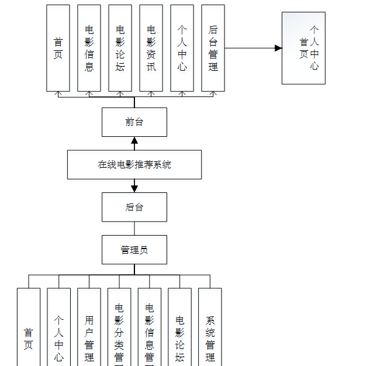

图3-1 系统总体设计图

### 3.3 数据库设计

在每一个系统中数据库有着非常重要的作用，数据库的设计得好将会增加系统的效率以及系统各逻辑功能的实现。所以数据库的设计我们要从系统的实际需要出发，才能使其更为完美的符合系统功能的实现。

#### 3.3.1 数据库E-R图

E-R图为实体-关系图，本系统的E-R图展现了各个实体之间的关系，在本数据库中，各个实体之间的关系均为多对多的关系；

用户注册属性图如图3-2所示。

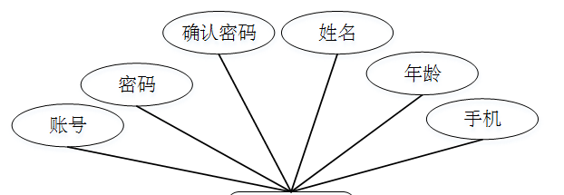

图3-2用户注册实体属性图

电影信息管理实体属性图如图3-3所示。

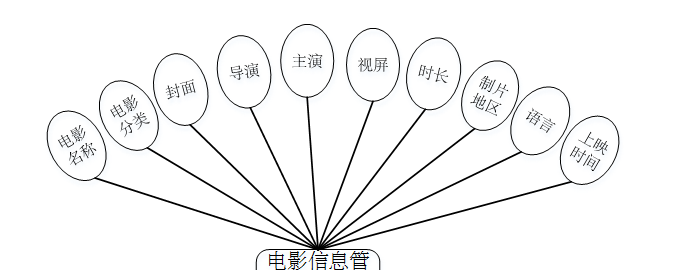

图3-3电影信息管理实体属性图

系统管理实体属性图如图3-4所示。

图3-4系统管理实体属性图

### 系统功能模块

在线电影推荐系统，在系统首页可以查看首页.电影信息.电影论坛.电影资讯.个人中心.后台管理等功能等内容，并进行详细操作；如图4-1所示。

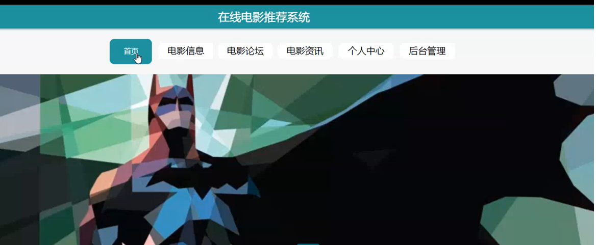

图4-1系统首页界面图

用户注册，在用户注册页面，用户通过填写账号.密码.确认密码.姓名.年龄.手机.等信息进行注册操作，如图4-2所示。

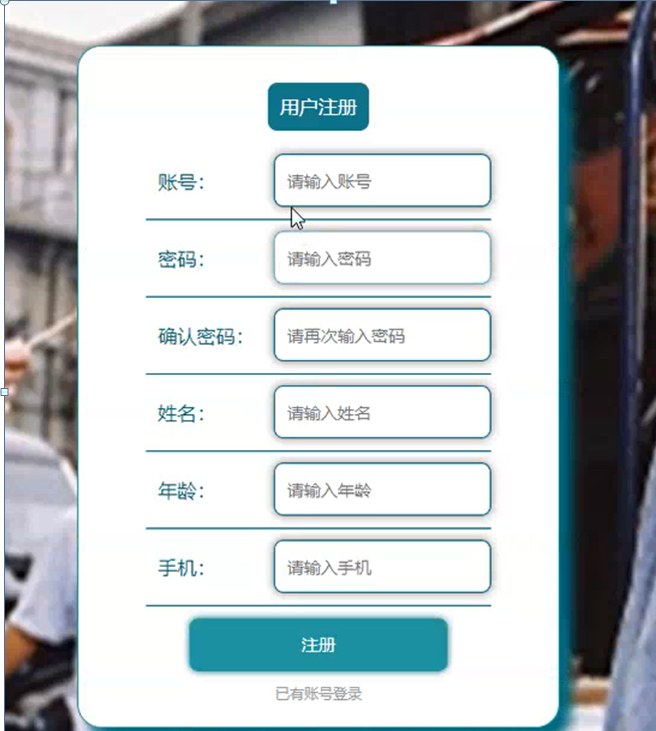

图4-2用户注册界面图

电影信息，在电影信息页面可以查看电影名称.电影分类.导演.主演.等内容，并进行操作，如图4-3所示。

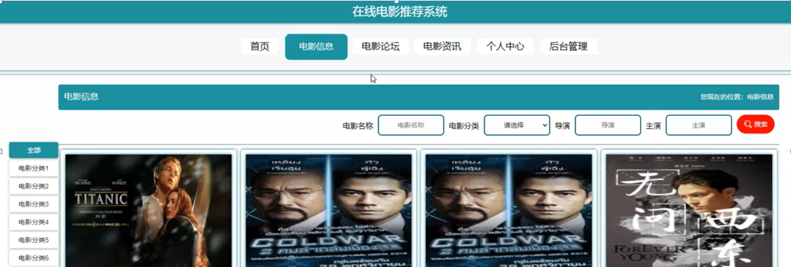

图4-3电影信息界面图

个人中心，在个人中心页面可以查看账号.密码.姓名.年龄.性别.手机.等内容，并进行修改等操作，如图4-4所示。

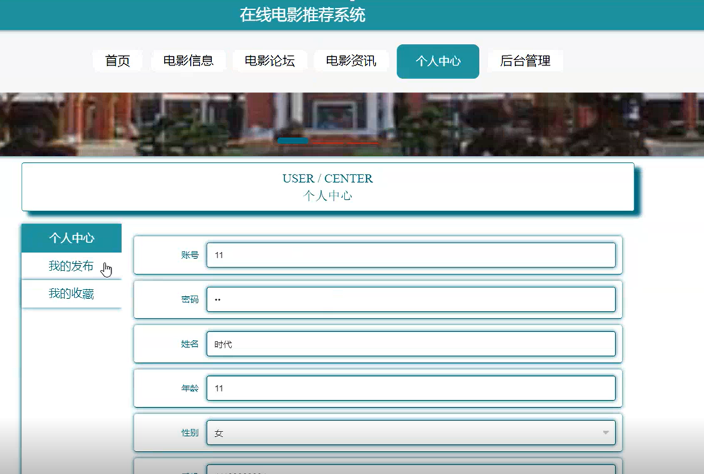

图4-4个人中心界面图

### 4.2管理员功能模块

管理员进行登录，进入系统前在登录页面根据要求填写用户名和密码，选择角色等信息，点击登录进行登录操作，如图4-5所示。

图4-5管理员登录界面图

管理员登录系统后，可以对主页.个人中心.用户管理.电影分类管理.电影信息管理.电影论坛.系统管理.等功能进行相应的操作，如图4-6所示。

图4-6管理员功能界面图

用户管理，在用户列表可以对索引.账号.姓名.年龄.性别.手机.照片.等内容进行查看，修改和删除等操作，如图4-7所示。

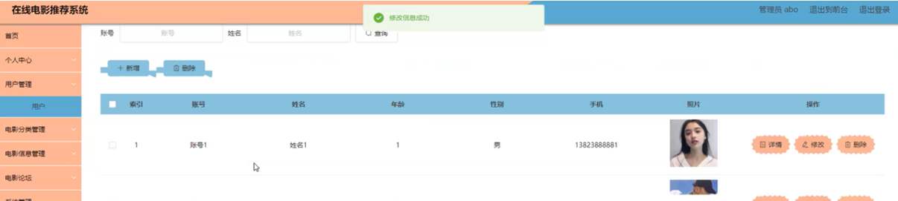

图4-7用户管理界面图

电影分类管理，在电影分类页面可以对索引.电影分类等详情内容进行查看，修改和删除操作，如图4-8所示。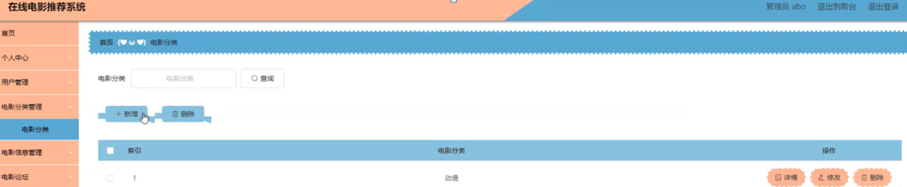

图4-8电影分类管理界面图

电影信息管理，在电影信息管理列表可以查看索引.电影名称.电影分类.封面.导演.主演.视频.片长.制片地区.语言.上映时间.等内容进行修改，查看评论和删除操作，如图4-9所示。

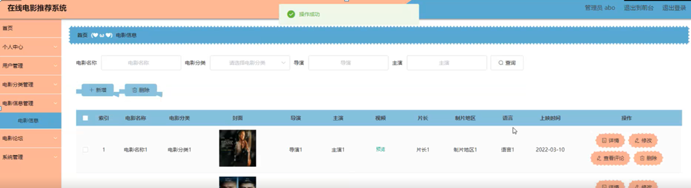

图4-9电影分类管理界面图

电影论坛，电影论坛页面可以查看索引.帖子标题.用户名.状态等内容进行修改，查看评论和删除操作，如图4-10所示。

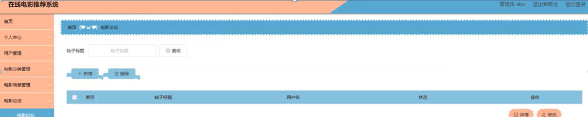

图4-10电影论坛界面图

系统管理，系统管理页面可以对索引.标题.图片等内容进行查看，修改和删除等操作，还可以对轮播图管理进行详细的操作管理；如图4-11所示。

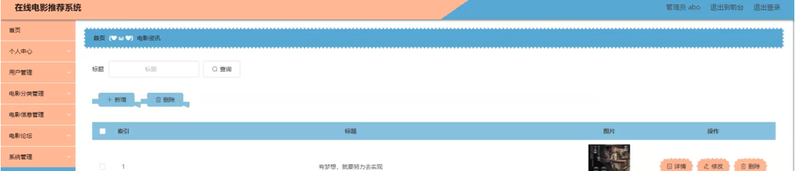

图4-11系统管理界面图

### 4.3用户功能模块

用户登录进入系统可以对首页页.个人中心.门票订单管等功能进行相应操作，如图4-12所示。

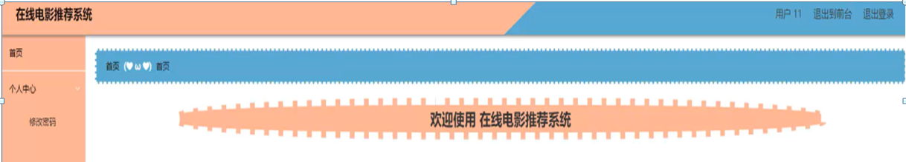

图4-12用户功能界面图

#### **JAVA** **毕设帮助，指导，源码分享，调试部署**

