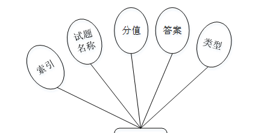

ssm+Vue计算机毕业设计在线答题系统（程序+LW文档）

**项目运行**

**环境配置：**

**Jdk1.8 + Tomcat7.0 + Mysql + HBuilderX** **（Webstorm也行）+ Eclispe（IntelliJ
IDEA,Eclispe,MyEclispe,Sts都支持）。**

**项目技术：**

**SSM + mybatis + Maven + Vue** **等等组成，B/S模式 + Maven管理等等。**

**环境需要**

**1.** **运行环境：最好是java jdk 1.8，我们在这个平台上运行的。其他版本理论上也可以。**

**2.IDE** **环境：IDEA，Eclipse,Myeclipse都可以。推荐IDEA;**

**3.tomcat** **环境：Tomcat 7.x,8.x,9.x版本均可**

**4.** **硬件环境：windows 7/8/10 1G内存以上；或者 Mac OS；**

**5.** **是否Maven项目: 否；查看源码目录中是否包含pom.xml；若包含，则为maven项目，否则为非maven项目**

**6.** **数据库：MySql 5.7/8.0等版本均可；**

**毕设帮助，指导，本源码分享，调试部署** **(** **见文末** **)**

###  系统体系结构

在线答题系统的结构图4-1所示：

图4-1 系统结构

登录系统结构图，如图4-2所示：

图4-2 登录结构图

系统结构图，如图4-3所示：

图4-3 系统结构图

### 4.2 数据库实体设计

数据库的功能就是对系统中所有的数据进行存储和管理。所有的数据可以在数据库中产时间的进行存储，方便用户的使用。而且所有的数据库中的数据也应该具有一定的共享性，任何的系统可以对一些数据进行使用，同时还应该保持一定的独立性，每一个数据库中的数据都有很强的安全性，可以被很好的存放到数据库，没有进行身份的验证是不能对这些数据进行查看和使用的。数据库的设计需要明确每一个实体之间的联系，系统的E-
R图如下图所示：：

管理员实体主要存储管理信息包括用户名、密码、验证码、角色属性。管理员信息属性图如图4-4所示。

图4-4 管理员信息实体属性图

用户信息主要包括用户名、姓名、性别、手机、邮箱、照片等属性，用户信息属性图如图4-5所示。

图4-5用户信息实体属性图

题库管理实体属性主要包括索引、标题、题型、习题下载、习题封面等属性。题库管理实体属性图如图4-6所示。

图4-6题库管理实体属性图

试题管理实体属性主要包括试卷、试题名称、分值、答案、类型等属性。试题管理实体属性图如图4-7所示。

图4-7试题管理实体属性图

### 系统功能模块

在线答题系统，在系统的首页可以查看首页、题库、学习交流论坛、试卷列表、留言板管理、个人中心、后台管理等信息，如图5-1所示。

图5-1系统首页界面图

用户注册，在用户注册通过填写用户名、密码、姓名、手机、邮箱等信息完成用户注册，如图5-2所示。

图5-2用户注册界面图

题库，在题库信息页面中可以查看标题、题型、习题下载、习题封面等信息，如图5-3所示。

图5-3题库界面图

学习交流论坛，在学习交流论坛页面中通过填写标题、类型、内容等信息进行发布帖子，如图5-4所示。

图5-4学习交流论坛界面图

留言板管理，在留言板管理页面中通过输入留言内容并立即提交，如图5-5所示。

图5-5留言板管理界面图

个人中心，在个人中心页面通过填写用户名、密码、姓名、性别、手机、邮箱等信息进行更新信息，并可对我的发布、考试记录、错题本、我的收藏进行相对应操作，如图5-6所示。

图5-6个人中心界面图

### 5.2 管理员功能模块

管理员登录，管理员通过输入界面上显示的信息然后点击登录就能登录到系统进行系统的使用了，如图5-7所示。

图5-7管理员登录界面图

管理员登录进入在线答题系统之后，就可以对所有的信息进行查看，可以查看到首页、个人中心、用户管理、题型管理、题库管理、留言板管理、试题管理、学习交流论坛、试卷管理、系统管理、考试管理等，并且还可以对其进行相应的操作管理，如图5-8所示。

图5-8管理员功能界面图

用户管理，在用户管理页面中可以查看索引、用户名、密码、姓名、性别、手机、邮箱、照片等信息，还可以根据需要进行删除等操作，如图5-9所示。

图5-9用户管理界面图

题型管理，在题型管理页面中可以查看题型等信息，还可以根据需要进行修改或删除等操作，如图5-10所示。

图5-10题型管理界面图

题库管理，在题库管理页面中可以查看索引、标题、题型、习题下载、习题封面等信息，还可以根据需要进行查看评论，修改或删除等操作，如下图5-11所示。

图5-11题库管理界面图

留言板管理，在留言板管理页面中可以查看索引、用户名、留言内容、回复内容等信息，还可以根据需要进行回复，修改或删除等操作，如图5-12所示。

图5-12留言板管理界面图

#### **JAVA** **毕设帮助，指导，源码分享，调试部署**

