ssm+Vue计算机毕业设计在线考试主观题评分系统（程序+LW文档）

**项目运行**

**环境配置：**

**Jdk1.8 + Tomcat7.0 + Mysql + HBuilderX** **（Webstorm也行）+ Eclispe（IntelliJ
IDEA,Eclispe,MyEclispe,Sts都支持）。**

**项目技术：**

**SSM + mybatis + Maven + Vue** **等等组成，B/S模式 + Maven管理等等。**

**环境需要**

**1.** **运行环境：最好是java jdk 1.8，我们在这个平台上运行的。其他版本理论上也可以。**

**2.IDE** **环境：IDEA，Eclipse,Myeclipse都可以。推荐IDEA;**

**3.tomcat** **环境：Tomcat 7.x,8.x,9.x版本均可**

**4.** **硬件环境：windows 7/8/10 1G内存以上；或者 Mac OS；**

**5.** **是否Maven项目: 否；查看源码目录中是否包含pom.xml；若包含，则为maven项目，否则为非maven项目**

**6.** **数据库：MySql 5.7/8.0等版本均可；**

**毕设帮助，指导，本源码分享，调试部署** **(** **见文末** **)**

### 系统体系结构

在线考试主观题评分系统开发系统的结构图4-1所示：

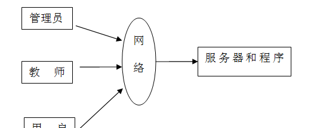

图4-1 系统结构

模块包括首页、个人中心、用户管理、主观题管理、成绩申诉管理、主观题回答管理、主观题评分管理、教师管理、试卷管理、试题管理、考试管理等进行相应的操作。

登录系统结构图，如图4-2所示：

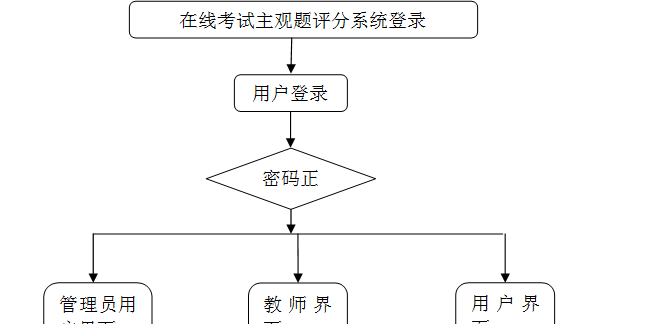

图4-2 登录结构图

这些功能可以充分满足在线考试主观题评分系统的需求。此系统功能较为全面如下图系统功能结构如图4-3所示。

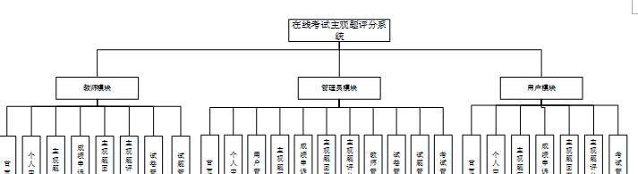

图4-3系统功能结构图

### 4.2 数据库设计原则

每个数据库的应用它们都是和区分开的，当运行到一定的程序当中，它就会与自己相关的协议与客户端进行通讯。那么这个系统就会对使这些数据进行连接。当我们选择哪个桥段的时候，接下来就会简单的叙述这个数据库是如何来创建的。当点击完成按钮的时候就会自动在对话框内弹出数据源的名称，在进行点击下一步即可，直接在输入相对应的身份验证和登录密码。

在线考试主观题评分系统的数据流程：

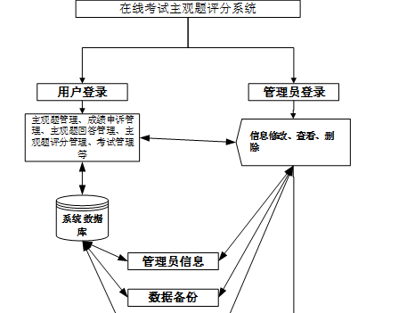

图4-4 系统数据流程图

主观题回答管理实体E-R图，如图4-5所示。

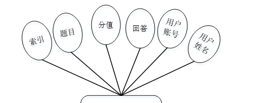

图4-5主观题回答管理E-R图

主观题评分管理E-R图，如图4-6所示。

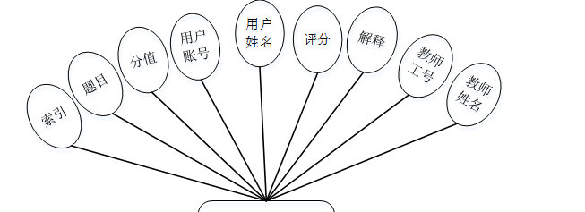

图4-6主观题评分管理E-R图

### 管理员功能模块

管理员通过用户名和密码，密码填写完成后选则提交，如图5-1所示。管理员登录成功后进入到系统操作界面，可以对首页、个人中心、用户管理、主观题管理、成绩申诉管理、主观题回答管理、主观题评分管理、教师管理、试卷管理、试题管理、考试管理等功能模块进行相对应操作，如图5-2所示。

图5-1管理员登录界面图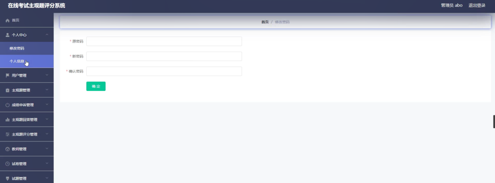

图5-2管理员功能界面图

用户管理：通过列表可以获取索引、用户账号、用户姓名、性别、年龄、头像、用户手机等信息，进行详情，修改或删除等操作，如图5-3所示。

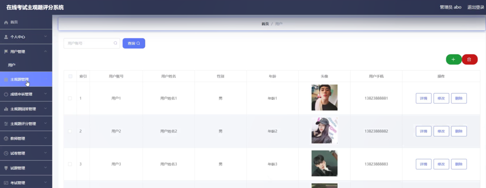

图5-3用户管理界面图

主观题管理：通过列表可以获取索引、题目、分值等信息，进行详情，修改或删除等操作，如图5-4所示。

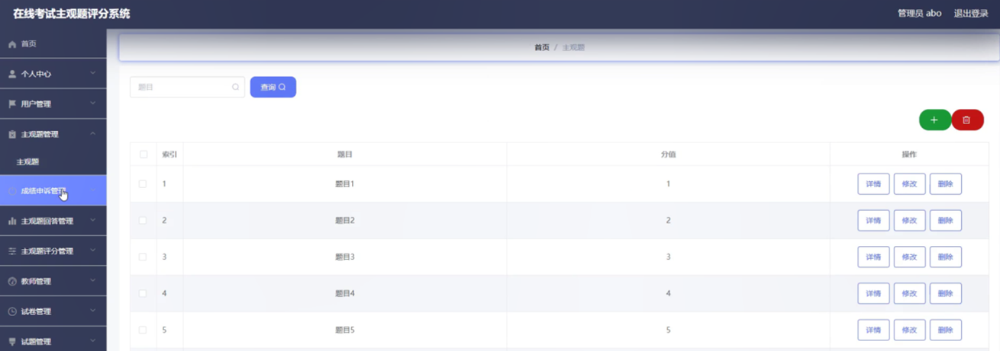

图5-4主观题管理界面图

成绩申诉管理：通过列表可以获取索引、用户账号、用户姓名、试卷名称、申诉时间、申诉理由、审核回复、审核状态、审核等信息，进行详情，修改或删除等操作，如图5-5所示。

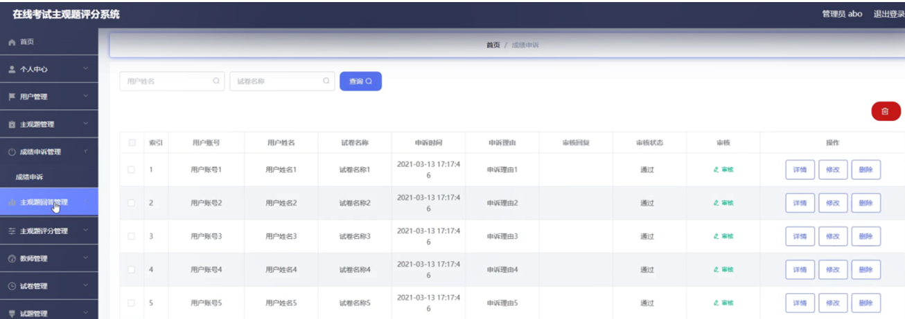

图5-5成绩申诉管理界面图

主观题回答管理：通过列表可以获取索引、题目、分值、回答、用户账号、用户姓名等信息，进行详情，修改或删除等操作，如图5-6所示。

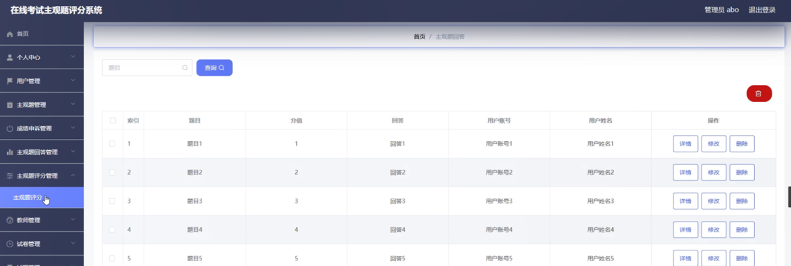

图5-6主观题回答管理界面图

主观题评分管理：通过列表可以获取索引、题目、分值、用户账号、用户姓名、评分、解释、教师工号、教师姓名等信息，进行详情，修改或删除等操作，如图5-7所示。

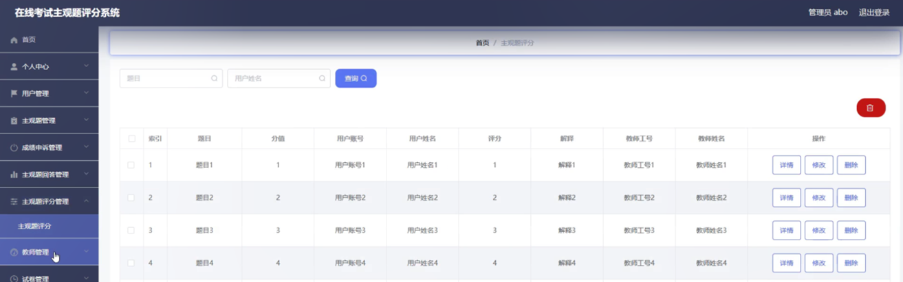

图5-7主观题评分管理界面图

教师管理：通过列表可以获取索引、教师工号、教师姓名、性别、照片、职称、联系电话、教师邮箱等信息，进行详情，修改或删除等操作，如图5-8所示。

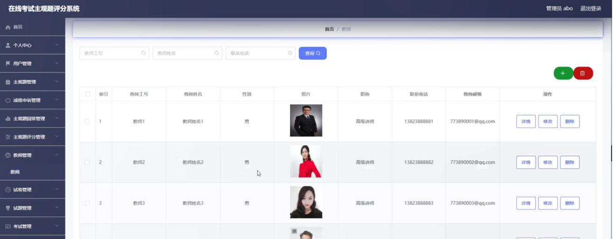

图5-8教师管理界面图

### 5.2教师功能模块

教师点击进入到系统操作界面，可以对首页、个人中心、主观题管理、成绩申诉管理、主观题回答管理、主观题评分管理、试卷管理、试题管理等功能进行详细操作，如图5-9所示。

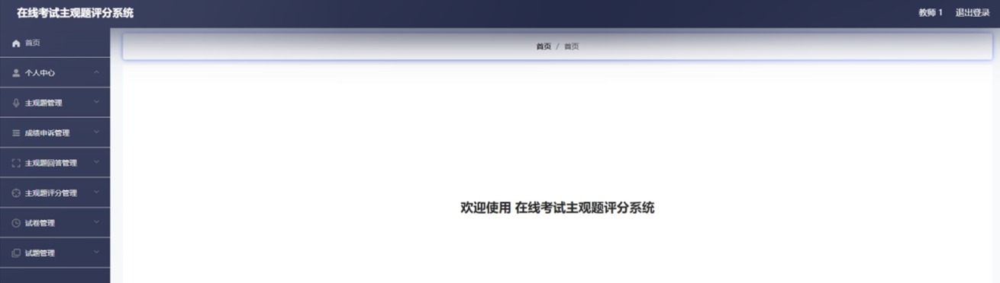

图5-9教师功能界面图

个人中心：通过个人中心页面可以填写教师工号、教师姓名、性别、照片、职称、联系电话、教师邮箱等信息进行修改操作，如图5-10所示。

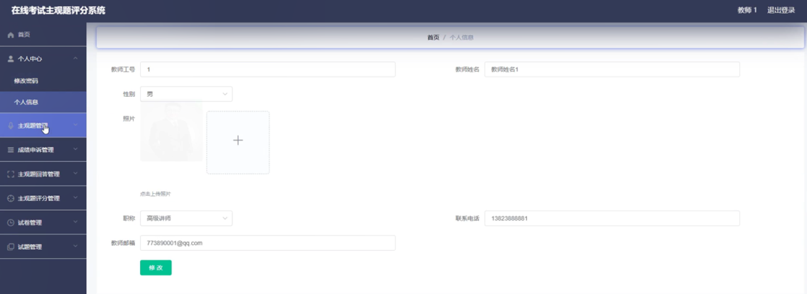

图5-10个人中心界面图

主观题管理：通过列表可以获取索引、题目、分值等信息，进行详情，修改或删除操作，如图5-11所示。

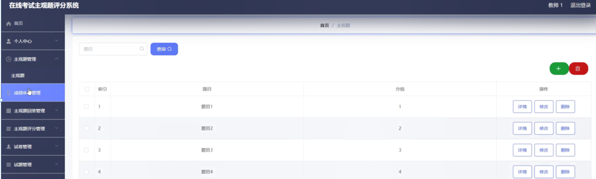

图5-11主观题管理界面图

试卷管理：通过列表可以获取索引、试卷名称、考试时长（分钟）、试卷状态等信息，进行详情，修改或删除等操作，如图5-12所示。

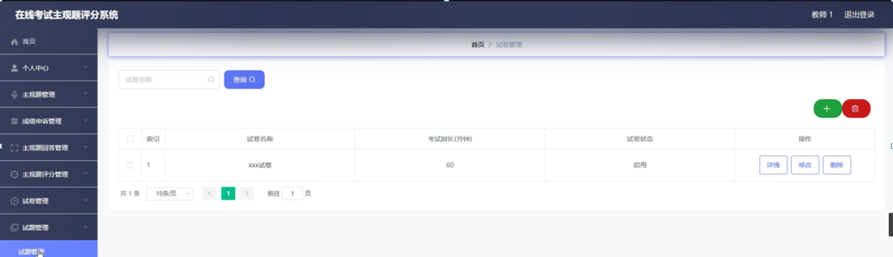

图5-12试卷管理界面图

#### **JAVA** **毕设帮助，指导，源码分享，调试部署**

