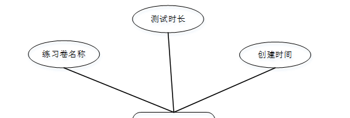

ssm+Vue计算机毕业设计在线考试系统的考务管理（程序+LW文档）

**项目运行**

**环境配置：**

**Jdk1.8 + Tomcat7.0 + Mysql + HBuilderX** **（Webstorm也行）+ Eclispe（IntelliJ
IDEA,Eclispe,MyEclispe,Sts都支持）。**

**项目技术：**

**SSM + mybatis + Maven + Vue** **等等组成，B/S模式 + Maven管理等等。**

**环境需要**

**1.** **运行环境：最好是java jdk 1.8，我们在这个平台上运行的。其他版本理论上也可以。**

**2.IDE** **环境：IDEA，Eclipse,Myeclipse都可以。推荐IDEA;**

**3.tomcat** **环境：Tomcat 7.x,8.x,9.x版本均可**

**4.** **硬件环境：windows 7/8/10 1G内存以上；或者 Mac OS；**

**5.** **是否Maven项目: 否；查看源码目录中是否包含pom.xml；若包含，则为maven项目，否则为非maven项目**

**6.** **数据库：MySql 5.7/8.0等版本均可；**

**毕设帮助，指导，本源码分享，调试部署** **(** **见文末** **)**

### 软件功能模块设计

网站整功能如下图所示：

图 4-1 在线考试系统的考务管理总体功能模块图

### 4.2 数据库设计

#### 4.2.1 概念模型设计

概念模型是对现实中的问题出现的事物的进行描述，ER图是由实体及其关系构成的图，通过E-R图可以清楚地描述系统涉及到的实体之间的相互关系。

考务信息实体图如图4-2所示：

图4-2考务信息实体图

练习卷实体图如图4-3所示：

图4-3练习卷实体图

考生个人资料实体图如图4-4所示：

图4-4考生个人资料实体图

### 系统功能模块

在线考试系统的考务管理，在系统首页可以查看首页，考务信息，练习卷，个人中心，后台管理等内容，如图5-1所示。

图5-1系统首页界面图

考务信息，在考务信息页面可以查看考试科目，考场，考次，楼层，教室，图片，考试时间，时间段等信息进行报名操作，如图5-2所示。

图5-2考务信息界面图

练习卷，在练习卷页面可以查看练习卷名称，测试时长，创建时间等内容，并进行测试操作，如图5-3所示。

图5-3练习卷界面图

个人中心，在个人中心页面通过填写学号，姓名，密码，性别，联系电话，专业，学校，学院，图片等信息进行更新信息，还可以根据需要对测试记录，错题本进行相对应操作，如图5-4所示。

图5-4个人中心界面图

### 5.2管理员模块

管理员进行登录，进入系统前在登录页面根据要求填写用户名，密码和验证码，选择角色等信息，点击登录进行登录操作，如图5-5所示。

图5-5管理员登录界面图

管理员登录系统后，可以对首页,个人中心,教师管理,考生管理,考务信息管理,报名信息管理,考试成绩管理,练习卷管理,测试试题管理,系统管理,测试管理等进行相应的操作管理，如图5-6所示。

图5-6管理员功能界图面

教师管理，在教师管理页面可以对索引，工号，姓名，性别，职位，电话，照片等内容进行详情，修改和删除等操作，如图5-7所示。

图5-7教师管理界面图

考生管理，在考生管理页面可以对索引，学号，姓名，性别，联系电话，专业，学校，学院，头像等内容进行详情，修改和删除等操作，如图5-8所示。

图5-8考生管理界面图

考务信息管理，在考务信息管理页面可以对索引，考试科目，考场，考次，楼层，教室，考试时间，时间段，封面等内容进行详情，修改和删除等操作，如图5-9所示。

图5-9考务信息管理界面图

报名信息管理，在报名信息管理页面可以对索引，考试科目，考试类型，考场，考次，考试时间，时间段，楼层，教室，学号，姓名，专业，学校，学院，报名时间，审核回复，审核状态，审核等内容进行详情和删除等操作，如图5-10所示。

图5-10报名信息管理界面图

考试成绩管理，在考试成绩管理页面可以对索引，考试科目，考试类型，考场，考次，考试时间，时间段，楼层，教室，学号，姓名，班级，学校，学院，登记时间，考试成绩等内容进行详情，修改和删除等操作，如图5-11所示。

图5-11考试成绩管理界面图

系统管理，在轮播图管理页面可以对索引，名称，值等内容进行详情和修改等操作，如图5-12所示。

图5-12客户信息管理界面图

#### **JAVA** **毕设帮助，指导，源码分享，调试部署**

