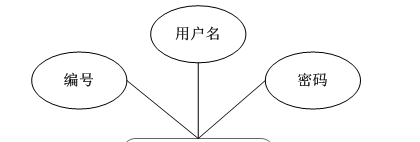
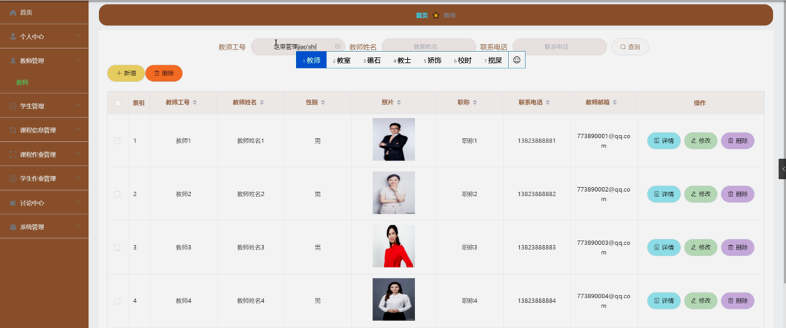

ssm+Vue计算机毕业设计在线考试系统（程序+LW文档）

**项目运行**

**环境配置：**

**Jdk1.8 + Tomcat7.0 + Mysql + HBuilderX** **（Webstorm也行）+ Eclispe（IntelliJ
IDEA,Eclispe,MyEclispe,Sts都支持）。**

**项目技术：**

**SSM + mybatis + Maven + Vue** **等等组成，B/S模式 + Maven管理等等。**

**环境需要**

**1.** **运行环境：最好是java jdk 1.8，我们在这个平台上运行的。其他版本理论上也可以。**

**2.IDE** **环境：IDEA，Eclipse,Myeclipse都可以。推荐IDEA;**

**3.tomcat** **环境：Tomcat 7.x,8.x,9.x版本均可**

**4.** **硬件环境：windows 7/8/10 1G内存以上；或者 Mac OS；**

**5.** **是否Maven项目: 否；查看源码目录中是否包含pom.xml；若包含，则为maven项目，否则为非maven项目**

**6.** **数据库：MySql 5.7/8.0等版本均可；**

**毕设帮助，指导，本源码分享，调试部署** **(** **见文末** **)**

### 系统结构

本系统架构网站系统，本系统的具体功能如下：

图4-2系统功能结构图

管理员功能结构图，如图4-3所示：

图4-3 管理员功能结构图

教师功能结构图，如图4-4所示：

图4-4 教师功能结构图

学生功能结构图，如图4-5所示：

图4-5学生功能结构图

### 4.3. 数据库设计

#### 4.3.1 数据库实体

管理员信息结构图，如图4-6所示：

图4-6管理员信息实体结构图

课程信息实体属性图，如图4-7所示：

图4-7课程信息实体属性图

试卷管理实体属性图，如图4-8所示：

图4-8试卷管理实体属性图

### 系统功能模块

在线考试系统，在系统首页可以查看首页、课程信息、课程作业、讨论中心、试卷列表、公告信息、个人中心、后台管理等内容，如图5-1所示。

图5-1系统首页界面图

课程信息，在课程信息页面可以查看课程名称、课程图片、课程视频、教学资源、教师工号、教师姓名、教师邮箱、点击次数等信息，如图5-2所示。

图5-2课程信息界面图

课程作业，在课程作业页面可以查看作业名称、课程名称、作业图片、作业要求、发布日期、作业附件、教师工号、教师姓名、教师邮箱等信息，根据需要进行提交作业操作，如图5-3所示。

图5-3课程作业界面图

讨论中心，在讨论中心页面通过填写标题、类型、内容等信息进行发布帖子，如图5-4所示。

图5-4讨论中心界面图

个人中心，在个人中心页面通过填写学号、密码、学生姓名、性别、手机、专业、邮箱等信息进行更新信息，根据需要对我的发布、考试记录、错题本、我的收藏进行对应操作，如图5-5所示。

图5-5个人中心界面图

### 5.2管理员功能模块

管理员登录，通过填写注册时输入的用户名和密码，选择角色进行登录，如图5-6所示。

图5-6管理员登录界面图

管理员登录进入在线考试系统可以查看首页、个人中心、教师管理、学生管理、课程信息管理、课程作业管理、学生作业管理、讨论中心、系统管理等信息,如图5-7所示。

图5-7管理员功能界面图

教师管理，在教师管理页面中可以查看索引、教师工号、教师姓名、性别、照片、职称、联系电话、教师邮箱等信息，并可根据需要对已有列表进行详情、修改或删除等操作，如图5-8所示。

图5-8教师管理界面图

学生管理，在学生管理页面中可以查看索引、学号、学生姓名、性别、头像、手机、班级、专业、邮箱等信息，并可根据需要对已有列表进行详情、修改或删除等操作，如图5-9所示。

图5-9学生管理界面图

课程作业管理，在课程作业管理页面中可以查看索引、作业名称、课程名称、作业图片、作业要求、发布日期、作业附件、教师工号、教师姓名、教师邮箱等信息，并可根据需要对已有列表进行详情、修改或删除等操作，如图5-10所示。

图5-10课程作业管理界面图

讨论中心，在讨论中心页面中可以查看索引、帖子标题、用户名、状态等信息，并可根据需要对已有列表进行详情、修改或删除等操作，如图5-11所示。

图5-11讨论中心界面图

系统管理，在公告信息页面中可以查看索引、标题、图片等信息，并可根据需要对轮播图管理进行相对应操作，如图5-12所示。

图5-12系统管理界面图

#### **JAVA** **毕设帮助，指导，源码分享，调试部署**

