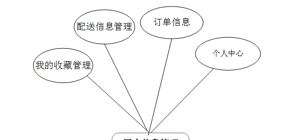
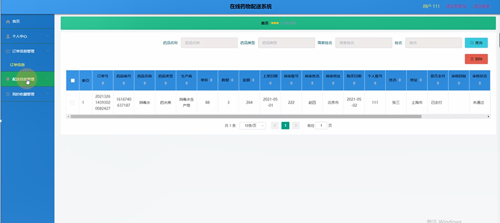

ssm+Vue计算机毕业设计在线药物配送系统（程序+LW文档）

**项目运行**

**环境配置：**

**Jdk1.8 + Tomcat7.0 + Mysql + HBuilderX** **（Webstorm也行）+ Eclispe（IntelliJ
IDEA,Eclispe,MyEclispe,Sts都支持）。**

**项目技术：**

**SSM + mybatis + Maven + Vue** **等等组成，B/S模式 + Maven管理等等。**

**环境需要**

**1.** **运行环境：最好是java jdk 1.8，我们在这个平台上运行的。其他版本理论上也可以。**

**2.IDE** **环境：IDEA，Eclipse,Myeclipse都可以。推荐IDEA;**

**3.tomcat** **环境：Tomcat 7.x,8.x,9.x版本均可**

**4.** **硬件环境：windows 7/8/10 1G内存以上；或者 Mac OS；**

**5.** **是否Maven项目: 否；查看源码目录中是否包含pom.xml；若包含，则为maven项目，否则为非maven项目**

**6.** **数据库：MySql 5.7/8.0等版本均可；**

**毕设帮助，指导，本源码分享，调试部署** **(** **见文末** **)**

### 系统体系结构

在线药物配送系统网站系统的结构图4-1所示：

图4-1 系统结构

登录系统结构图，如图4-2所示：

图4-2 登录结构图

管理员结构图，如图4-3所示。

图4-3 管理员结构图

### 数据库设计原则

学习编程，我们都知道数据库设计是基于需要设计的系统功能，我们需要建立一个数据库关系模型，用于存储数据信息，这样当我们在程序中时，就没有必要为程序页面添加数据，从而提高系统的效率。数据库存储了很多信息，可以说是信息管理系统的核心和基础，数据库还提供了添加、删除、修改和检查，使系统能够快速找到自己想要的信息，而不是在程序代码中找到。数据库中信息表的每个部分根据一定的关系精确地组合，排列和组合成数据表。

通过在线药物配送系统网站系统的功能进行规划分成几个实体信息，实体信息将通过ER图进行说明，本系统的主要实体图如下：

管理员信息属性图如图4-5所示。

图4-5 管理员信息实体属性图

用户信息管理实体属性图如图4-6所示。

图4-6用户信息属性图

管理员系统菜单实体属性图如图4-7所示。

图4-7管理员系统菜单实体属性图

用户个人资料管理实体属性图如图4-8所示。

图4-8用户个人资料管理实体属性图

### 系统功能模块

在线药物配送系统网站，在系统首页可以查看药品信息、个人中心、后台管理等内容，如图5-1所示。

图5-1系统功能界面图

药品信息，在药品信息页面可以查看药品编号、药品类型、简介、规格、生产商、单价、数量、上架日期、商家账号、商家姓名、商家地址等详细内容，如图5-2所示。

图5-2药品信息界面图

用户注册，在用户注册页面通过填写个人账号、密码、姓名、年龄、身份证号码、手机号码、地址等信息完成用户注册，如图5-3所示。

图5-3用户注册界面图

### 5.2商家功能模块

商家登录，通过填写注册时输入的账号密码进行登录，如图5-4所示。

图5-4商家登录界面图

商家登录进入在线药物配送系统网站可以查看系统个人中心、药品信息管理、药品类型管理、订单信息管理、配送信息管理等信息。如图5-5所示。

图5-5商家后台系统信息管理界面图

个人信息管理，在个人信息管理页面中可以通过填写商家账号、性别、身份证号码、相片、商家地址、商家姓名、年龄、手机号码等内容进行订单信息添加，如图5-6所示。

图5-6商家信息管理界面图

药品类型管理，在药品类型管理页面中可以查看药品详情等信息，并可根据需要对已有用户注册列表进行修改或删除等操作，如图5-7所示。

图5-7药品类型管理界面图

药品信息管理，在药品管理页面中可以查看药品编号、药品类型、药品图片、生产商、数量、商家账号、商家地址、药品名称、规格、单价、上架日期、商家姓名等信息，并可根据需要对已有我的购买列表进行修改或删除等详细操作，如图5-8所示。

图5-8药品信息管理界面图

订单信息管理，在订单信息管理页面中可以查看订单号、药品编号、药品名称、药品类型、生产商、单价、数量、金额、上架日期、商家编号、商家姓名、商家地址、购买日期、个人账号、姓名、地址、是否支付、审核回复、审核状态等内容，如图5-9所示。

图5-9订单信息管理界面图

### 5.3用户功能模块

用户登录进入海鲜食品销售网可以查看个人中心、订单信息、配送信息管理、我的收藏管理等内容，如图5-10所示。

图5-10用户后台管理界面图

配送信息管理，在配送信息管理页面中通过填写订单号、药品编号、药品类型、生产商、单价、数量、金额、上架日期、商家账号、商家姓名、商家地址、购买日期、个人账号、姓名、地址、是否支付、审核回复、审核状态等信息，如图5-11所示。

图5-11配送信息管理界面图

我的收藏管理，在我的收藏管理页面中可以查看收藏名称、收藏图片等信息内容，并且根据需要对已有收藏列表进行修改或删除等其他详细操作，如图5-12所示。

图5-12我的收藏管理界面图

#### **JAVA** **毕设帮助，指导，源码分享，调试部署**

