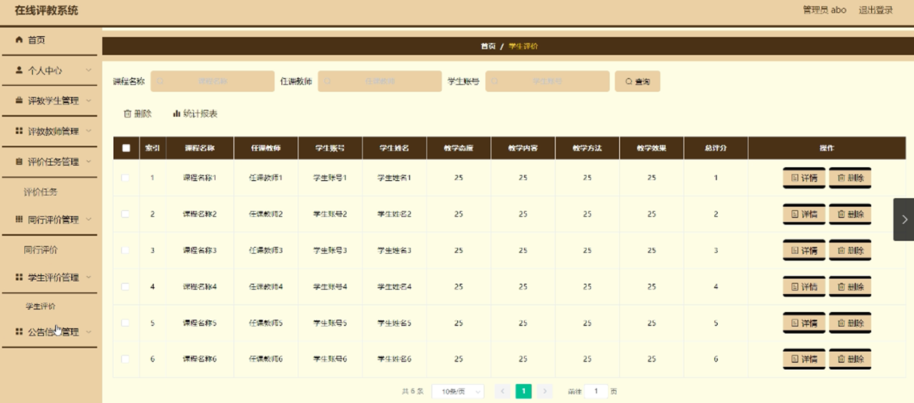

ssm+Vue计算机毕业设计在线评教系统（程序+LW文档）

**项目运行**

**环境配置：**

**Jdk1.8 + Tomcat7.0 + Mysql + HBuilderX** **（Webstorm也行）+ Eclispe（IntelliJ
IDEA,Eclispe,MyEclispe,Sts都支持）。**

**项目技术：**

**SSM + mybatis + Maven + Vue** **等等组成，B/S模式 + Maven管理等等。**

**环境需要**

**1.** **运行环境：最好是java jdk 1.8，我们在这个平台上运行的。其他版本理论上也可以。**

**2.IDE** **环境：IDEA，Eclipse,Myeclipse都可以。推荐IDEA;**

**3.tomcat** **环境：Tomcat 7.x,8.x,9.x版本均可**

**4.** **硬件环境：windows 7/8/10 1G内存以上；或者 Mac OS；**

**5.** **是否Maven项目: 否；查看源码目录中是否包含pom.xml；若包含，则为maven项目，否则为非maven项目**

**6.** **数据库：MySql 5.7/8.0等版本均可；**

**毕设帮助，指导，本源码分享，调试部署** **(** **见文末** **)**

### **4.1** **系统总体设计**

系统总体设计即对有关系统全局问题的设计，也就是设计系统总的处理方案，又称系统概要设计。它包括系统规划与系统功能设计等内容。

在线评教系统主要有三类用户。分别是管理员，评教学生，评教教师，详细规划如图4-1所示。

图4-1 系统规划图

其中各子模块的主要功能如下：

1、用户登录：用户进入网页先输入用户名与密码，选择权限登录，用户登录成功，要记录登录的用户名和登录类型。

2、详情在线评教信息：用户登录成功后，能够按分类或者查找在线评教信息进行管理。

4、主页内容管理：管理员登录以后，可以对首页，个人中心，评教学生管理，评教教师管理，评价任务管理，同行评价管理，学生评价管理，公告信息管理进行详细操作。

### **4.2** **数据库设计**

数据库是一个软件项目的根基，它决定了整个项目代码的走势，同时也决定了整个项目在后期的维护以及升级的难易程度。

#### **4.2.1** **数据库概念设计**

根据在线评教系统的功能需求，对数据库进行分析，得到相应的数据，设计用户需要的各种实体，以及相互之间的关联，为逻辑结构设计铺好路。根据所实体内的各种具体信息得于实现。

1.评教学生管理信息实体

评教学生管理信息实体包括用户名，密码，姓名，手机，邮箱等属性。评教学生信息实体图如图4-2所示：

图4-2.评教学生管理信息实体图

2.评教教师管理实体

评教学生实体包括索引，教师工号，教师姓名，性别，职称，联系电话，主教课程等属性；评教学生实体图如图4-3所示：

图4-3评教学生实体图

3.评价任务管理实体

评价任务管理实体包括索引，课程标题，课程名称，课程封面，任课教师，学院，学习账号，教师工号等属性。评价任务管理实体图如图4-4所示：

图4-4评价任务管理实体图

### **5.1** **功能页面实现**

按照不同功能模块，在此对系统所涉及的关键页面的实现细节进行阐述，包括页面功能描述，页面涉及功能分析，介绍以及界面展示。

系统登录：
运行系统，首先进入登录界面，按照登录界面的要求填写相应的“账号”和“密码”以及用户类型，点击“登录”然后系统判断填写是否正确，若正确进入相应的界面，否则给出要求先注册信息。具体流程如图5-1所示。

图5-1 登录流程图

登录，通过输入账号，密码，选择角色并点击登录进行系统登录操作，如图5-2所示。

图5-2登录界面图

### **5.** **2** **管理员功能模块**

管理员登录系统后，可以对首页，个人中心，评教学生管理，评教教师管理，评价任务管理，同行评价管理，学生评价管理，公告信息管理等功能进行相应操作，如图5-3所示。

图5-3管理员功能界面图

评教学生管理；在评教学生管理页面可以对索引，学生账号，学生姓名，性别，专业，联系电话等内容进行详情，修改或删除等操作，如图5-4所示。

图5-4评教学生管理界面图

评教教师管理；在评教教师管理页面可以对索引，教师工号，教师姓名，性别，职称，联系电话，主教课程等进行详情，修改或删除等操作，如图5-5所示。

图5-5评教教师管理界面图

评价任务管理；在评价任务管理页面可以对索引，课程标题，课程名称，课程封面，任课教师，学院，学习账号，教师工号等内容进行详情，修改或删除等操作，如图5-6所示。

图5-6评价任务管理界面图

同行评价管理；在同行评价管理页面可以对索引，课程名称，任课教师，教师工号，教师姓名，教学态度，教学内容，教学方法，教学效果，总评价等内容进行详情，删除等操作，如图5-7所示。

图5-7同行评价管理界面图

学生评价管理；在学生评价管理页面可以对索引，课程名称，任课教师，学生账号，教学态度，教学内容，教学效果，总评分等内容进行详情，删除等操作，如图5-8所示。

图5-8学生评价管理界面图

### **5.3** **评教学生功能模块**

评教学生登录进入系统后台，可以对首页，个人中心，评价任务管理，学生评价管理，公告信息管理等功能进行相应操作，如图5-9所示。

图5-9用户后台功能界面图

个人中心；在个人中心管理页面可以对学生账号，学生姓名，性别，专业，联系电话等内容进行修改操作，如图5-10所示。

图5-10个人中心管理界面图

评价任务管理；在评价任务管理页面可以对索引，课程标题，课程名称，课程封面，课程性质，任课教师，学院，学生张家辉，教师工号等内容进行详情，学生评价等操作，如图5-11所示。

图5-11评价任务管理界面图

### **5.4** **评教教师功能模块**

评教学生登录进入系统后台，可以对首页，个人中心，评价任务管理，同行评价管理，公告信息管理等功能进行相应操作，如图5-12所示。

图5-12用户后台功能界面图

**JAVA** **毕设帮助，指导，源码分享，调试部署**

