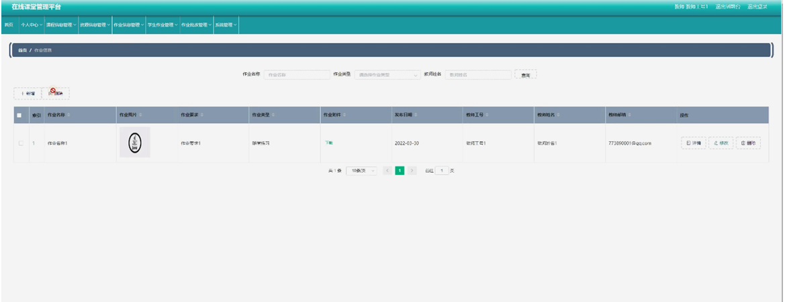

ssm+Vue计算机毕业设计在线课堂管理平台（程序+LW文档）

**项目运行**

**环境配置：**

**Jdk1.8 + Tomcat7.0 + Mysql + HBuilderX** **（Webstorm也行）+ Eclispe（IntelliJ
IDEA,Eclispe,MyEclispe,Sts都支持）。**

**项目技术：**

**SSM + mybatis + Maven + Vue** **等等组成，B/S模式 + Maven管理等等。**

**环境需要**

**1.** **运行环境：最好是java jdk 1.8，我们在这个平台上运行的。其他版本理论上也可以。**

**2.IDE** **环境：IDEA，Eclipse,Myeclipse都可以。推荐IDEA;**

**3.tomcat** **环境：Tomcat 7.x,8.x,9.x版本均可**

**4.** **硬件环境：windows 7/8/10 1G内存以上；或者 Mac OS；**

**5.** **是否Maven项目: 否；查看源码目录中是否包含pom.xml；若包含，则为maven项目，否则为非maven项目**

**6.** **数据库：MySql 5.7/8.0等版本均可；**

**毕设帮助，指导，本源码分享，调试部署** **(** **见文末** **)**

### 系统结构图

整个系统的模块划分包含学生管理模块、教师管理模块和管理员管理模块,
用户管理模块和管理员管理模块又划分了若干了子模块,为了方便更直观的理解,下图以图形形式给出关于整个网站的结构图。

网站总体功能结构图3-1如图所示：

图3-2网站总体功能结构图

### 数据库概念设计

在对数据库设计之前首先要分析一下在线课堂管理平台的功能，和各模块之间的关系，再对数据表进行设计。每一个模块的实体都会对应多个实体对象，下面是几个系统中的数据实体。

课程信息管理实体E-R图如图4-1所示：

图4-1课程信息管理E-R图

学生管理实体E-R图如图4-2所示：

图4-2学生管理实体E-R图

资源信息管理实体E-R图如图4-3所示：

图4-3资源信息管理实体E-R图

### 网站首页的设计

该界面是在线课堂管理平台的首页，界面设置要求界面简洁明了、操作简单、兼容性好。在考虑设计界面时，首先要考虑界面标准化设计，其次是完善界面设计，但不要因对界面的美化使界面的操作变得复杂，用户可在此页面进行登录等操作，页面顶部导航条是各模块的入口。

网站首页页面主要包括首页、课程信息、资源信息、作业信息、公告信息、个人中心、后台管理等内容，并根据需要进行详细操作；如图5-1所示：

图5-1网站首页界面图

学生注册，学生在注册页面通过输入学号、密码、姓名、手机进行注册，如图5-2所示。

图5-2学生注册、登录界面图

个人中心，学生可在个人中心页面通过输入学号、密码、姓名、性别、手机、上传图片等内容进行更新信息或查看我的收藏等内容，如图5-3所示。

图5-3个人中心界面图

课程信息，学生可在课程信息页面查看课程名称、开课班级、教师工号、教师姓名、联系电话、封面、课程资料等内容，还可进行收藏等操作，如图5-4所示。

图5-4课程信息界面图

作业信息，学生可在作业信息页面查看作业名称、作业要求、作业类型、封面、发布日期、教师工号、教师姓名、教师邮箱等内容，还可进行收藏或提交作业等操作，如图5-5所示。

图5-5作业信息界面图

后台管理，学生可在后台管理页面查看个人中心、学生作业管理、作业批改管理、我的收藏管理等内容，如图5-6所示。

图5-6学生后台功能界面图

学生作业管理，学生可在学生作业管理页面查看作业名称、教师工号、作业文件、提交日期、批改状态、学号、手机、审核回复、审核状态等内容，如图5-7所示。

图5-7学生作业管理界面图

我的收藏管理，学生可在我的收藏管理页面查看收藏名称、收藏图片、推荐类型等内容，还可进行删除等操作，如图5-8所示。

图5-8我的收藏管理界图面

作业批改管理，学生可在作业批改管理页面查看作业名称、教师工号、作业评分、批改日期、学号、手机等内容，如图5-9所示。

图5-9作业批改管理界面图

5.2教师功能模块

教师通过登录进入系统可查看个人中心、课程信息管理、资源信息管理、作业信息管理、学生作业管理、作业批改管理、系统管理等内容，如图5-10所示。

图5-10教师功能界面图

课程信息管理，教师可在课程信息管理页面查看课程名称、开课班级、课程图片、课程资料、教师工号、教师姓名、联系电话等内容，还可进行新增、修改或删除等操作，如图5-11所示。

图5-11课程信息管理界面图

作业信息管理，教师可在作业信息管理页面查看作业名称、作业图片、作业要求、作业类型、作业资料、发布日期、教师工号、教师姓名、教师邮箱等内容，还可进行新增、修改或删除等操作，如图5-12所示。

图5-12作业信息管理界面图

**JAVA** **毕设帮助，指导，源码分享，调试部署**

