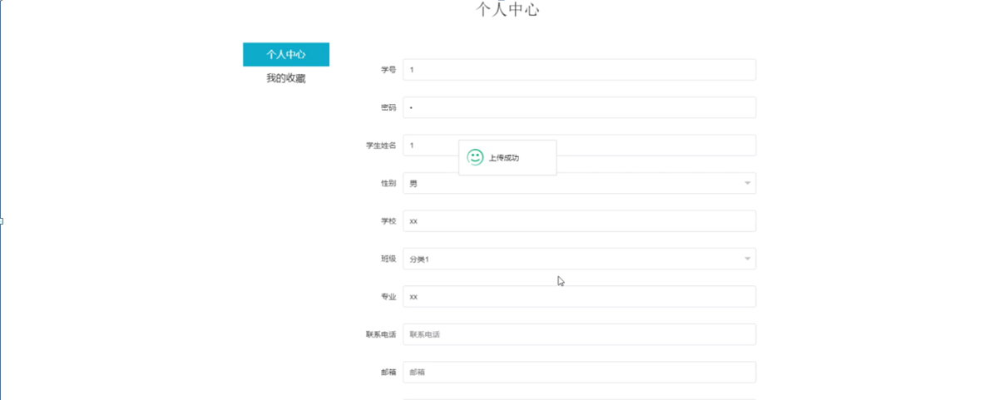

ssm+Vue计算机毕业设计在线辅导答疑系统（程序+LW文档）

**项目运行**

**环境配置：**

**Jdk1.8 + Tomcat7.0 + Mysql + HBuilderX** **（Webstorm也行）+ Eclispe（IntelliJ
IDEA,Eclispe,MyEclispe,Sts都支持）。**

**项目技术：**

**SSM + mybatis + Maven + Vue** **等等组成，B/S模式 + Maven管理等等。**

**环境需要**

**1.** **运行环境：最好是java jdk 1.8，我们在这个平台上运行的。其他版本理论上也可以。**

**2.IDE** **环境：IDEA，Eclipse,Myeclipse都可以。推荐IDEA;**

**3.tomcat** **环境：Tomcat 7.x,8.x,9.x版本均可**

**4.** **硬件环境：windows 7/8/10 1G内存以上；或者 Mac OS；**

**5.** **是否Maven项目: 否；查看源码目录中是否包含pom.xml；若包含，则为maven项目，否则为非maven项目**

**6.** **数据库：MySql 5.7/8.0等版本均可；**

**毕设帮助，指导，本源码分享，调试部署** **(** **见文末** **)**

### 系统结构设计

系统设计主要是管理员登录后对整个系统相关操作进行处理，可进行管理员的添加和删除，首页、个人中心、学生管理、教师管理、课程信息管理、提问信息管理、课程评价管理、班级类型管理、提问解答管理、系统管理等操作管理。

系统的功能结构图如下图所示。

图4-1系统功能结构图

#### E-R图设计

概念设计是整个数据库设计的关键，在概念设计阶段，由需求分析得到了E-
R模型。E-R图是识别功能模型与数据模型间关联关系的，在主题数据库的抽取和规范化的过程中，采用的是简化的E-R图表示方法，从而避免过繁过细的E-
R图表示影响规划的直观和可用性。是对现实世界的抽象和概括，是数据库设计人员进行数据可设计的有力工具，能够方便直接地表达应用中的各种语义知识，令一方面它简单、清晰、易于用户理解。

课程信息ER图如下图所示。

图4-2课程信息ER图

在线讲课管理ER图如下图所示。

图4-3在线讲课管理ER图

提问解答管理ER图如下图所示。

图4-4提问解答管理ER图

### 登录模块

系统登录模块可分为前台登录模块和后台登录模块，为确保系统安全性，系统操作员只有在登录界面输入正确的管理员名、密码、角色，单击“登录”按钮后才能够进入本系统的主界面。

管理员登录流程图如下所示。

图5-1管理员登录流程图

登录界面如下图所示。

图5-2登录界面图

### 5.2系统功能模块

在线辅导答疑系统，在系统首页可以查看首页、课程信息、在线讲课、系统简介、个人中心、后台管理等信息，如图5-3所示。

图5-3系统首页界面图

学生注册：在学生注册页面通过填写学号、密码、学生姓名、学校、专业、联系电话、邮箱、身份证等信息完成学生注册，如图5-4所示。

图5-4学生注册界面图

课程信息：在课程信息页面可以获取课程名称、课程编号、课程学时、学分、上课要求、教师姓名、教师工号等信息，根据需要进行申请操作，如图5-5所示。

图5-5课程信息界面图

在线讲课：在在线讲课页面可以查看课程名称、讲课时长、课程简介、难点解析、教师工号、教师姓名、在线视频等信息，如图5-6所示。

图5-6在线讲课界面图

我的：在个人中心页面可以通过填写用户信息等信息进行更新信息，根据需要对我的收藏进行相对应操作，如图5-7所示。

图5-7我的界面图

### 5.3管理员功能模块

管理员登录成功后进入到系统操作界面，可以对首页、个人中心、学生管理、教师管理、课程信息管理、提问信息管理、课程评价管理、班级类型管理、提问解答管理、系统管理等功能模块进行相对应操作。如图5-8所示。

图5-8管理员功能界面图

学生管理：在学生管理页面可以查看索引、学号、学生姓名、性别、学校、班级、专业、联系电话、邮箱、身份证、照片等信息，根据需要进行详情、修改或删除等操作，如图5-9所示。

图5-9学生管理界面图

教师管理：在教师管理页面可以查看索引、教师工号、教师姓名、性别、年龄、职称、主教课程、教龄、手机、邮箱、照片等信息，根据需要进行详情、修改或删除等操作，如图5-10所示。

图5-10教师管理界面图

课程信息管理：在课程信息管理页面可以查看索引、课程编号、课程名称、课程学时、学分、封面、教师姓名、教师工号等信息，根据需要进行详情、查看评论、修改或删除等操作，如图5-11所示。

图5-11课程信息管理界面图

提问信息管理：在提问信息管理页面可以查看索引、教师工号、教师姓名、课程名称、提问日期、学生姓名、学号等信息，根据需要进行详情、删除等操作，如图5-12所示。

图5-12提问信息管理界面图

#### **JAVA** **毕设帮助，指导，源码分享，调试部署**

