ssm+Vue计算机毕业设计在线问诊平台的信息储存安全分析（程序+LW文档）

**项目运行**

**环境配置：**

**Jdk1.8 + Tomcat7.0 + Mysql + HBuilderX** **（Webstorm也行）+ Eclispe（IntelliJ
IDEA,Eclispe,MyEclispe,Sts都支持）。**

**项目技术：**

**SSM + mybatis + Maven + Vue** **等等组成，B/S模式 + Maven管理等等。**

**环境需要**

**1.** **运行环境：最好是java jdk 1.8，我们在这个平台上运行的。其他版本理论上也可以。**

**2.IDE** **环境：IDEA，Eclipse,Myeclipse都可以。推荐IDEA;**

**3.tomcat** **环境：Tomcat 7.x,8.x,9.x版本均可**

**4.** **硬件环境：windows 7/8/10 1G内存以上；或者 Mac OS；**

**5.** **是否Maven项目: 否；查看源码目录中是否包含pom.xml；若包含，则为maven项目，否则为非maven项目**

**6.** **数据库：MySql 5.7/8.0等版本均可；**

**毕设帮助，指导，本源码分享，调试部署** **(** **见文末** **)**

### 4.1系统总体设计

系统总体设计即对有关系统全局问题的设计，也就是设计系统总的处理方案，又称系统概要设计。它包括系统规划与系统功能设计等内容。

在线问诊平台的信息储存安全分析主要有三类用户，分别是医生模块、患者模块和管理员模块，详细规划如图4-1所示。

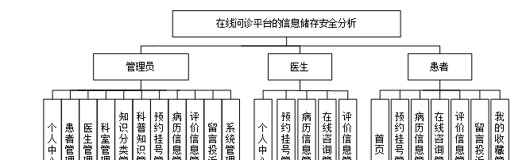

图4-1 系统规划图

其中各子模块的主要功能如下：

1、用户登录：用户进入网页先输入用户名与密码，选择权限登录，系统要记录登录的用户名和登录类型。

2、新用户注册：新用户填写账号、密码、姓名、手机、身份证号完成注册。

3、查看在线问诊平台的信息储存安全分析信息：用户登录成功后，能够按分类或者查找在线问诊平台的信息储存安全分析信息进行管理。

4、主页内容管理：管理员登录以后，可以对个人中心、患者管理、医生管理、科室管理、知识分类管理、科普知识管理、预约挂号管理、病历信息管理、评价信息管理、留言投诉、系统管理进行详细操作。

### 4.2数据库设计

数据库是一个软件项目的根基，它决定了整个项目代码的走势，同时也决定了整个项目在后期的维护以及升级的难易程度。

#### 4.2.1 数据库概念设计

根据在线问诊平台的信息储存安全分析的功能需求，对数据库进行分析，得到相应的数据，设计用户需要的各种实体，以及相互之间的关联，为逻辑结构设计铺好路。根据所实体内的各种具体信息得于实现。

1\. 患者管理实体

患者管理实体包括患者账号、患者姓名、头像、性别、手机号码、身份证号、患者住址等属性。患者管理实体图如图4-2所示：

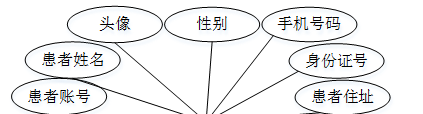

图4-2 患者管理实体图

2\. 在线咨询管理实体

在线咨询管理实体包括医生账号、医生姓名、咨询内容、咨询时间、患者账号、患者姓名、审核回复、审核状态等属性；在线咨询管理实体图如图4-3所示：

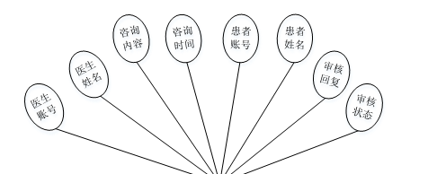

图4-3在线咨询管理实体图

### 5.1功能页面实现

按照不同功能模块，在此对系统所涉及的关键页面的实现细节进行阐述，包括页面功能描述，页面涉及功能分析，介绍以及界面展示。

系统登录：
运行系统，首先进入登录界面，按照登录界面的要求填写相应的“账号”和“密码”以及用户类型，点击“登录”然后系统判断填写是否正确，若正确进入相应的界面，否则给出要求先注册信息。具体流程如图5-1所示。

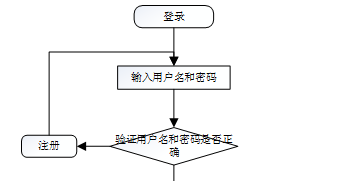

图5-1 登录流程图

登录，通过输入账号，密码，选择角色并点击登录进行系统登录操作，如图5-2所示。

图5-2登录界面图

### 5.2系统功能模块

在线问诊平台的信息储存安全分析，在系统首页可以查看首页、医生、科普知识、疫情资讯、留言投诉、个人中心、后台管理等内容进行详细操作，如图5-3所示。

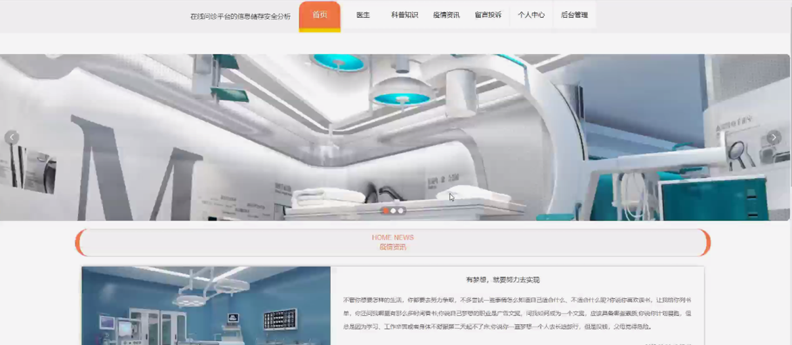

图5-3系统首页界面图

科普知识，患者可在科普知识页面查看标题、知识分类、发布日期等内容，还可进行收藏等操作，如图5-4所示。

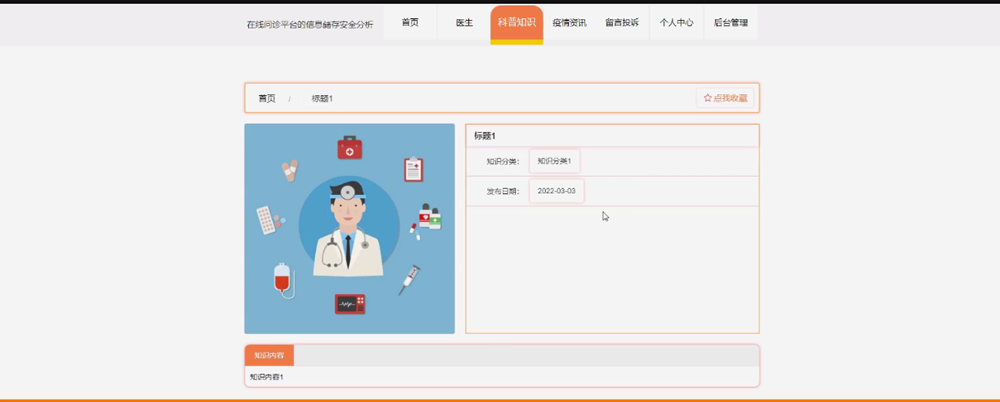

图5-4科普知识界面图

患者注册，患者通过输入患者账号、患者姓名、密码、手机号码、身份证号、患者住址等内容进行注册，如图5-5所示。

图5-5患者注册界面图

医生，患者可在医生页面查看医生姓名、医生账号、性别、从业年限、职称、科室、挂号费、擅长领域、个人简介、可预约时间等内容，还可进行预约挂号或在线咨询等操作，如图5-6所示。

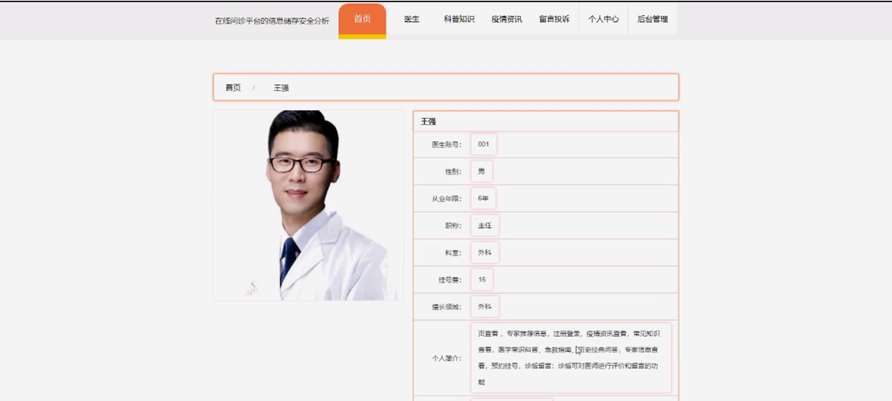

图5-6医生界面图

个人中心，患者可在个人中心页面通过输入患者账号、密码、患者姓名、上传图片、性别、手机号码、身份证号、患者住址等内容进行更新信息或查看我的收藏等内容，如图5-7所示。

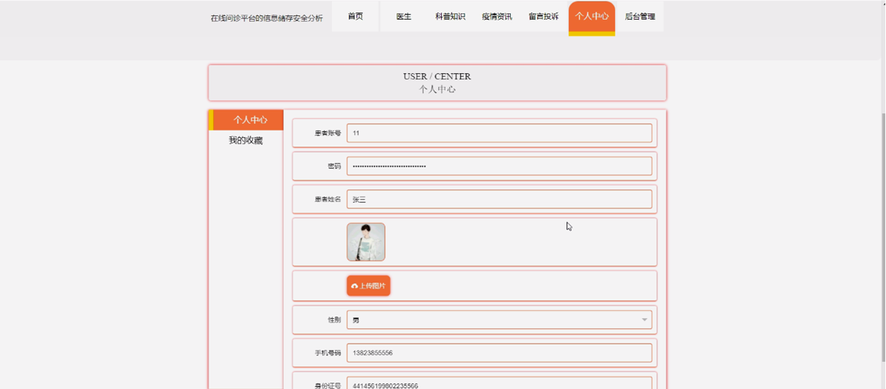

图5-7个人中心界面图

### 5.3患者功能模块

患者进入系统后台功能模块可查看个人中心、预约挂号管理、病历信息管理、在线咨询管理、评价信息管理、留言投诉、我的收藏管理等内容，如图5-8所示。

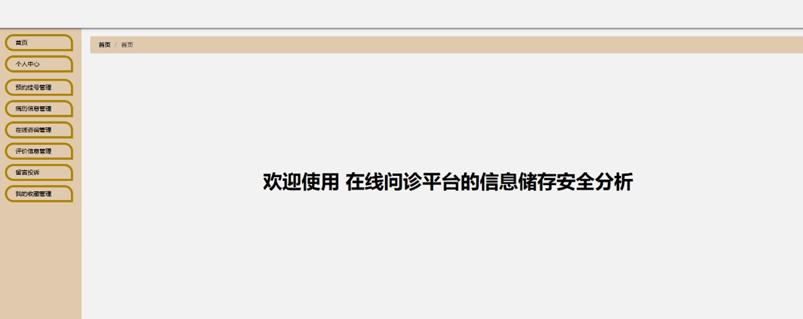

图5-8患者功能界图面

预约挂号管理，患者可在预约挂号管理页面查看预约编号、医生账号、医生姓名、职称、科室、挂号费、预约时间、患者账号、患者姓名、手机号码、身份证号、是否支付、审核回复、审核状态等内容，如图5-9所示。

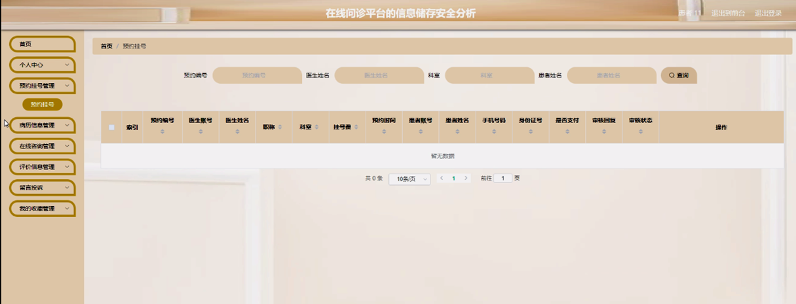

图5-9预约挂号管理界面图

在线咨询管理，患者可在在线咨询管理页面查看医生账号、医生姓名、咨询内容、咨询时间、患者账号、患者姓名、审核回复、审核状态等内容，如图5-10所示。

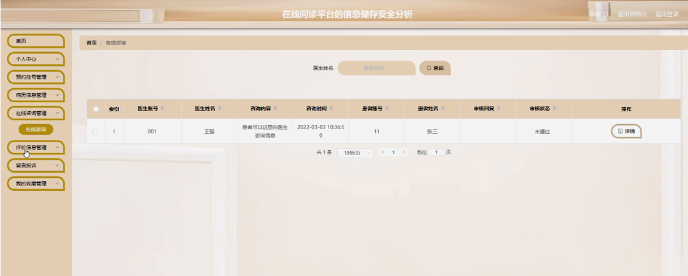

图5-10在线咨询管理界面图

评价信息管理，患者可在评价信息管理页面查看预约编号、医生账号、医生姓名、职称、科室、评价内容、评价时间、患者账号、患者姓名等内容，如图5-11所示。

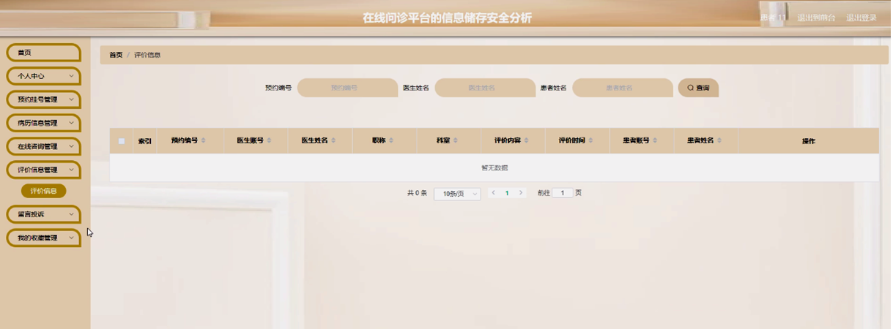

图5-11评价信息管理界面图

5.4管理员功能模块

管理员通过输入用户名、密码、角色进行登录进入系统，如图5-12所示。

图5-12管理员登录界面图

#### **JAVA** **毕设帮助，指导，源码分享，调试部署**

