ssm+Vue计算机毕业设计在线音乐网站（程序+LW文档）

**项目运行**

**环境配置：**

**Jdk1.8 + Tomcat7.0 + Mysql + HBuilderX** **（Webstorm也行）+ Eclispe（IntelliJ
IDEA,Eclispe,MyEclispe,Sts都支持）。**

**项目技术：**

**SSM + mybatis + Maven + Vue** **等等组成，B/S模式 + Maven管理等等。**

**环境需要**

**1.** **运行环境：最好是java jdk 1.8，我们在这个平台上运行的。其他版本理论上也可以。**

**2.IDE** **环境：IDEA，Eclipse,Myeclipse都可以。推荐IDEA;**

**3.tomcat** **环境：Tomcat 7.x,8.x,9.x版本均可**

**4.** **硬件环境：windows 7/8/10 1G内存以上；或者 Mac OS；**

**5.** **是否Maven项目: 否；查看源码目录中是否包含pom.xml；若包含，则为maven项目，否则为非maven项目**

**6.** **数据库：MySql 5.7/8.0等版本均可；**

**毕设帮助，指导，本源码分享，调试部署** **(** **见文末** **)**

### 系统结构

在线音乐网站，它是一个由人、电脑及其他组件构成的，一种能够收集、存储、加工、传送信息的系统。该系统可以帮助决策者找出当前急需解决的问题，然后将信息快速的反馈，使管理人员能够以最快的时间知道目前的状况，进行更进一步的计划。

当前MIS系统结构目前存在两种较为流行的结构：C/S和B/S两种。

C/S结构的系统：C/S结构就是客户机服务器结构，它可以法派任务到Client端和Server端来进行，充分利用两端硬件环境的优势，来降低系统的通讯的花费。客户端主要作用是处理人机交互，执行客户端应用程序，收集数据以及向服务器发送任务请求。服务器基本作用是执行后台程序，它主要对客户机的请求申请进行反馈，除此之外，它的作用还包括：数据库存储系统的共享管理、通讯管理、文件管理等等。

B/S结构的系统：这种网络结构简化了客户端，并把系统功能实现的中心集中到服务器上，在这种模式中，只需要一个浏览器就可以了。这种结构将很多的工作交予WEB服务器，只通过浏览器请求WEB服务，随后根据请求返回信息。

通常在只在企业网内部使用，采用C/S。而使用不仅限于内网的情况下使用B/S。考虑到本管理系统的一系列需求，所以，该系统开发使用B/S结构开发。其主要功能结构如下图所示。

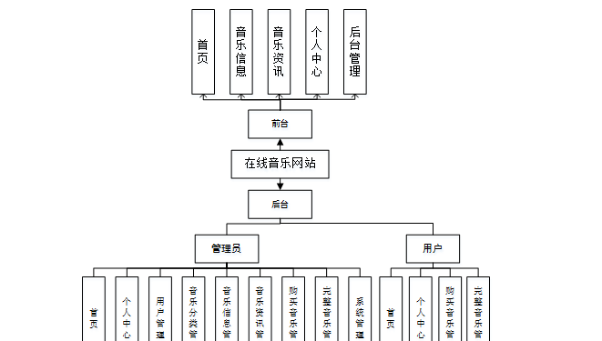

图4-1 系统总体功能结构图

### 4.2数据库设计

数据库设计是指为系统提供最优化的数据库模式，使得应用程序能够有效的存储数据，满足用户的各类需求。

#### 4.2.1 数据库概念结构设计

概念结构设计是根据用户需求形成的。用最常的E-R方法描述数据模型进行数据库的概念设计，首先设计局部的E-
R模式，最后各局部ER模式综合成一个全局模式。然后再把概念模式转换成逻辑模式。将概念设计从设计过程中独立开来，设计复杂程度降低，不受特定DBMS的限制。

1.所有实体和属性的定义如下所示。

音乐资讯属性图如下图4-2所示。

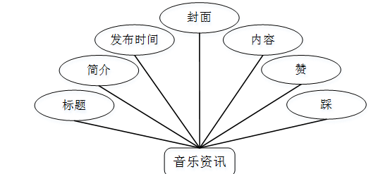

图4-2音乐资讯实体属性图

完整音乐实体属性图，如图4-3所示：

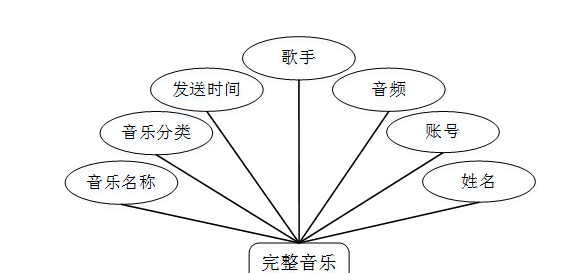

图4-3完整音乐实体属性图

### 系统功能模块

在线音乐网站，在网站首页可以查看首页，音乐信息，音乐资讯，个人中心，后台管理等内容，并进行详细操作；如图5-1所示。

图5-1网站首页界面图

音乐信息，在音乐信息页面可以查看音乐分类，歌手，编曲，填词，金额，语言，专辑，时长，发行方，发行日期，音频预览等内容，并进行购买音乐操作，如图5-2所示。

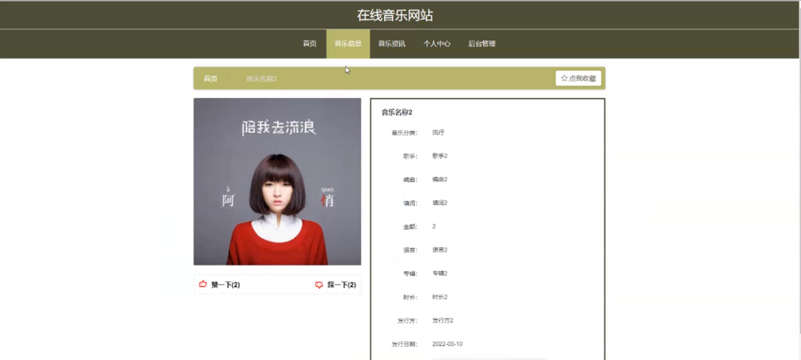

图5-2音乐信息界面图

音乐资讯，在音乐资讯页面可以查看简介，发布时间等内容，还可以进行评论和收藏等操作，如图5-3所示。

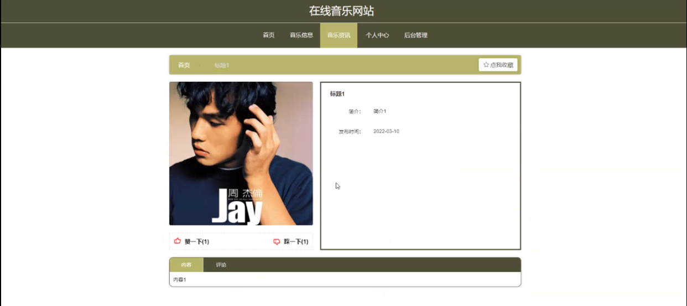

图5-3音乐资讯界面图

个人中心，在个人中心页面通过填写账号，密码，姓名，年龄，性别，手机，上传图片等内容进行更新信息操作，还可以对我的收藏进行详细操作；如图5-4所示。

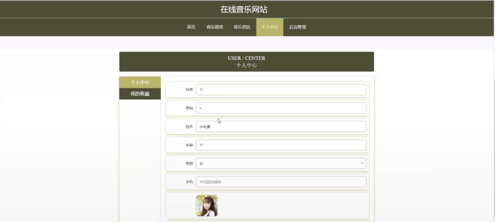

图5-4个人中心界面图

### 5.2管理员功能模块

管理员登录，管理员进入系统前在登录页面根据要求填写用户名和密码，选择角色等信息，点击登录进行登录操作，如图5-5所示。

图5-5管理员登录界面图

管理员登录网站后，可以对首页，个人中心，用户管理，音乐分类管理，音乐信息管理，音乐资讯管理，购买音乐管理，完整音乐管理，系统管理等功能进行相应的操作管理，如图5-6所示。

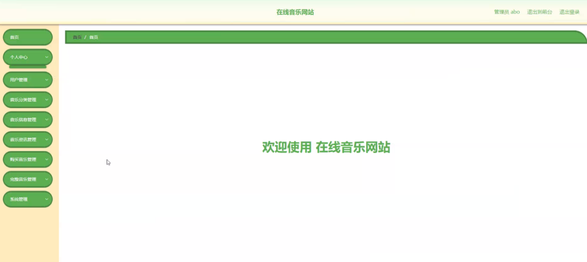

图5-6管理员功能界面图

用户管理，在用户管理页面可以对索引，账号，姓名，年龄，性别，手机，照片等内容进行详情，修改和删除等操作，如图5-7所示。

图5-7用户管理界面图

音乐分类管理，在音乐分类管理页面可以对索引，音乐分类等内容进行详情，修改和删除等操作，如图5-8所示。

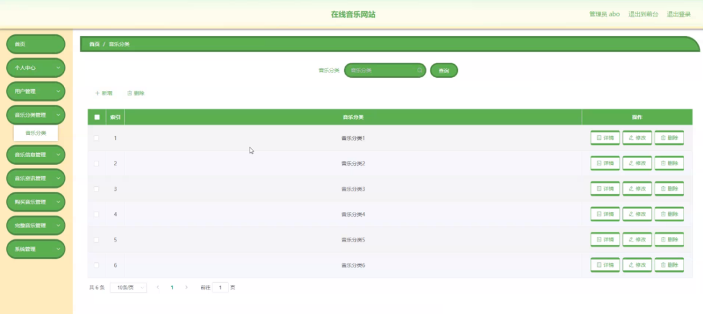

图5-8音乐分类管理界面图

音乐信息管理，在音乐信息管理页面可以对索引，音乐名称，音乐分类，封面，歌手，编曲，填词，金额，音频预览，语言，专辑，时长，发行方，发行日期等内容进行详情，修改，查看评论和删除等操作，如图5-9所示。

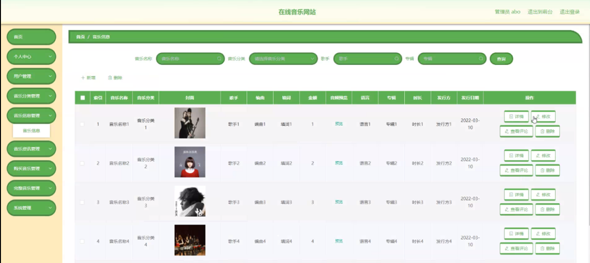

图5-9音乐信息管理界面图

音乐资讯管理，在音乐资讯管理页面可以对索引，标题，发布时间，封面等内容进行详情，修改，查看评论和删除等操作，如图5-10所示。

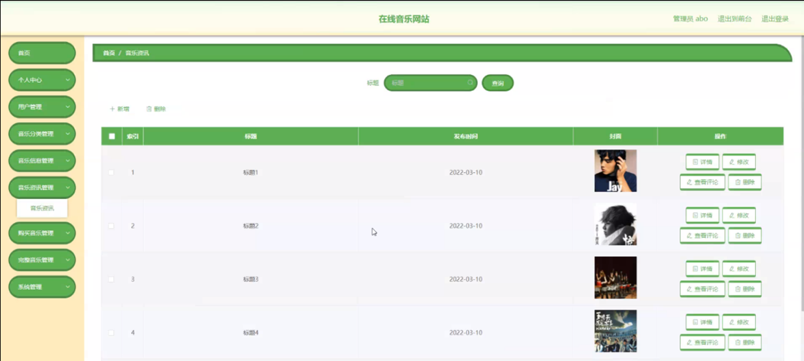

图5-10音乐资讯管理界面图

购买音乐管理，在购买音乐管理页面可以对索引，音乐名称，音乐分类，封面，金额，歌手，备注，下单时间，账号，姓名，是否支付等内容进行详情，发送音乐和删除等操作，如图5-11所示。

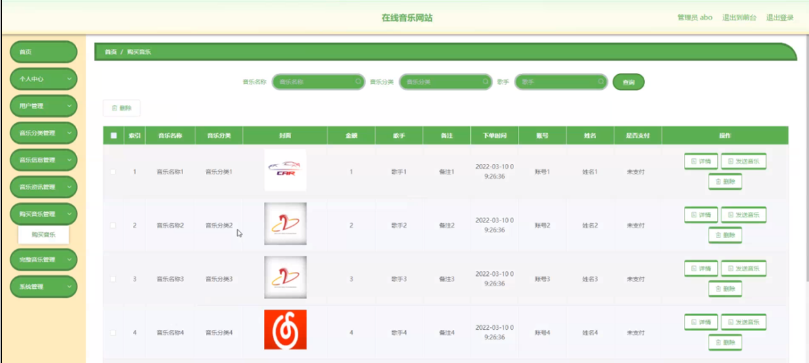

图5-11购买音乐管理界面图

### 5.3用户功能模块

用户登录进入在线音乐网站可以对：首页，个人中心，购买音乐管理，完整音乐管理等功能进行相应操作，如图5-12所示。

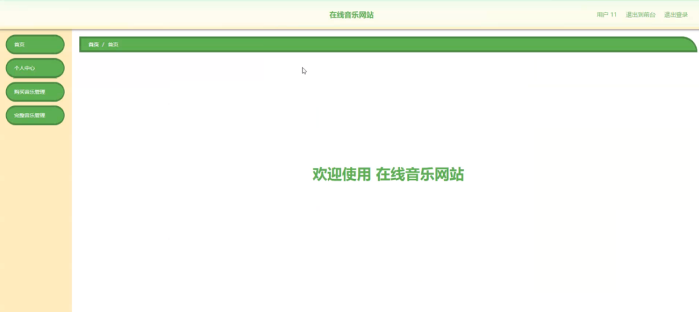

图5-12用户功能界面图

#### **JAVA** **毕设帮助，指导，源码分享，调试部署**

