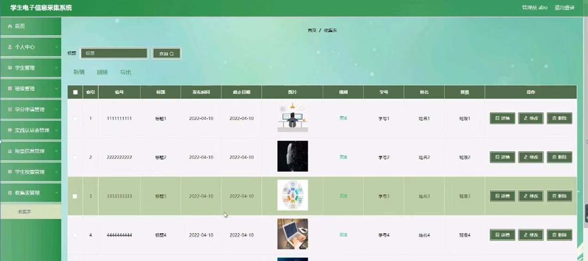

ssm+Vue计算机毕业设计学s电学信息采集系统（程序+LW文档）

**项目运行**

**环境配置：**

**Jdk1.8 + Tomcat7.0 + Mysql + HBuilderX** **（Webstorm也行）+ Eclispe（IntelliJ
IDEA,Eclispe,MyEclispe,Sts都支持）。**

**项目技术：**

**SSM + mybatis + Maven + Vue** **等等组成，B/S模式 + Maven管理等等。**

**环境需要**

**1.** **运行环境：最好是java jdk 1.8，我们在这个平台上运行的。其他版本理论上也可以。**

**2.IDE** **环境：IDEA，Eclipse,Myeclipse都可以。推荐IDEA;**

**3.tomcat** **环境：Tomcat 7.x,8.x,9.x版本均可**

**4.** **硬件环境：windows 7/8/10 1G内存以上；或者 Mac OS；**

**5.** **是否Maven项目: 否；查看源码目录中是否包含pom.xml；若包含，则为maven项目，否则为非maven项目**

**6.** **数据库：MySql 5.7/8.0等版本均可；**

**毕设帮助，指导，本源码分享，调试部署** **(** **见文末** **)**

### 系统功能结构

一、学生管理功能

该部分内容包含了首页，个人中心，班级管理，学分申请管理，实践认证表管理，投票信息管理，学生投票管理，收集表管理等功能。

二、管理员管理功能

该部分内容包含了首页，个人中心，学生管理，班级管理，学分申请管理，实践认证表管理，投票信息管理，学生投票管理，收集表管理等功能。管理员可对所有的信息进行增、删、改、查，能对学生信息进行管理,更新最近的学生电子信息采集。

为了方便更直观的理解,下图以图形形式给出关于整个网站的结构图。网站总体功能结构图3-1如图所示：

图3-1系统总体功能结构图

### 数据库概念设计

在对数据库设计之前首先要分析一下学生电子信息采集系统的功能，和各模块之间的关系，再对数据表进行设计。每一个模块的实体都会对应多个实体对象，下面是几个系统中的数据实体如下所示。

学生注册实体E-R图如图4-1所示：

图4-1学生注册E-R图

实践认证表管理E-R图如图4-2所示：

图4-2实践认证表管理E-R图

班级管理实体E-R图如图4-3所示：

图4-3班级管理实体E-R图

系统登录，用户进入系统前在登录页面根据要求填写用户名和密码，选择角色等信息，点击登录进行登录操作，如图5-1所示。

图5-1系统登录界面图

### 5.1管理员功能模块

管理员登录系统后，可以对首页，个人中心，学生管理，班级管理，学分申请管理，实践认证表管理，投票信息管理，学生投票管理，收集表管理等功能进行相应的操作管理，如图5-2所示。

图5-2管理员功能界面图

学生管理，在学生管理页面可以对首页，学号，姓名，性别，学生电话，头像，班级，专业等内容进行详情，修改和删除等操作，如图5-3所示。

图5-3学生管理界面图

班级管理，在班级管理页面可以对索引，班级，专业，班级人数，班主任等内容进行详情，修改和删除等操作，如图5-4所示。

图5-4班级管理界面图

学分申请管理，在学分申请管理页面可以对索引，申请编号，申请标题，申请时间，学号，姓名，班级，审核回复，审核状态，审核等内容进行详情，修改和删除等操作，如图5-5所示。

图5-5学分申请管理界面图

实践认证表管理，在实践认证表管理页面可以对索引，编号，实践标题，登记时间，学号，姓名，班级等内容进行申请，修改，删除等操作，如图5-6所示。

图5-6实践认证表管理界面图

投票信息管理，在投票信息管理页面可以对索引，编号，标题，发布时间，投票数等内容进行详情，修改和删除等操作，如图5-7所示。

图5-7投票信息管理界面图

学生投票管理，在学生投票管理页面可以对索引，投票编号，标题，投票时间，投票数，学号，姓名等内容进行详情修改和删除等操作，如图5-8所示。

图5-8学生投票管理界面图

收集表管理，在收集表页面可以对索引，编号，标题，发布时间，截止日期，图片，视频，学号，姓名，班级等内容进行详情，修改和删除等操作，如图5-9所示。

图5-9收集表管理界面图

### 5.2学生功能模块

学生登录进入系统可以对首页，个人中心，班级管理，学分申请管理，实践认证表管理，投票信息管理，学生投票管理，收集表管理等功能进行详细操作，如图5-10所示。

图5-10学生功能界面图

个人中心，在个人信息页面通过填写学号，性别，头像，班级，姓名，学生电话，专业等内容并提交进行个人信息修改操作，如图5-11所示。

图5-11个人中心界面图

班级管理，在班级管理页面可以对索引，班级，专业，班级人数，班主任等内容进行详情操作，如图5-12所示。

图5-12班级管理界面图

#### **JAVA** **毕设帮助，指导，源码分享，调试部署**

