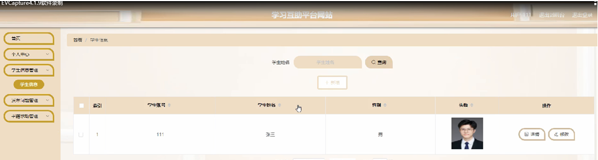

ssm+Vue计算机毕业设计学习互助平台网站（程序+LW文档）

**项目运行**

**环境配置：**

**Jdk1.8 + Tomcat7.0 + Mysql + HBuilderX** **（Webstorm也行）+ Eclispe（IntelliJ
IDEA,Eclispe,MyEclispe,Sts都支持）。**

**项目技术：**

**SSM + mybatis + Maven + Vue** **等等组成，B/S模式 + Maven管理等等。**

**环境需要**

**1.** **运行环境：最好是java jdk 1.8，我们在这个平台上运行的。其他版本理论上也可以。**

**2.IDE** **环境：IDEA，Eclipse,Myeclipse都可以。推荐IDEA;**

**3.tomcat** **环境：Tomcat 7.x,8.x,9.x版本均可**

**4.** **硬件环境：windows 7/8/10 1G内存以上；或者 Mac OS；**

**5.** **是否Maven项目: 否；查看源码目录中是否包含pom.xml；若包含，则为maven项目，否则为非maven项目**

**6.** **数据库：MySql 5.7/8.0等版本均可；**

**毕设帮助，指导，本源码分享，调试部署** **(** **见文末** **)**

### 系统功能

通过前面的功能分析可以将学习互助平台网站的功能分为管理员和用户两个部分，系统的主要功能包括首页，个人中心，用户管理，学生信息管理，发布问题管理，书籍求助管理，书籍分类管理，交流论坛，系统管理等内容。任何用户只要进入网站不需登录也可浏览到的信息，后台管理是针对已登录的用户看到学习信息而设计的。

1、一般用户的功能及权限

所谓一般用户就是指还没有注册的过客，他们可以浏览主页面上的信息。但如果要进入后台进行信息管理时，要登录注册，只有注册成功才有的权限。

2、管理员的功能及权限

用户信息的添加和管理，学习互助详细信息和文档信息添加，管理网站信息，这些都是管理员的功能。

3、系统功能结构图

系统功能结构图是系统设计阶段，系统功能结构图只是这个阶段一个基础，整个系统的架构决定了系统的整体模式，是系统的根据。学习互助平台网站的整个设计结构如图3-1所示。

图3-1系统功能结构图

### 数据库设计

信息管理系统的效率和实现的效果完全取决于数据库结构设计的好坏。为了保证数据的完整性，提高数据库存储的效率，那么统一合理地设计数据库结构是必要的。数据库设计一般包括如下几个步骤：

（1）根据用户需求，确定数据库信息进行保存

对用户的需求分析是数据库设计的第一阶段，用户的需求调研，熟悉学习互助平台运作流程，系统要求，这些都是以概念模型为基础的。

（2）设计数据的概念模型

概念模型与数据建模用户的观点一致，用于信息世界的建模工具。通过E-R图可以清楚地描述系统涉及到的实体之间的相互关系。

用户注册实体图如图4-1所示：

图4-1用户注册实体图

发布问题实体图如图4-2所示：

图4-2发布问题实体图

### 系统功能模块

学习互助平台网站，在网站首页可以查看首页，学生信息，发布问题，书籍求助，交流论坛，公告信息，个人中心，后台管理等内容进行详细操作，如图5-1所示。

图5-1网站首页界面图

用户注册，在用户注册页面通过填写学生账号，密码，确认密码，学生姓名，联系方式等信息完成用户注册，如图5-2所示。

图5-2用户注册界面图

发布问题，在发布问题页面可以查看标题，类型，问题描述，发布日期，学生账号，学生姓名等详细内容，并进行添加到 赞一下，踩一下，点我收藏等操作，如图5-3所示。

图5-3发布问题界面图

个人中心，在个人中心页面通过填写用学生账号，密码，学生姓名，性别，联系方式，头像
等信息进行更新信息，根据需要对我的发布，我的收藏进行详细操作，如图5-4所示。

图5-4个人中心界面图

### 5.2管理员功能模块

登录，通过输入用户，密码，选择角色等信息进行系统登录，如图5-5所示。

图5-5登录界面图

管理员登录系统后，可以对首页，个人中心，用户管理，学生信息管理，发布问题管理，书籍求助管理，书籍分类管理，交流论坛，系统管理等功能模块进行相应操作，如图5-6所示。

图5-6管理员功能界面图

用户管理，在用户管理页面可以对索引，学生姓名，性别，联系方式，头像等信息进行详情，修改和删除等操作，如图5-7所示。

图5-7用户管理界面图

发布问题管理，在发布问题管理页面可以对索引，标题，类型，图片，发布日期，学生账号，学生姓名，审核回复，审核状态，审核等内容进行详情，修改，查看评论和删除等操作，如图5-8所示。

图5-8发布问题管理界面图

书籍求助管理，在书籍求助管理页面可以对索引，求助编号，书籍名称，书籍分类，封面，学生账号，学生姓名，联系方式，审核回复，审核状态，审核等内容进行详情，修改，查看评论和删除等操作，如图5-9所示。

图5-9书籍求助管理界面图

交流论坛，在交流论坛页面可以对索引，帖子标题，用户名，状态等内容进行详情，修改和删除等操作，如图5-10所示。

图5-10交流论坛界面图

### 5.3用户功能模块

用户登录进入系统，可以对首页，个人中心，学生信息管理，发布问题管理，书籍求助管理等功能模块进行相应操作，如图5-11所示。

图5-11用户功能界面图

学生信息管理，在学生信息管理页面可以对索引，学生账号，学生姓名，性别，头像等信息进行详情，修改等操作，如图5-12所示。

图5-12学生信息管理界面图

#### **JAVA** **毕设帮助，指导，源码分享，调试部署**

