ssm+Vue计算机毕业设计学习和分享做菜web系统（程序+LW文档）

**项目运行**

**环境配置：**

**Jdk1.8 + Tomcat7.0 + Mysql + HBuilderX** **（Webstorm也行）+ Eclispe（IntelliJ
IDEA,Eclispe,MyEclispe,Sts都支持）。**

**项目技术：**

**SSM + mybatis + Maven + Vue** **等等组成，B/S模式 + Maven管理等等。**

**环境需要**

**1.** **运行环境：最好是java jdk 1.8，我们在这个平台上运行的。其他版本理论上也可以。**

**2.IDE** **环境：IDEA，Eclipse,Myeclipse都可以。推荐IDEA;**

**3.tomcat** **环境：Tomcat 7.x,8.x,9.x版本均可**

**4.** **硬件环境：windows 7/8/10 1G内存以上；或者 Mac OS；**

**5.** **是否Maven项目: 否；查看源码目录中是否包含pom.xml；若包含，则为maven项目，否则为非maven项目**

**6.** **数据库：MySql 5.7/8.0等版本均可；**

**毕设帮助，指导，本源码分享，调试部署** **(** **见文末** **)**

### 系统的结构划分

本网站可以分为:用户使用的功能、美食家使用的功能和管理员进行管理的功能。

用户使用功能：登陆、注册验证，首页、个人中心、厨房点滴管理、好友管理等。

美食家使用功能：登陆、注册验证，首页、个人中心、菜谱信息管理等。

管理员管理功能：登陆验证，首页、个人中心、菜谱分类管理、口味管理、用户管理、美食家管理、菜谱信息管理、厨房点滴管理、交流论坛、系统管理等。

学习和分享做菜WEB系统的结构图3-1所示：首页、个人中心、菜谱信息管理等

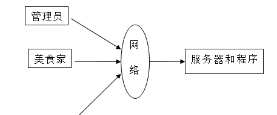

图3-1系统结构

登录系统结构图，如图3-2所示：

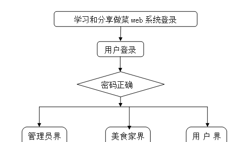

图3-2登录结构图

这些功能可以充分满足学习和分享做菜web系统的需求。此系统功能较为全面如下图系统功能结构如图3-3所示。

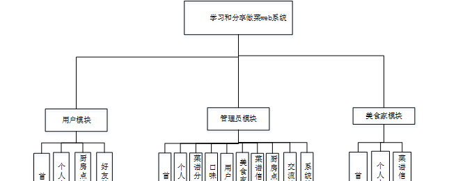

图3-3系统功能结构图

### 系统实现

#### 4.2.1系统功能模块

学习和分享做菜WEB系统，在系统首页可以查看首页、菜谱信息、厨房点滴、交流论坛、美食资讯、个人中心、后台管理等内容，如图4-1所示。

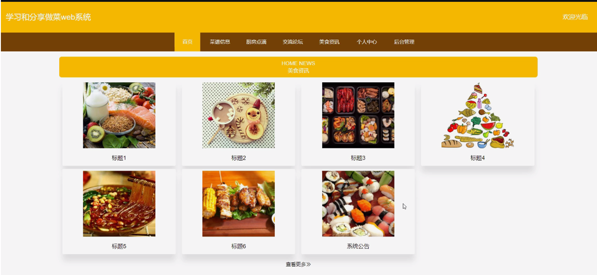

图4-1系统功能界面图

菜谱信息：在菜谱信息页面输入菜谱分类、口味、难度、烹饪时长、美食家编号、烹饪方法、点击次数等内容；进行赞一下、评论或收藏等操作，如图4-2所示。

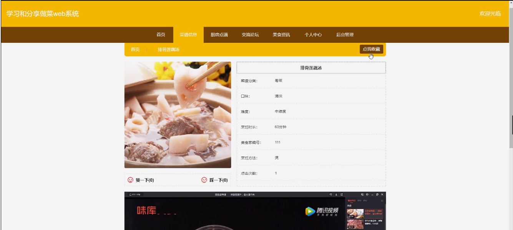

图4-2菜谱信息界面图

厨房点滴；在厨房点滴页面填写菜品名称、菜谱分类、口味、烹饪方法、用户账号、点击次数等内容，进行评论或收藏等操作；如图4-3所示。

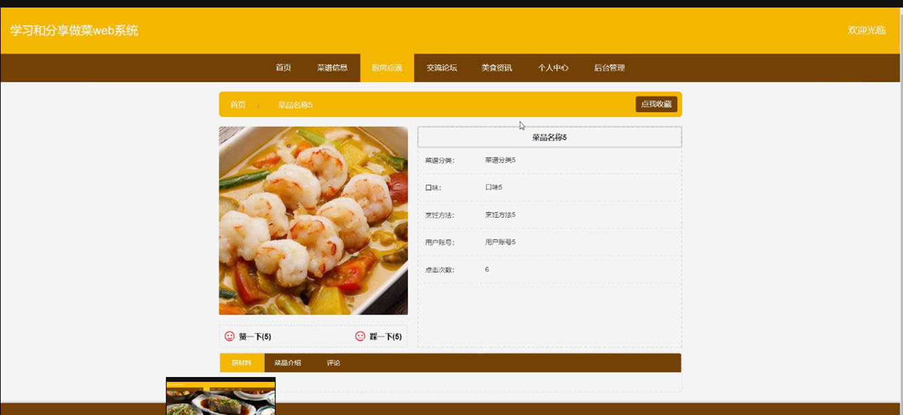

图4-3厨房点滴界面图

个人中心；在个人中心页面输入用户账号、用户姓名、密码、性别、年龄、联系电话等那内容进行更新信息；并根据我的发布、我的收藏进行相应的操作；如图4-4所示。

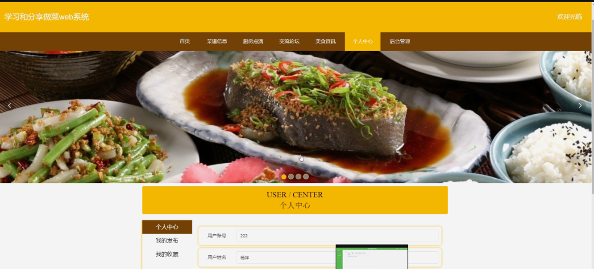

图4-4个人中心界面图

#### 4.2.2管理员功能模块

管理员登录，通过填写注册时输入的用户名、密码选择角色进行登录，如图4-5所示。

图4-5管理员登录界面图

管理员：在管理员页面中可以查看首页、个人中心、菜谱分类管理、口味管理、用户管理、美食家管理、菜谱信息管理、厨房点滴管理、交流论坛、系统管理；如图4-6所示。

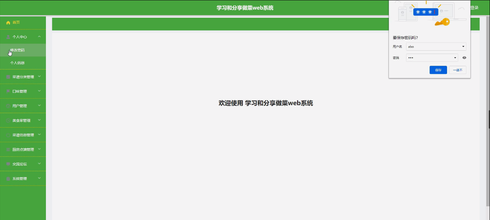

图4-6管理员功能界面图

菜谱分类管理；在菜谱分类管理页面中可以对索引、菜谱分类等内容进行详情、修改或删除等操作；如图4-7所示。

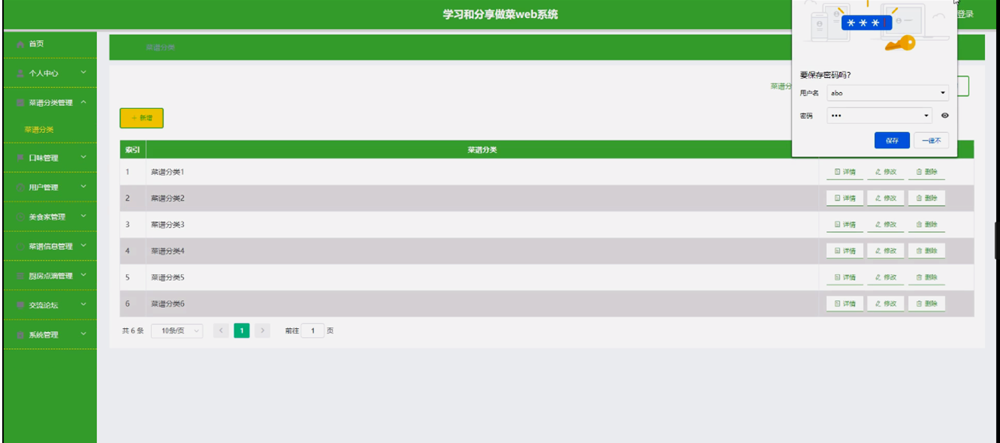

图4-7菜谱分类管理界面图

口味管理：在口味管理页面可以对索引、口味等内容进行详情、修改或删除等操作，如图4-8所示。

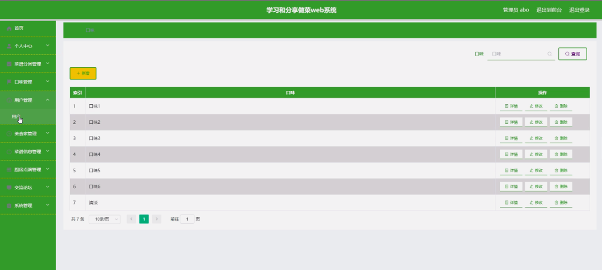

图4-8口味管理界面图

用户管理：在用户管理页面可以对索引、用户账号、用户姓名、性别、年龄、联系电话等内容，进行详情、修改或删除等详细操作，如图4-9所示。

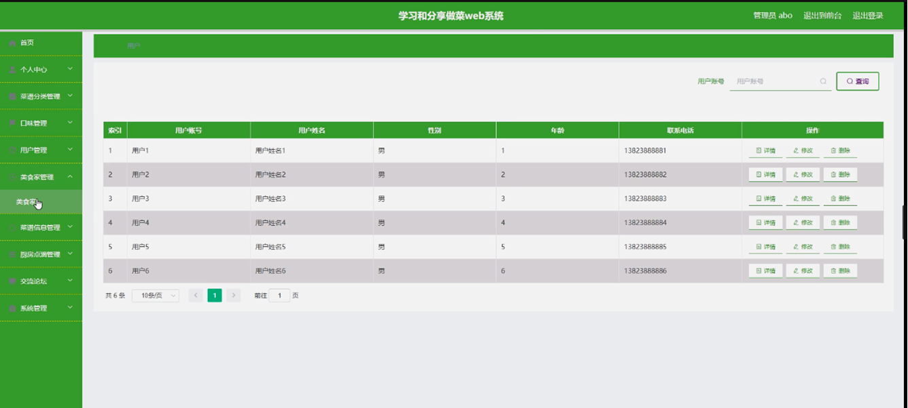

图4-9用户管理界面图

美食家管理：在美食家管理页面可以对索引、美食家编号、美食家姓名、性别、联系电话、教师邮箱等内容，进行详情、修改或删除等详细操作，如图4-10所示。

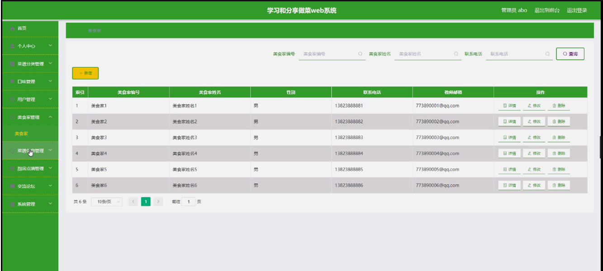

图4-10美食家管理界面图

菜谱信息管理；在菜谱信息管理页面可以对索引、菜品名称、菜谱分类、口味、难度、烹饪时长、视频、图片、美食家编号、烹饪方法等内容，进行详情、查看评论或删除等操作；如图4-11所示。

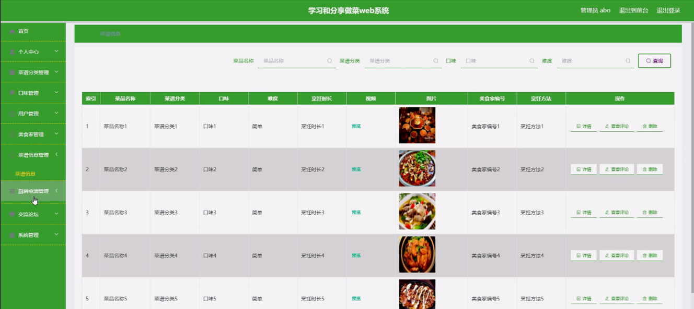

图4-11菜谱信息管理界面图

厨房点滴管理：在厨房点滴管理页面可以对索引、菜品名称、菜谱分类、口味、烹饪方法、用户账号、图片等内容；详情、查看评论或删除等操作，如图4-12所示。

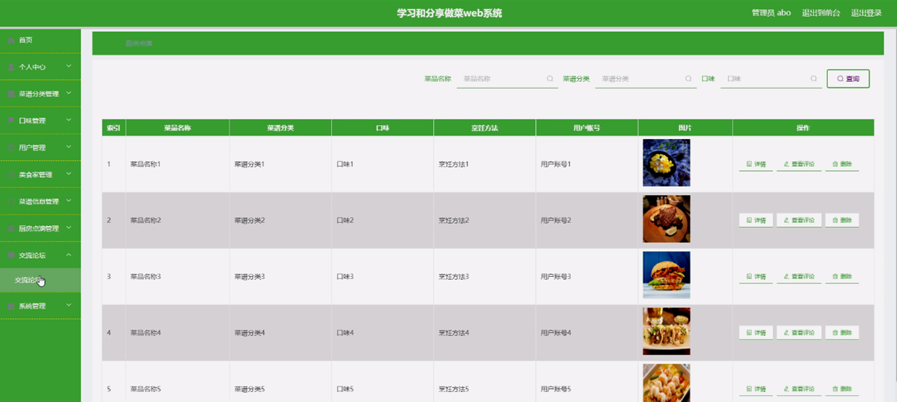

图4-12厨房点滴管理界面图

#### **JAVA** **毕设帮助，指导，源码分享，调试部署**

