ssm+Vue计算机毕业设计学习管理系统（程序+LW文档）

**项目运行**

**环境配置：**

**Jdk1.8 + Tomcat7.0 + Mysql + HBuilderX** **（Webstorm也行）+ Eclispe（IntelliJ
IDEA,Eclispe,MyEclispe,Sts都支持）。**

**项目技术：**

**SSM + mybatis + Maven + Vue** **等等组成，B/S模式 + Maven管理等等。**

**环境需要**

**1.** **运行环境：最好是java jdk 1.8，我们在这个平台上运行的。其他版本理论上也可以。**

**2.IDE** **环境：IDEA，Eclipse,Myeclipse都可以。推荐IDEA;**

**3.tomcat** **环境：Tomcat 7.x,8.x,9.x版本均可**

**4.** **硬件环境：windows 7/8/10 1G内存以上；或者 Mac OS；**

**5.** **是否Maven项目: 否；查看源码目录中是否包含pom.xml；若包含，则为maven项目，否则为非maven项目**

**6.** **数据库：MySql 5.7/8.0等版本均可；**

**毕设帮助，指导，本源码分享，调试部署** **(** **见文末** **)**

### 系统结构

本系统架构网站系统，本系统的具体功能如下：

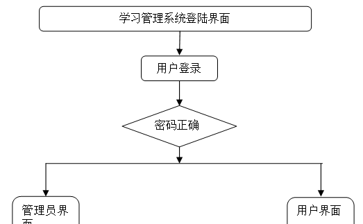

图4-2系统功能结构图

管理员功能结构图，如图4-3所示：

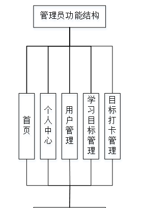

图4-3 管理员功能结构图

用户功能结构图，如图4-4所示：

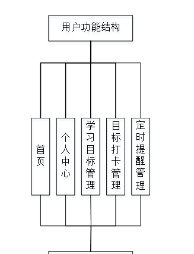

图4-4 用户功能结构图

### 4.3. 数据库设计

#### 4.3.1 数据库实体

管理员信息结构图，如图4-5所示：

图4-5 管理员信息实体结构图

学习目标管理实体属性图，如图4-6所示：

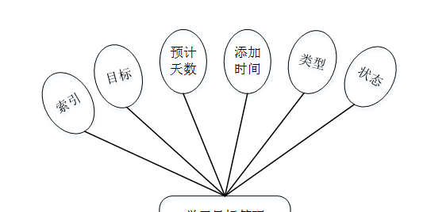

图4-6学习目标管理实体属性图

用户信息实体属性图，如图4-7所示：

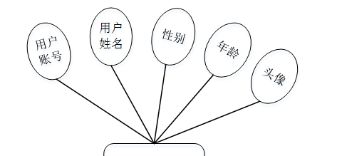

图4-7用户信息实体属性图

### 管理员功能模块

管理员登录，管理员通过输入账号，密码，角色等信息即可进行系统登录，如图5-1所示。

图5-1管理员登录界面图

管理员登录进入学习管理系统可以查看首页、个人中心、用户管理、学习目标管理、目标打卡管理等内容，如图5-2所示。

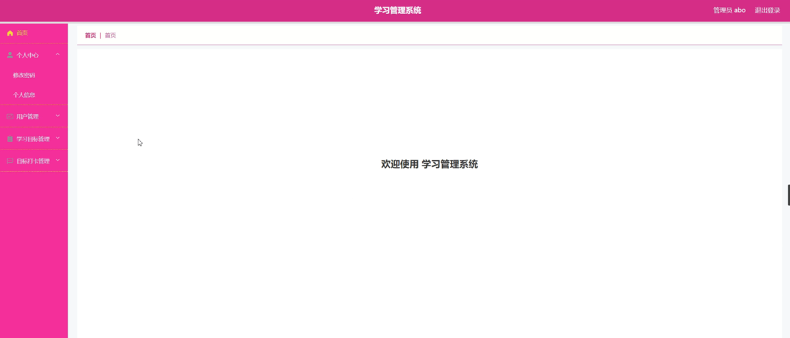

图5-2管理员功能界面图

用户管理，在用户管理页面可以查看索引、用户账号、密码、用户姓名、性别、年龄、头像等信息，并可根据需要进行修改或删除等操作，如图5-3所示。

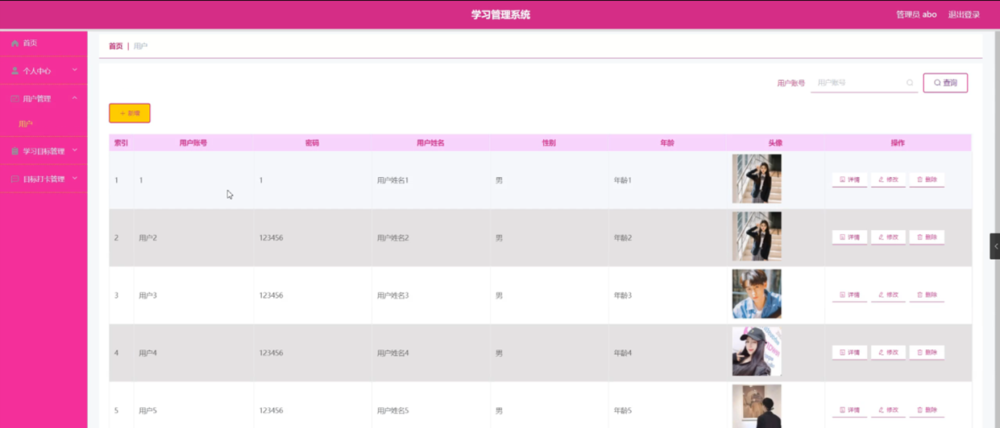

图5-3用户管理界面图

学习目标管理，在学习目标管理页面可以查看索引、目标、预计天数、添加时间、类型、状态等信息，并可根据需要进行修改或删除等操作，如图5-4所示。

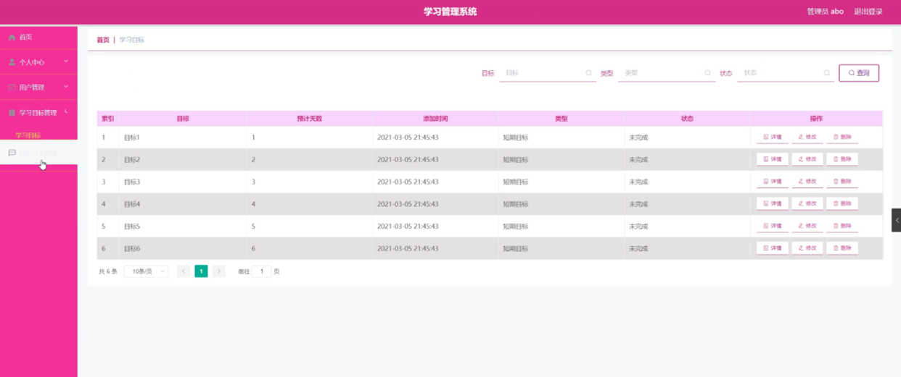

图5-4学习目标管理界面图

目标打卡管理，在目标打卡管理页面可以查看索引、目标、打卡时间、学习时长等信息，并可根据需要进行修改或删除等操作，如图5-5所示。

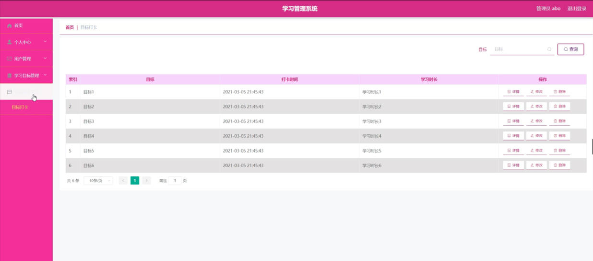

图5-5目标打卡管理界面图

### 5.2用户功能模块

用户登录进入学习管理系统可以查看首页、个人中心、学习目标管理、目标打卡管理、定时提醒管理等内容，如图5-6所示。

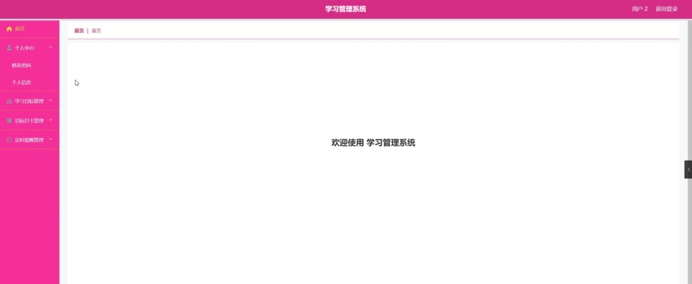

图5-6用户功能界面图

个人中心，在个人中心页面通过填写用户账号、用户姓名、性别、年龄、头像等信息进行修改，如图5-7所示。

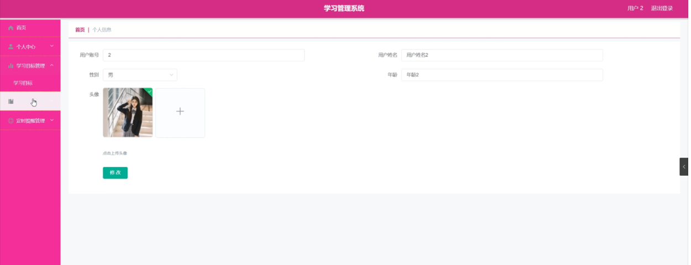

图5-7个人中心界面图

学习目标管理，在学习目标管理页面可以查看索引、目标、预计天数、添加时间、类型、状态等信息，并可根据需要进行打卡、添加提醒，如图5-8所示。

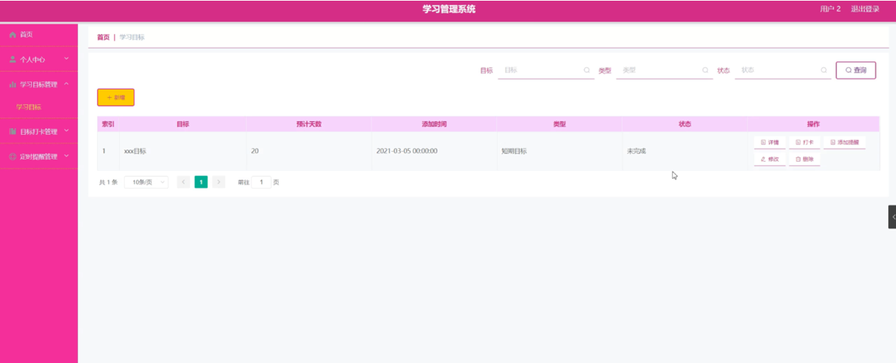

图5-8学习目标管理界面图

目标打卡管理，在目标打卡管理页面可以查看索引、目标、打卡时间、学习时长等信息，并可根据需要进行修改或删除等操作，如图5-9所示。

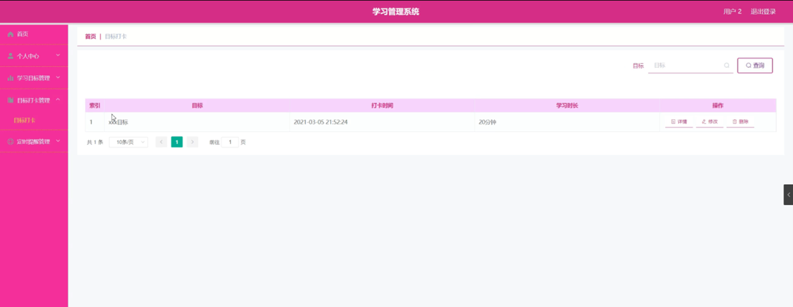

图5-9目标打卡管理界面图

定时提醒管理，在定时提醒管理页面可以查看索引、目标、提醒时间、备注等信息，并可根据需要进行修改或删除等操作，如图5-10所示。

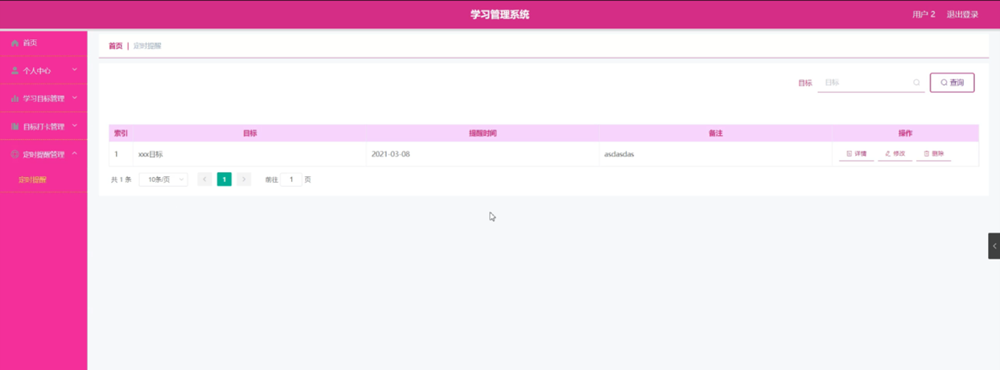

图5-10定时提醒管理界面图

#### **JAVA** **毕设帮助，指导，源码分享，调试部署**

