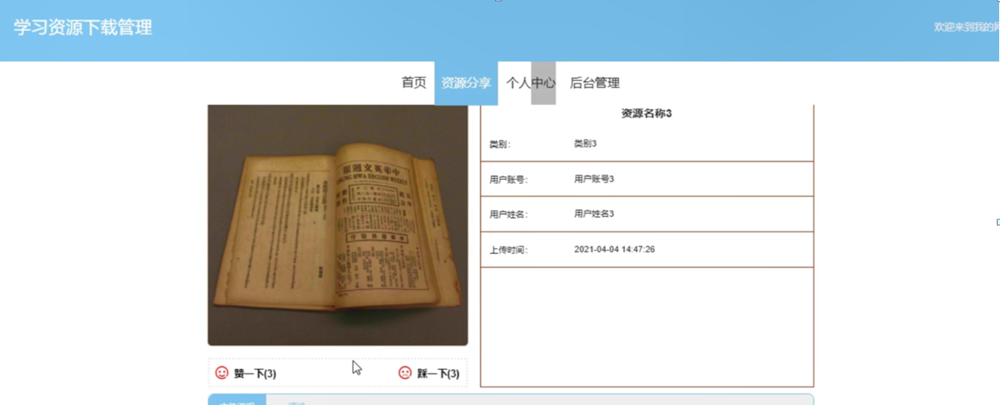

ssm+Vue计算机毕业设计学习资源下载管理（程序+LW文档）

**项目运行**

**环境配置：**

**Jdk1.8 + Tomcat7.0 + Mysql + HBuilderX** **（Webstorm也行）+ Eclispe（IntelliJ
IDEA,Eclispe,MyEclispe,Sts都支持）。**

**项目技术：**

**SSM + mybatis + Maven + Vue** **等等组成，B/S模式 + Maven管理等等。**

**环境需要**

**1.** **运行环境：最好是java jdk 1.8，我们在这个平台上运行的。其他版本理论上也可以。**

**2.IDE** **环境：IDEA，Eclipse,Myeclipse都可以。推荐IDEA;**

**3.tomcat** **环境：Tomcat 7.x,8.x,9.x版本均可**

**4.** **硬件环境：windows 7/8/10 1G内存以上；或者 Mac OS；**

**5.** **是否Maven项目: 否；查看源码目录中是否包含pom.xml；若包含，则为maven项目，否则为非maven项目**

**6.** **数据库：MySql 5.7/8.0等版本均可；**

**毕设帮助，指导，本源码分享，调试部署** **(** **见文末** **)**

### 系统结构

整个系统是由多个功能模块组合而成的，要将所有的功能模块都一一列举出来，然后进行逐个的功能设计，使得每一个模块都有相对应的功能设计，然后进行系统整体的设计。

本学习资源下载管理系统结构图如图4-2所示。

图4-2 系统功能结构图

### 4.3. 数据库设计

#### 4.3.1 数据库实体

管理员信息结构图，如图4-3所示：

图4-3 管理员信息实体结构图

用户信息管理实体属性图，如图4-4所示：

图4-4用户信息管理实体属性图

资源分享管理实体属性图，如图4-5所示：

图4-5资源分享管理实体属性图

###  系统功能模块

学习资源下载管理系统，在系统首页可以查看首页、资源分享、个人中心、后台管理等内容进行详细操作，如图5-1所示。

图5-1系统首页界面图

资源分享，在资源分享页面可以查看资源名称、类别、用户账号、用户姓名、上传时间、文件说明等详细信息进行评论，如图5-2所示。

图5-2资源分享界面图

用户注册，在用户注册页面通过填写用户账号、密码、用户姓名、手机、邮箱、身份证等详细信息进行用户注册，如图5-3所示。

图5-3用户注册界面图

个人中心，在个人中心页面通过填写用户账号、密码、用户姓名、性别、手机、邮箱、身份证、照片等信息，根据需要对个人信息进行修改，还可以根据需要对我的收藏进行详细操作；如图5-4所示。

图5-4个人中心界面图

### 5.2管理员功能模块

管理员登录，管理员通过输入用户名，密码，选择角色等信息即可进行系统登录，如图5-5所示。

图5-5管理员登录界面图

管理员登录进入学习资源下载管理系统可以查看首页、个人中心、用户管理、用户资源分享管理、资源分类管理、用户信息管理、会员充值记录管理、会员充值档次管理、会员信息管理、会员管理、会员资源分享管理、资源分享管理、资源下载管理、会员续费记录管理、系统管理等内容进行详细操作，如图5-6所示。

图5-6管理员功能界面图

用户管理，在用户管理页面可以查看索引、用户账号、用户姓名、性别、手机、邮箱、身份证、照片等信息，并可根据需要进行详情、建立会员账号、修改或删除等操作，如图5-7所示。

图5-7用户管理界面图

用户资源分享管理，在用户资源分享管理页面可以查看索引、资源名称、类别、用户账号、用户姓名、上传时间、封面、文件、审核回复、审核状态、审核等信息，并可根据需要进行详情、前台显示、下载显示、修改或删除等操作，如图5-8所示。

图5-8用户资源分享管理界面图

用户信息管理，在用户信息管理页面可以查看索引、用户账号、用户姓名、会员、到期时间等信息，并可根据需要进行详情、修改或删除等操作，如图5-9所示。

图5-9用户信息管理界面图

会员充值档次管理，在会员充值档次管理页面可以查看索引、天数、价格等信息，并可根据需要进行详情、修改或删除等操作，如图5-10所示。

图5-10会员充值档次管理界面图

会员管理，在会员管理页面可以查看索引、用户账号、用户姓名、性别、手机、邮箱、身份证、照片、审核回复、审核状态、审核等信息，并可根据需要进行详情、修改或删除等操作，如图5-11所示。

图5-11会员管理界面图

资源分享管理，在资源分享管理页面可以查看索引、资源名称、类别、用户账号、用户姓名、上传时间、封面等信息，并可根据需要进行详情、修改、查看评论或删除等操作，如图5-12所示。

图5-12资源分享管理界面图

#### **JAVA** **毕设帮助，指导，源码分享，调试部署**

