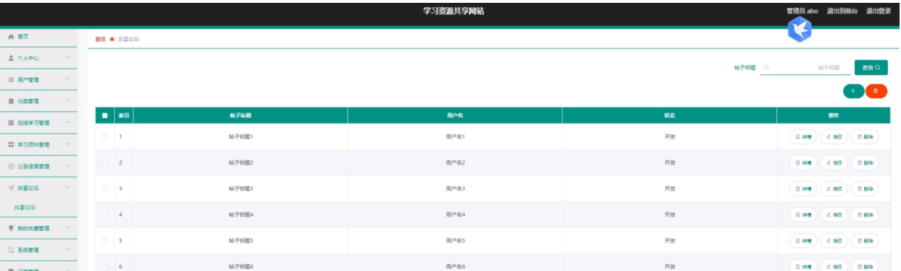

ssm+Vue计算机毕业设计学习资源共享网站（程序+LW文档）

**项目运行**

**环境配置：**

**Jdk1.8 + Tomcat7.0 + Mysql + HBuilderX** **（Webstorm也行）+ Eclispe（IntelliJ
IDEA,Eclispe,MyEclispe,Sts都支持）。**

**项目技术：**

**SSM + mybatis + Maven + Vue** **等等组成，B/S模式 + Maven管理等等。**

**环境需要**

**1.** **运行环境：最好是java jdk 1.8，我们在这个平台上运行的。其他版本理论上也可以。**

**2.IDE** **环境：IDEA，Eclipse,Myeclipse都可以。推荐IDEA;**

**3.tomcat** **环境：Tomcat 7.x,8.x,9.x版本均可**

**4.** **硬件环境：windows 7/8/10 1G内存以上；或者 Mac OS；**

**5.** **是否Maven项目: 否；查看源码目录中是否包含pom.xml；若包含，则为maven项目，否则为非maven项目**

**6.** **数据库：MySql 5.7/8.0等版本均可；**

**毕设帮助，指导，本源码分享，调试部署** **(** **见文末** **)**

###  系统体系结构

学习资源共享网站的结构图4-1所示：

图4-1 系统结构

登录系统结构图，如图4-2所示：

图4-2 登录结构图

系统结构图，如图4-3所示：

图4-3 系统结构图

### 4.2 数据库实体设计

数据库的功能就是对系统中所有的数据进行存储和管理。所有的数据可以在数据库中产时间的进行存储，方便用户的使用。而且所有的数据库中的数据也应该具有一定的共享性，任何的系统可以对一些数据进行使用，同时还应该保持一定的独立性，每一个数据库中的数据都有很强的安全性，可以被很好的存放到数据库，没有进行身份的验证是不能对这些数据进行查看和使用的。数据库的设计需要明确每一个实体之间的联系，系统的E-
R图如下图所示：：

管理员实体主要存储管理信息包括索引、用户名、密码、角色属性。管理员信息属性图如图4-4所示。

图4-4 管理员信息实体属性图

用户管理主要包括索引、账号、姓名、性别、手机、身份证、邮箱、照片、积分等属性，用户管理属性图如图4-5所示。

图4-5用户管理实体属性图

学习资料管理实体属性主要包括索引、分类、标题、附件、封面、发布时间、积分、价格等属性。学习资料管理实体属性图如图4-6所示。

图4-6学习资料管理实体属性图

###  系统功能模块

学习资源共享网站，在网站的首页可以查看首页、在线学习、学习资料、公告信息、共享论坛、校园资讯、个人中心、后台管理、购物车等信息进行详细操作，如图5-1所示。

图5-1网站首页界面图

在线学习，在在线学习页面中可以查看名称、图片、分类、发布时间、视频、内容等详细信息；如图5-2所示。

图5-2在线学习界面图

学习资料，在学习资料页面中可以查看标题、价格、积分、分类、发布时间、附件、封面、内容等信息，并进行添加到购物车、立即购买、积分兑换、评论或收藏等操作；如图5-3所示。

图5-3学习资料界面图

用户注册，在用户注册页面通过填写账号、密码、姓名、手机、身份证、邮箱等信息完成用户注册，如图5-4所示。，在个人中心页面通过填写账号、密码、姓名、性别、手机、身份证、邮箱、图片、积分、余额等内容进行信息更新操作，还可以对我的发布、我的订单、我的地址、我的收藏进行详细操作；如图5-5所示。

图5-4用户注册界面图

图5-5个人中心界面图

### 5.2 管理员功能模块

管理员登录，管理员通过输入界面上显示的信息然后点击登录就能登录到系统进行系统的使用了，如图5-6所示。

图5-6管理员登录界面图

管理员登录进入学习资源共享网站之后，就可以对所有的信息进行查看，可以查看到首页、个人中心、用户管理、分类管理、在线学习管理、学习资料管理、公告信息管理、共享论坛、我的收藏管理、系统管理、订单管理等，并且还可以对其进行相应的操作管理，如图5-7所示。

图5-7管理员功能界面图

用户管理，在用户管理页面中可以对索引、账号、姓名、性别、手机、身份证、邮箱、照片、积分等信息进行详情，修改或删除等操作，如图5-8所示。

图5-8用户管理界面图

在线学习管理，在在线学习管理页面中可以对索引、分类、名称、图片、视频、发布时间等信息进行详情，修改或删除等操作，如图5-9所示。

图5-9在线学习管理界面图

学习资料管理，在学习资料管理页面中可以对索引、分类、标题、附件、封面、发布时间、积分、价格等信息进行详情、修改、查看评论或删除等操作，如图5-10所示。

图5-10学习资料管理界面图

公告信息管理，在公告信息管理页面中可以对索引、公告标题、公告时间、公告图片等信息进行详情，修改或删除等操作，如图5-11所示。

图5-11公告信息管理界面图

共享论坛，在共享论坛页面中可以对索引、帖子标题、用户名、状态等信息进行详情，修改或删除等操作，如图5-12所示。

图5-12共享论坛界面图

**JAVA** **毕设帮助，指导，源码分享，调试部署**

