ssm+Vue计算机毕业设计学术会议管理系统（程序+LW文档）

**项目运行**

**环境配置：**

**Jdk1.8 + Tomcat7.0 + Mysql + HBuilderX** **（Webstorm也行）+ Eclispe（IntelliJ
IDEA,Eclispe,MyEclispe,Sts都支持）。**

**项目技术：**

**SSM + mybatis + Maven + Vue** **等等组成，B/S模式 + Maven管理等等。**

**环境需要**

**1.** **运行环境：最好是java jdk 1.8，我们在这个平台上运行的。其他版本理论上也可以。**

**2.IDE** **环境：IDEA，Eclipse,Myeclipse都可以。推荐IDEA;**

**3.tomcat** **环境：Tomcat 7.x,8.x,9.x版本均可**

**4.** **硬件环境：windows 7/8/10 1G内存以上；或者 Mac OS；**

**5.** **是否Maven项目: 否；查看源码目录中是否包含pom.xml；若包含，则为maven项目，否则为非maven项目**

**6.** **数据库：MySql 5.7/8.0等版本均可；**

**毕设帮助，指导，本源码分享，调试部署** **(** **见文末** **)**

**总体设计**

总体设计图规定了系统的主要功能，如图3-4所示：

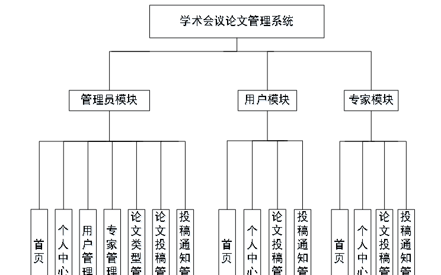

图3-4 总体设计图

**3.5** **数据库设计**

**3.5.1** **数据库E-R图**

E-R图为实体-关系图，本系统的E-R图展现了各个实体之间的关系，在本数据库中，各个实体之间的关系均为多对多的关系，

专家信息属性图如图3-5所示。

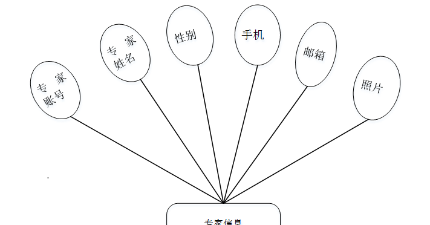

图3-5专家信息实体属性图

论文投稿信息实体属性图如图3-6所示。

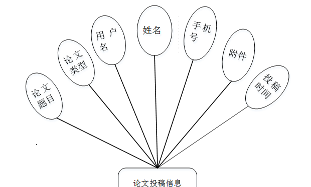

图3-6论文投稿信息实体属性图

投稿通知信息实体属性图如图3-7所示。

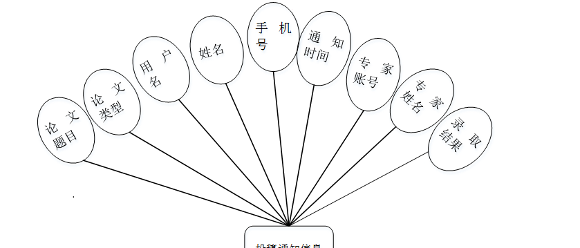

图3-7投稿通知信息实体属性图

**用户功能模块**

用户注册：在注册页面填写用户名、姓名、密码、确认密码、年龄、手机号等信息，进行注册操作，如图4-1所示。

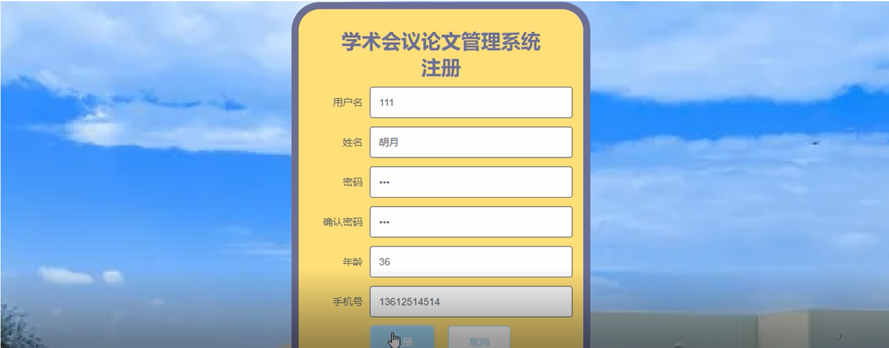图4-1用户注册界面图

用户登录：在登录页面填写用户名、密码、选择角色进行登录操作，如图4-2所示。

图4-2用户登录界面图

用户登录学术会议论文管理系统首页，用户可以对首页、个人中心、论文投稿管理、投稿通知管理等功能模块的查看与操作，如图4-3所示。

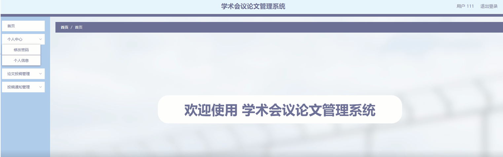

图4-3用户功能界面图

个人中心：在个人中心页面，用户可以填写用户名、姓名、性别、年龄、手机号等内容，进行修改，还能修改密码，如图4-4所示。

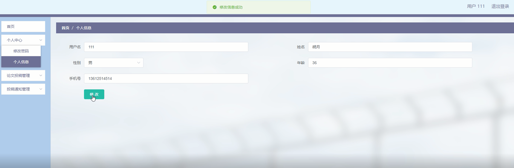

图4-4个人中心界面图

论文投稿管理：点击论文投稿管理，通过查看论文题目、论文类型、用户名、姓名、手机号、附件、投稿时间等内容，进行相对应操作，如图4-5所示。

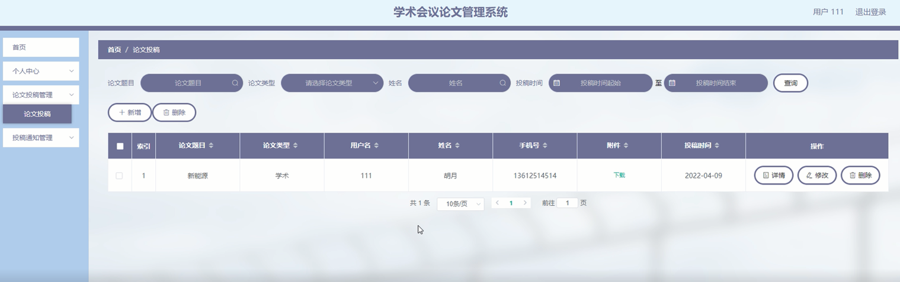

图4-5论文投稿管理界面图

投稿通知管理：点击投稿通知管理，通过查看论文题目、论文类型、用户名、姓名、手机号、通知时间、专家账号、专家姓名、录取结果等内容，进行相对应操作，如图4-6所示。

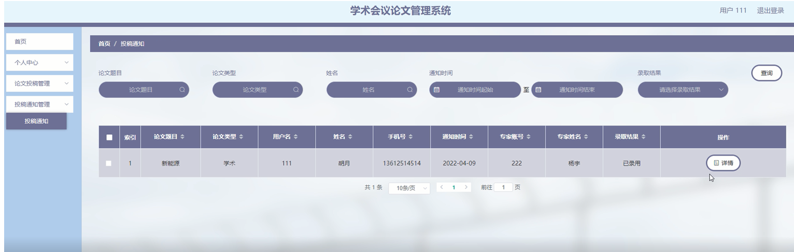

图4-6投稿通知管理界面图

### 4.2专家功能模块

专家登录：在登录页面填写用户名、密码、选择角色进行登录操作，如图4-7所示。

图4-7专家登录界面图

专家登录学术会议论文管理系统首页，专家可以对首页、个人中心、论文投稿管理、投稿通知管理等功能模块的查看与操作，如图4-8所示。

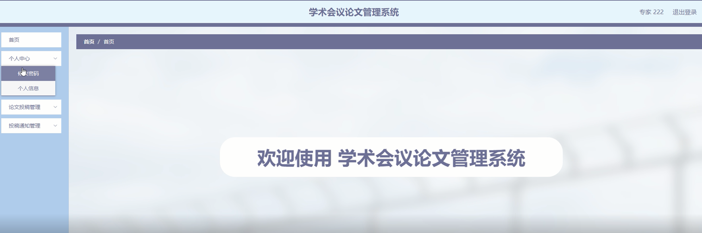

图4-8专家功能界面图

个人中心：在个人中心页面，专家可以填写专家账号、专家姓名、性别、手机、邮箱、照片等内容，进行修改，还能修改密码，如图4-9所示。

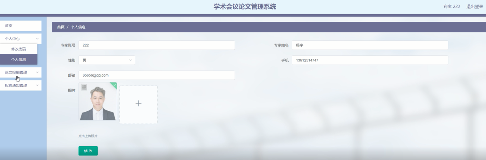

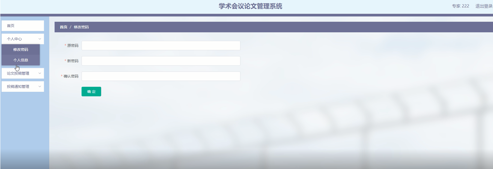

图4-9个人中心界面图

论文投稿管理：点击论文投稿管理，通过查看论文题目、论文类型、用户名、姓名、手机号、附件、投稿时间等内容，进行相对应操作，如图4-10所示。

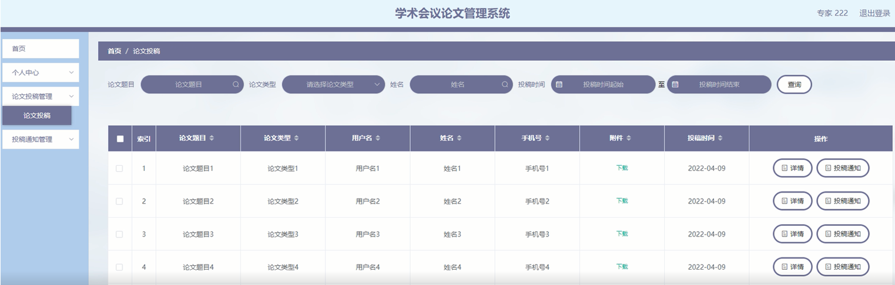

图4-10论文投稿管理界面图

投稿通知管理：点击投稿通知管理，通过查看论文题目、论文类型、用户名、姓名、手机号、通知时间、专家账号、专家姓名、录取结果等内容，进行相对应操作，如图4-11所示。

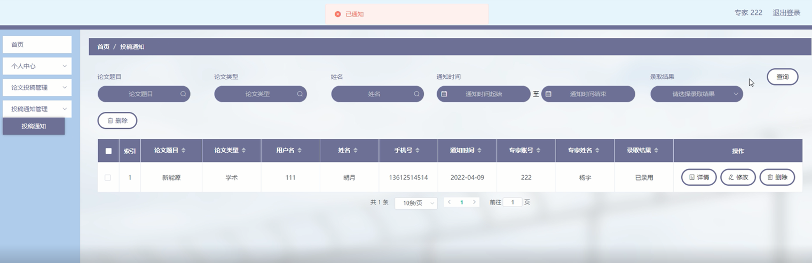

图4-11投稿通知管理界面图

**管理员功能模块**

管理员通过登录页面输入用户名，密码选择角色等内容进行登录，登录到系统后台，进行相应的操作，如下图4-12所示。

图4-12管理员登录界图面

#### **JAVA** **毕设帮助，指导，源码分享，调试部署**

