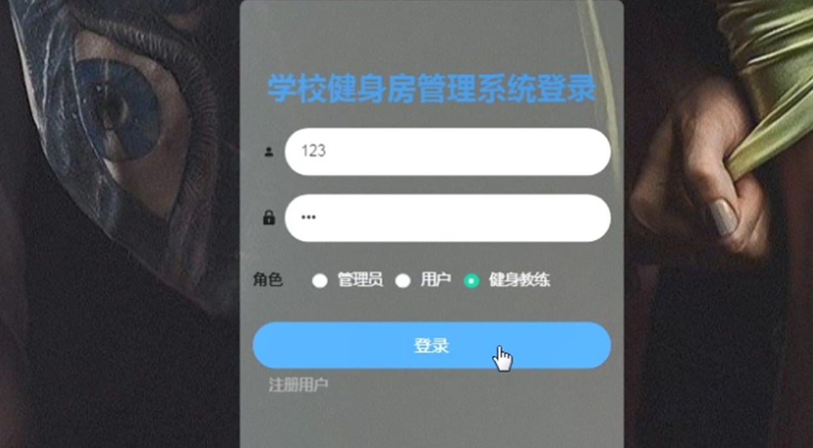

ssm+Vue计算机毕业设计学校健身房管理系统（程序+LW文档）

**项目运行**

**环境配置：**

**Jdk1.8 + Tomcat7.0 + Mysql + HBuilderX（Webstorm也行）+ Eclispe（IntelliJ
IDEA,Eclispe,MyEclispe,Sts都支持）。**

**项目技术：**

**SSM + mybatis + Maven + Vue 等等组成，B/S模式 + Maven管理等等。**

**环境需要**

**1.运行环境：最好是java jdk 1.8，我们在这个平台上运行的。其他版本理论上也可以。**

**2.IDE环境：IDEA，Eclipse,Myeclipse都可以。推荐IDEA;**

**3.tomcat环境：Tomcat 7.x,8.x,9.x版本均可**

**4.硬件环境：windows 7/8/10 1G内存以上；或者 Mac OS；**

**5.是否Maven项目: 否；查看源码目录中是否包含pom.xml；若包含，则为maven项目，否则为非maven项目**

**6.数据库：MySql 5.7/8.0等版本均可；**

**毕设帮助，指导，本源码分享，调试部署(** **见文末)**

### 系统体系结构

学校健身房管理系统的结构图4-1所示：

图4-1 系统结构

模块包括主界面，首页、个人中心、用户管理、健身教练管理、健身器材管理、健身分类管理、健身课程管理、商品分类管理、健身商品管理、课程预约管理、器材租借管理、留言板管理、系统管理、订单管理等进行相应的操作。

登录系统结构图，如图4-2所示：

图4-2 登录结构图

这些功能可以充分满足学校健身房管理系统的需求。此系统功能较为全面如下图系统功能结构如图4-3所示。

图4-3系统功能结构图

### 4.2 数据库设计原则

每个数据库的应用它们都是和区分开的，当运行到一定的程序当中，它就会与自己相关的协议与客户端进行通讯。那么这个系统就会对使这些数据进行连接。当我们选择哪个桥段的时候，接下来就会简单的叙述这个数据库是如何来创建的。当点击完成按钮的时候就会自动在对话框内弹出数据源的名称，在进行点击下一步即可，直接在输入相对应的身份验证和登录密码。

学校健身房管理系统的数据流程：

图4-4 系统数据流程图

课程预约管理实体E-R图，如图4-5所示。

图4-5课程预约管理E-R图

留言板管理E-R图，如图4-6所示。

图4-6留言板管理E-R图

### 用户功能模块

通过网站页面可以查看首页、健身教练、健身器材、健身课程、健身商品、健身资讯、留言反馈、个人中心、后台管理、购物车等信息，如图5-1所示。通过用户注册页面可以填写用户名、密码、姓名、年龄、手机、邮箱、身份证等详细信息，进行注册操作，如图5-2所示。点击登录进入登录页面，输入账号，密码、角色进行登录操作，如图5-3所示。

图5-1 系统首页页面

图5-2用户注册页面

图5-3登录界面

健身教练：通过健身教练页面可以获取教练工号、教练姓名、性别、年龄、身高、体重、照片、职业履历等信息进行评论，如图5-4所示。

图5-4健身教练页面

健身器材：通过健身器材页面可以获取器材编号、器材名称、图片、健身类型、品牌、使用方法、瘦身效果等信息进行租借、评论，如图5-5所示。

图5-5健身器材页面

健身课程：通过健身课程页面可以获取课程编号、课程名称、健身类型、图片、教练工号、教练姓名、上课时长、上课地点等信息进行预约，并根据需要进行评论或收藏操作，如图5-6所示。

图5-6健身课程页面

健身商品：通过健身商品页面可以获取商品编号、商品名称、商品类型、商品规格、图片、品牌、价格等信息进行添加到购物车、立即购买，并根据需要进行评论或收藏操作，如图5-7所示。

图5-7健身商品页面

购物车：通过购物车页面可以获取购买商品、价格、数量、总价等信息进行删除、点击购买，如图5-8所示。

图5-8购物车页面

### 5.2用户后台功能模块

用户点击进入到后台操作界面，可以对首页、个人中心、课程预约管理、器材租借管理、我的收藏管理、订单管理等内容进行操作，如图5-9所示。

图5-9用户后台功能界面图

个人中心：通过个人中心页面可以填写用户名、密码、姓名、年龄、性别、手机、邮箱、身份证等信息进行修改操作，如图5-10所示。

图5-10个人中心界面图

课程预约管理：通过课程预约管理页面可以获取索引、课程编号、课程名称、教练工号、教练姓名、上课时长、上课地点、上课时间、用户名、姓名、手机、审核回复、审核状态等信息进行修改或删除操作，如图5-11所示。

图5-11课程预约管理界面图

器材租借管理：通过器材租借管理页面可以获取索引、器材编号、器材名称、品牌、开始日期、租借天数、用户名、姓名、手机、审核回复、审核状态等信息进行修改或删除操作，如图5-12所示。

图5-12器材租借管理界面图

#### **JAVA毕设帮助，指导，源码分享，调试部署**

