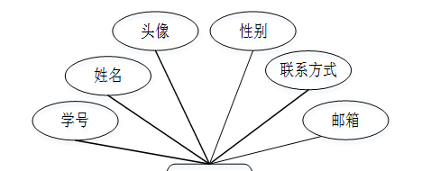
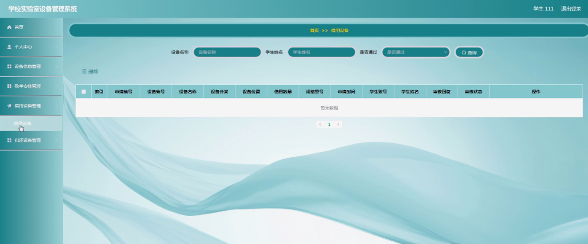

ssm+Vue计算机毕业设计学校实验室设备管理系统（程序+LW文档）

**项目运行**

**环境配置：**

**Jdk1.8 + Tomcat7.0 + Mysql + HBuilderX** **（Webstorm也行）+ Eclispe（IntelliJ
IDEA,Eclispe,MyEclispe,Sts都支持）。**

**项目技术：**

**SSM + mybatis + Maven + Vue** **等等组成，B/S模式 + Maven管理等等。**

**环境需要**

**1.** **运行环境：最好是java jdk 1.8，我们在这个平台上运行的。其他版本理论上也可以。**

**2.IDE** **环境：IDEA，Eclipse,Myeclipse都可以。推荐IDEA;**

**3.tomcat** **环境：Tomcat 7.x,8.x,9.x版本均可**

**4.** **硬件环境：windows 7/8/10 1G内存以上；或者 Mac OS；**

**5.** **是否Maven项目: 否；查看源码目录中是否包含pom.xml；若包含，则为maven项目，否则为非maven项目**

**6.** **数据库：MySql 5.7/8.0等版本均可；**

**毕设帮助，指导，本源码分享，调试部署** **(** **见文末** **)**

### 功能结构

为了更好的去理清本系统整体思路，对该系统以结构图的形式表达出来，设计实现该学校实验室设备管理系统的功能结构图如下所示：

图4-1 系统总体结构图

### 4.2 数据库设计

####  4.2.1 数据库E/R图

ER图是由实体及其关系构成的图，通过E/R图可以清楚地描述系统涉及到的实体之间的相互关系。在系统中对一些主要的几个关键实体如下图：

(1) 学生管理E/R图如下所示：

图4-2学生管理E/R图

(2) 设备信息管理E/R图如下所示：

图4-3设备信息管理E/R图

(3) 教学安排管理E/R图如下所示：

图4-4教学安排管理E/R图

### 学生功能模块

学生注册，学生通过输入学生账号、密码、学生姓名、联系方式、邮箱进行注册，如图5-1所示。

图5-1学生注册界面图

学生通过登录进入系统可查看个人中心、设备信息管理、教学安排管理、借用设备管理、归还设备管理等内容，在个人中心页面还可进行修改密码和个人信息等操作，如图5-2所示。

图5-2学生功能界图面

设备信息管理，学生可在设备信息管理页面查看设备编号、设备名称、设备分类、设备图片、设备位置、规格型号、设备数量等内容，还可进行申请等操作，如图5-3所示。

图5-3设备信息管理界面图

教学安排管理，学生可在教学安排管理页面查看安排编号、标题、设备名称、规格型号、数量、安排时间、教师工号、教师姓名等内容，如图5-4所示。

图5-4教学安排管理界面图

借用设备管理，学生可在借用设备管理页面查看申请编号、设备编号、设备名称、设备分类、设备位置、借用数量、规格型号、申请时间、学生账号、学生姓名、审核回复、审核状态等内容，如图5-5所示。

图5-5借用设备管理界面图

5.2教师功能模块

教师注册，教师通过输入教师工号、密码、教师姓名、联系电话、教师邮箱进行注册，如图5-6所示。

图5-6教师注册界面图

教师通过登录进入系统可查看个人中心、设备信息管理、教学安排管理、设备维修管理、设备报废管理等内容，如图5-7所示。

图5-7教师功能界面图

设备信息管理，教师可在设备信息管理页面查看设备编号、设备名称、设备分类、设备图片、设备位置、规格型号、设备数量等内容，如图5-8所示。

图5-8设备信息管理界图面

设备维修管理，教师可在设备维修管理页面查看维修编号、设备编号、设备名称、设备分类、设备位置、规格型号、维修数量、教师工号、教师姓名、申请时间、审核回复、审核状态等内容，还可进行修改或删除等操作，如图5-9所示。

图5-9设备维修管理界面图

设备报废管理，教师可在设备报废管理页面查看报废编号、设备编号、设备名称、设备分类、设备位置、规格型号、报废数量、教师工号、教师姓名、报废时间、审核回复、审核状态等内容，还可进行修改或删除等操作，如图5-10所示。

图5-10设备报废管理界面图

5.3管理员功能模块

管理员登录，管理员通过输入用户名、密码、角色进行登录，如图5-11所示。

图5-11管理员登录界面图

管理员通过登录进入系统可查看个人中心、学生管理、教师管理、设备分类管理、设备信息管理、教学安排管理、借用设备管理、归还设备管理、设备维修管理、设备报废管理等内容，如图5-12所示。

图5-12管理员功能界面图

#### **JAVA** **毕设帮助，指导，源码分享，调试部署**

