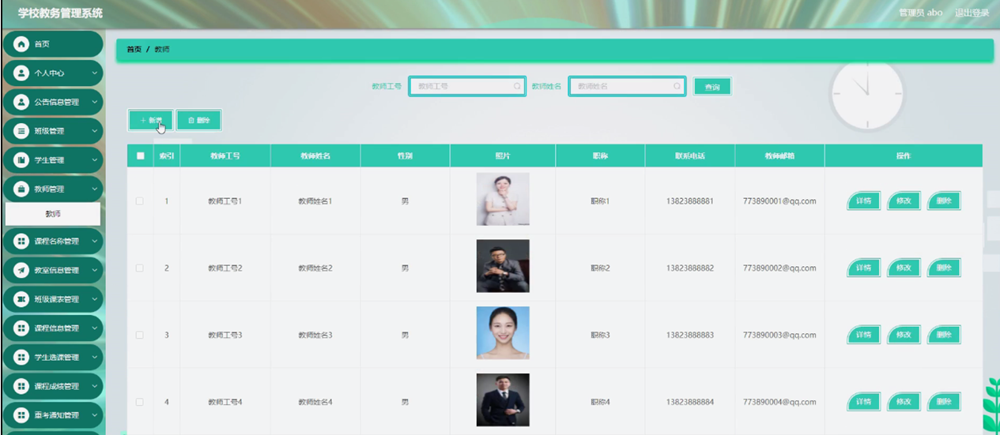

ssm+Vue计算机毕业设计学校教务管理系统（程序+LW文档）

**项目运行**

**环境配置：**

**Jdk1.8 + Tomcat7.0 + Mysql + HBuilderX** **（Webstorm也行）+ Eclispe（IntelliJ
IDEA,Eclispe,MyEclispe,Sts都支持）。**

**项目技术：**

**SSM + mybatis + Maven + Vue** **等等组成，B/S模式 + Maven管理等等。**

**环境需要**

**1.** **运行环境：最好是java jdk 1.8，我们在这个平台上运行的。其他版本理论上也可以。**

**2.IDE** **环境：IDEA，Eclipse,Myeclipse都可以。推荐IDEA;**

**3.tomcat** **环境：Tomcat 7.x,8.x,9.x版本均可**

**4.** **硬件环境：windows 7/8/10 1G内存以上；或者 Mac OS；**

**5.** **是否Maven项目: 否；查看源码目录中是否包含pom.xml；若包含，则为maven项目，否则为非maven项目**

**6.** **数据库：MySql 5.7/8.0等版本均可；**

**毕设帮助，指导，本源码分享，调试部署** **(** **见文末** **)**

###  软件功能模块设计

网站整功能如下图所示：

**图 4-1** **学校教务管理系统总体功能模块图**

### 4.2 数据库设计

#### 4.2.1 概念模型设计

概念模型是对现实中的问题出现的事物的进行描述，ER图是由实体及其关系构成的图，通过E-R图可以清楚地描述系统涉及到的实体之间的相互关系。

管理员登录信息实体图如图4-2所示：

图4-2管理员登录信息实体图

学生管理实体图如图4-3所示：

图4-3学生管理实体图

教室信息管理实体图如图4-4所示：

图4-4教室信息管理实体图

### 管理员功能模块

管理员通过输入用户名、密码、角色进行登录进入学校教务管理系统，如图5-1所示。

图5-1管理员功能界面图

管理员通过登录进入系统可查看个人中心、学生管理、教师管理、公告信息管理、班级管理、课程名称管理、教室信息管理、班级课表管理、课程信息管理、学生选课管理、课程成绩管理、重考通知管理、重修通知管理等内容，如图5-2所示。

图5-2管理员功能界面图

班级管理，管理员可在班级管理页面通过输入班级进行查询、新增、修改或删除等操作，如图5-3所示。

图5-3班级管理界面图

学生管理，管理员可在学生管理页面查看学号、学生姓名、性别、头像、班级、手机、邮箱等内容，还可进行新增、修改或删除等操作，如图5-4所示。

图5-4学生管理界面图

教师管理，管理员可在教师管理页面查看教师工号、教师姓名、性别、头像、职称、联系电话、教师邮箱等内容，还可进行新增、修改或删除等操作，如图5-5所示。

图5-5教师管理界面图

课程名称管理，管理员可在课程名称管理页面通过输入课程名称进行查询、新增、修改或删除等操作，如图5-6所示。

图5-6课程名称管理界面图

教室信息管理，管理员可在教室信息管理页面查看教室号、楼栋、位置、总座位数、教学设备等内容，还可进行新增、修改或删除等操作，如图5-7所示。

图5-7教室信息管理界面图

重修通知管理，管理员可在重修通知管理页面查看课程名称、课程类型、班级、学年、学期、通知内容、通知时间、教师工号、教师姓名、学号、学生姓名等内容，还可进行修改或删除等操作，如图5-8所示。

图5-8重修通知管理界面图

课程成绩管理，管理员在课程成绩管理页面查看课程名称、课程类型、学年、班级、学期、考核成绩、等级、评语、登记时间、教师工号、教师姓名、学号、学生姓名等内容，还可进行导出、统计、修改或删除等操作，如图5-9所示。

图5-9课程成绩管理界图面

5.2教师功能模块

教师通过登录进入系统可查看个人中心、公告信息管理、课程信息管理、学生选课管理、课程成绩管理、重考通知管理、重修通知管理等内容，如图5-10所示。

图5-10教师功能界面图

课程信息管理，教师可在课程信息管理页面查看课程名称、课程类型、图片、学年、学期、班级、教室、发布日期、教师工号、教师姓名等内容，还可进行新增、修改或删除等操作，如图5-11所示。

图5-11课程信息管理界面图

课程成绩管理，教师可在课程成绩管理页面查看课程名称、课程类型、学年、班级、学期、考核成绩、等级、评语、登记时间、教师工号、教师姓名、学号、学生姓名等内容，还可进行导出、统计、修改或删除等操作，如图5-12所示。

图5-12课程成绩管理界面图

#### **JAVA** **毕设帮助，指导，源码分享，调试部署**

