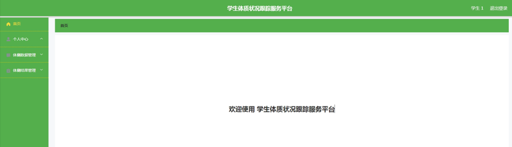

ssm+Vue计算机毕业设计学生体质状况跟踪服务平台（程序+LW文档）

**项目运行**

**环境配置：**

**Jdk1.8 + Tomcat7.0 + Mysql + HBuilderX** **（Webstorm也行）+ Eclispe（IntelliJ
IDEA,Eclispe,MyEclispe,Sts都支持）。**

**项目技术：**

**SSM + mybatis + Maven + Vue** **等等组成，B/S模式 + Maven管理等等。**

**环境需要**

**1.** **运行环境：最好是java jdk 1.8，我们在这个平台上运行的。其他版本理论上也可以。**

**2.IDE** **环境：IDEA，Eclipse,Myeclipse都可以。推荐IDEA;**

**3.tomcat** **环境：Tomcat 7.x,8.x,9.x版本均可**

**4.** **硬件环境：windows 7/8/10 1G内存以上；或者 Mac OS；**

**5.** **是否Maven项目: 否；查看源码目录中是否包含pom.xml；若包含，则为maven项目，否则为非maven项目**

**6.** **数据库：MySql 5.7/8.0等版本均可；**

**毕设帮助，指导，本源码分享，调试部署** **(** **见文末** **)**

系统结构设计

系统设计主要是管理员登录后对整个系统相关操作进行处理，可进行管理员的添加和删除，首页、个人中心、学生管理、项目信息管理、体侧数据管理、体侧结果管理等操作管理。

系统的功能结构图如下图所示。

图4-1系统功能结构图

4.3.1 E-R图设计

概念设计是整个数据库设计的关键，在概念设计阶段，由需求分析得到了E-
R模型。E-R图是识别功能模型与数据模型间关联关系的，在主题数据库的抽取和规范化的过程中，采用的是简化的E-R图表示方法，从而避免过繁过细的E-
R图表示影响规划的直观和可用性。是对现实世界的抽象和概括，是数据库设计人员进行数据可设计的有力工具，能够方便直接地表达应用中的各种语义知识，令一方面它简单、清晰、易于用户理解。

学生管理ER图如下图所示。

图4-2学生管理ER图

体侧数据管理ER图如下图所示。

图4-3体侧数据管理ER图

体侧结果管理ER图如下图所示。

图4-4体侧结果管理ER图

登录模块的实现

系统登录模块，为确保系统安全性，系统操作员只有在登录界面输入正确的管理员名、密码以及权限，单击“登录”按钮后才能够进入本系统的主界面。

管理员登录流程图如下所示。

图5-1管理员登录流程图

登录界面如下图所示。

图5-2登录界面图

5.2管理员功能模块

管理员登录进入学生体质状况跟踪服务平台可以查看首页、个人中心、学生管理、项目信息管理、体侧数据管理、体侧结果管理等信息进行详细操作，如图5-3所示。

图5-3管理员功能界面图

学生管理，在学生管理页面中可以对索引、学号、学生姓名、性别、头像、学院、专业、手机等信息进行详情、修改或删除等操作，如图5-4所示。

图5-4学生管理界面图

项目信息管理，在项目信息管理页面中可以对索引、项目名称等信息进行修改或删除等详细操作，如图5-5所示。

图5-5项目信息管理界面图

体侧数据管理，在体侧数据管理页面中可以对索引、学号、学生姓名、学院、专业、项目名称、分数、发布时间等信息进行详情，修改或删除等详细操作，如图5-6所示。

图5-6体侧数据管理界面图

体侧结果管理，在体侧结果管理页面中可以对索引、学号、学生姓名、学院、专业、身高、体重、五十米、肺活量、一千米、坐位体前屈、身体状态、发布时间等信息进行详情，修改或删除等详细操作，如图5-7所示。

图5-7体侧结果管理界面图

5.3学生功能模块

学生登录进入学生体质状况跟踪服务平台可以查看首页、个人中心、体侧数据管理、体侧结果管理等信息进行详细操作，如图5-8所示。

图5-8学生功能界面图

个人中心，在个人中心页面通过填写学号、学生姓名、性别、头像、学院、专业、手机等信息进行个人信息修改操作，如图5-9所示。

图5-9个人中心界面图

体侧数据管理，在体侧数据管理页面中可以对索引、学号、学生姓名、学院、专业、项目名称、分数、发布时间等信息进行查看详情操作，如图5-10所示。

图5-10体侧数据管理界面图

体侧结果管理，在体侧结果管理页面中可以对索引、学号、学生姓名、学院、专业、身高、体重、五十米、肺活量、一千米、坐位体前屈、身体状态、发布时间等信息进行查看详情操作，如图5-11所示。

图5-11体侧结果管理界面图

**JAVA** **毕设帮助，指导，源码分享，调试部署**

