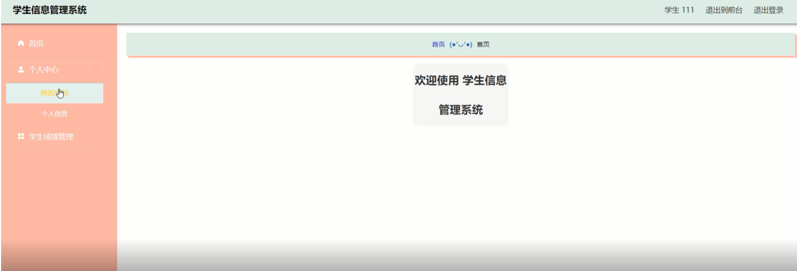

ssm+Vue计算机毕业设计学生信息管理系统 （程序+LW文档）

**项目运行**

**环境配置：**

**Jdk1.8 + Tomcat7.0 + Mysql + HBuilderX** **（Webstorm也行）+ Eclispe（IntelliJ
IDEA,Eclispe,MyEclispe,Sts都支持）。**

**项目技术：**

**SSM + mybatis + Maven + Vue** **等等组成，B/S模式 + Maven管理等等。**

**环境需要**

**1.** **运行环境：最好是java jdk 1.8，我们在这个平台上运行的。其他版本理论上也可以。**

**2.IDE** **环境：IDEA，Eclipse,Myeclipse都可以。推荐IDEA;**

**3.tomcat** **环境：Tomcat 7.x,8.x,9.x版本均可**

**4.** **硬件环境：windows 7/8/10 1G内存以上；或者 Mac OS；**

**5.** **是否Maven项目: 否；查看源码目录中是否包含pom.xml；若包含，则为maven项目，否则为非maven项目**

**6.** **数据库：MySql 5.7/8.0等版本均可；**

**毕设帮助，指导，本源码分享，调试部署** **(** **见文末** **)**

### 功能结构

为了更好的去理清本系统整体思路，对该系统以结构图的形式表达出来，设计实现该学生信息管理系统的功能结构图如下所示：

图4-1 系统总体结构图

### 4.2 数据库设计

####  4.2.1 数据库E/R图

ER图是由实体及其关系构成的图，通过E/R图可以清楚地描述系统涉及到的实体之间的相互关系。在系统中对一些主要的几个关键实体如下图：

(1) 院系简介信息E/R图如下所示：

图4-2院系简介信息E/R图

(2) 教师信息E/R图如下所示：

图4-3教师信息E/R图

(3)专业信息E/R图如下所示：

图4-4专业信息E/R图

(4) 学生信息E/R图如下所示：

图4-5学生信息E/R图

### 管理员功能模块

管理员登录，管理员通过登录页面输入用户名、密码，选择角色并点击登录进行系统登录操作，如图5-1所示。

图5-1管理员登录界面图

管理员登录系统后，可以对首页、个人中心、学生管理、教师管理、专业信息管理、院系简介管理、学生成绩管理、课程课表管理、系统管理等功能进行相应操作，如图5-2所示。

图5-2管理员功能界图面

学生管理，在学生管理页面可以对学生学号、学生姓名、性别、出生年月、学生年龄、联系电话、邮箱、所属专业、所属班级、入学日期等内容进行详情、修改、删除等操作，如图5-3所示。

图5-3学生管理界面图

教师管理，在教师管理页面可以对教师工号、教师姓名、性别、职称、手机号、出生年月、教师年龄、教学方向等内容进行修改、删除等操作，如图5-4所示。

图5-4教师管理界面图

专业信息管理，在专业信息管理页面可以对学院名称、所属地区、学院级别、专业名称、招生电话、学院邮箱、学院网址、图片等内容进行修改、删除等操作，如图5-5所示。

图5-5专业信息管理界面图

院系简介管理，在院系简介管理页面可以对学院名称、院系名称、学院地址、校长、封面等内容进行查看、修改、删除等操作，如图5-6所示。

图5-6院系简介管理界面图

学生成绩管理，在学生成绩管理页面可以对课程名称、课程性质、学生学号、学生姓名、教师工号、教师姓名、总成绩、绩点、学分、是否通过、登记时间等内容进行查看、删除等操作，如图5-7所示。

图5-7学生成绩管理界面图

课程课表管理，在课程课表管理页面可以对课程名称、课表图片、发布日期、专业、班级、教师工号、教师姓名等内容进行查看、删除等操作，如图5-8所示。

图5-8课程课表管理界面图

系统管理，在系统管理页面可以对名称、值等内容进行详情、修改等操作，并对系统公告发布，如图5-9 5-10所示。

图5-9轮播图管理界面图

图5-10系统公告界面图

### 5.2学生功能模块

学生登录到学生信息管理系统后台后，可以对首页、个人中心、学生成绩管理等功能进行相应操作，如图5-11所示。

图5-11学生功能界面图

个人中心，在个人中心页面学生通过输入学生学号、学生姓名、性别、出生年月、学生年龄、联系电话、邮箱、所属专业、所属班级、入学日期等信息进行修改个人信息、并修改密码等操作，如图5-12所示。

图5-12个人中心界面图

#### **JAVA** **毕设帮助，指导，源码分享，调试部署**

