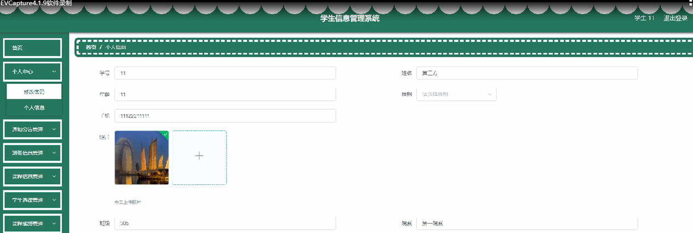

ssm+Vue计算机毕业设计学生信息管理系统（程序+LW文档）

**项目运行**

**环境配置：**

**Jdk1.8 + Tomcat7.0 + Mysql + HBuilderX** **（Webstorm也行）+ Eclispe（IntelliJ
IDEA,Eclispe,MyEclispe,Sts都支持）。**

**项目技术：**

**SSM + mybatis + Maven + Vue** **等等组成，B/S模式 + Maven管理等等。**

**环境需要**

**1.** **运行环境：最好是java jdk 1.8，我们在这个平台上运行的。其他版本理论上也可以。**

**2.IDE** **环境：IDEA，Eclipse,Myeclipse都可以。推荐IDEA;**

**3.tomcat** **环境：Tomcat 7.x,8.x,9.x版本均可**

**4.** **硬件环境：windows 7/8/10 1G内存以上；或者 Mac OS；**

**5.** **是否Maven项目: 否；查看源码目录中是否包含pom.xml；若包含，则为maven项目，否则为非maven项目**

**6.** **数据库：MySql 5.7/8.0等版本均可；**

**毕设帮助，指导，本源码分享，调试部署** **(** **见文末** **)**

#### 系统的主要的功能结构

学生信息管理系统的主要功能的结构如图4-1所示。

图4-1系统功能结构图

### 4.2系统设计

#### 4.2.1数据表E-R图

E-R图为实体-关系图，本系统的E-R图展现了各个实体之间的关系，在本数据库中，各个实体之间的关系均为多对多的关系，如下图：

学生注册属性图如图4-2所示。

图4-2学生注册实体属性图

课程信息实体属性图如图4-3所示。

图4-3课程信息实体属性图

系统登录，进入系统前在登录页面根据要求填写用户名和密码，选择角色等信息，点击登录进行登录操作，如图5-1所示。

图5-1系统登录界面图

### 5.1管理员功能模块

管理员登录系统后，可以对首页，个人中心，通知公告，学生管理，教师管理，班级信息管理，课程分类管理，课程信息管理，学生选课管理，课程成绩管理等功能进行相应的操作，如图5-2所示。

图5-2管理员功能界面图

学生管理，在学生管理页面可以对索引，学号，姓名，年龄，性别，手机，照片，班级，院系等内容进行详情，修改或删除等操作，如图5-3所示。

图5-3学生管理界面图

教师管理，在教师管理页面可以对教师账号，教师姓名，年龄，性别，手机，院系，照片等内容进行详情，修改或删除等操作，如图5-4所示。

图5-4教师管理界面图

班级信息管理，在班级信息管理页面可以对索引，班级号，班级人数，位置，教师账号，教师姓名，图片等内容进行详情，修改和删除等操作，如图5-5所示。

图5-5班级信息管理界面图

课程信息管理，在课程信息管理页面可以对索引，课程名称，课程分类，开课时间，结束时间，上课地点，封面，教师账号，教师姓名等内容进行详情，修改和删除等操作；如图5-6所示。

图5-6课程信息管理界面图

### 5.2教师功能模块

教师登录系统后，可以对首页，个人中心，通知公告管理，班级信息管理，课程信息管理，学生选课管理，课程成绩管理等功能进行相应的操作，如图5-7所示。

图5-7教师功能界面图

个人中心，在个人中心页面可以对教师账号，教师姓名，年龄，性别，手机，院系，照片等进行个人信息修改操作，如图5-8所示。

图5-8个人中心界面图

班级信息管理，在班级信息管理页面可以对索引，班级号，班级人数，位置，教师账号，教师姓名，图片等内容进行详情操作，如图5-9所示。

图5-9班级信息管理界面图

课程信息管理，在课程信息管理页面可以对索引，课程名称，课程分类，开课时间，结束时间，上课地点，封面，教师账号，教师姓名等内容进行详情，修改和删除等操作，如图5-10所示。

图5-10课程信息管理界面图

### 5.3学生功能模块

学生登录系统后，可以对首页，个人中心，通知公告管理，班级信息管理，课程信息管理，学生选课管理，课程成绩管理等功能进行相应的操作，如图5-11所示。

图5-11学生功能界面图

个人中心，在个人中心页面可以对学号，姓名，年龄，性别，手机，照片，班级，院系等进行个人信息修改操作，如图5-12所示。

图5-12个人中心界面图

**JAVA** **毕设帮助，指导，源码分享，调试部署**

