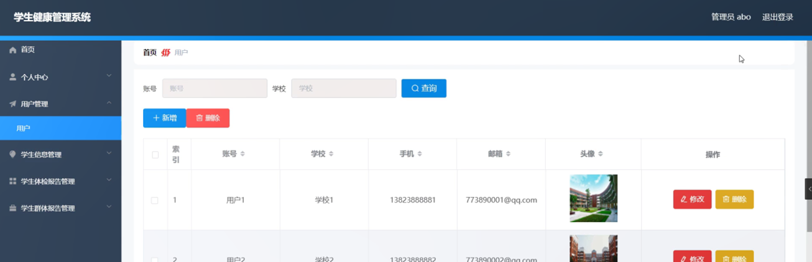

ssm+Vue计算机毕业设计学生健康管理系统（程序+LW文档）

**项目运行**

**环境配置：**

**Jdk1.8 + Tomcat7.0 + Mysql + HBuilderX** **（Webstorm也行）+ Eclispe（IntelliJ
IDEA,Eclispe,MyEclispe,Sts都支持）。**

**项目技术：**

**SSM + mybatis + Maven + Vue** **等等组成，B/S模式 + Maven管理等等。**

**环境需要**

**1.** **运行环境：最好是java jdk 1.8，我们在这个平台上运行的。其他版本理论上也可以。**

**2.IDE** **环境：IDEA，Eclipse,Myeclipse都可以。推荐IDEA;**

**3.tomcat** **环境：Tomcat 7.x,8.x,9.x版本均可**

**4.** **硬件环境：windows 7/8/10 1G内存以上；或者 Mac OS；**

**5.** **是否Maven项目: 否；查看源码目录中是否包含pom.xml；若包含，则为maven项目，否则为非maven项目**

**6.** **数据库：MySql 5.7/8.0等版本均可；**

**毕设帮助，指导，本源码分享，调试部署** **(** **见文末** **)**

###  系统体系结构

学生健康管理系统开发系统的结构图4-1所示：

图4-1 系统结构

学生健康管理系统主要功能包括首页、个人中心、用户管理、学生信息管理、学生体检报告管理、学生群体报告管理等进行相应的操作。

登录系统结构图，如图4-2所示：

图4-2 登录结构图

这些功能可以充分满足学生健康管理系统的需求。此系统功能较为全面如下图系统功能结构如图4-3所示。

图4-3系统功能结构图

### 4.2 数据库设计原则

每个数据库的应用它们都是和区分开的，当运行到一定的程序当中，它就会与自己相关的协议与客户端进行通讯。那么这个系统就会对使这些数据进行连接。当我们选择哪个桥段的时候，接下来就会简单的叙述这个数据库是如何来创建的。当点击完成按钮的时候就会自动在对话框内弹出数据源的名称，在进行点击下一步即可，直接在输入相对应的身份验证和登录密码。

学生健康管理系统的数据流程：

图4-4 系统数据流程图

学生信息管理实体E-R图，如图4-5所示。

图4-5学生信息管理E-R图

学生体检报告管理E-R图，如图4-6所示。

图4-6学生体检报告管理E-R图

### 管理员功能模块

管理员登录，管理员通过输入用户名、密码、选择角色等信息，然后点击登录就能登录到系统进行系统的使用了，如图5-1所示。

图5-1管理员登录界面图

管理员登录进入系统之后，就可以对所有的信息进行查看，可以查看到首页、个人中心、用户管理、学生信息管理、学生体检报告管理、学生群体报告管理等，并且还可以对其进行相应的操作管理，如图5-2所示。

图5-2管理员功能界面图

用户管理，在用户管理页面中可以对索引、账号、学校、手机、邮箱、头像等信息进行修改或删除等操作，如图5-3所示。

图5-3用户管理界面图

学生信息管理，在学生信息管理页面中可以对索引、账号、学校、学生姓名、学号、籍贯、性别、民族、出生日期、政治面貌、家庭地址、身份证号码、照片等信息进行详情，修改或删除等操作，如图5-4所示。

图5-4学生信息管理界面图

学生体检报告管理，在学生体检报告管理页面中可以对索引、账号、学校、学号、学生姓名、性别、年龄、年级、身高、体重、龋齿、贫血、视力、照片等信息进行详情、修改或删除等操作，如图5-5所示。

图5-5学生体检报告管理界面图

学生群体报告管理，在学生群体报告管理页面中可以对索引、账号、学校、图片等信息进行详情、修改或删除等操作，如图5-6所示。

图5-6学生群体报告管理界面图

### 5.2 用户功能模块

用户登录进入系统可以查看首页、个人中心、学生信息管理、学生体检报告管理、学生群体报告管理等信息，并进行相应的操作管理，如图5-7所示。

图5-7用户功能界面图

个人中心，在个人中心页面中通过填写账号、学校、手机、邮箱、头像等内容进行个人信息修改操作，如图5-8所示。

图5-8个人中心界面图

学生信息管理，在学生信息管理页面中可以对索引、账号、学校、学生姓名、学号、籍贯、性别、民族、出生日期、政治面貌、家庭地址、身份证号码、照片等信息进行详情，修改或删除等操作，如图5-9所示。

图5-9学生信息管理界面图

学生体检报告管理，在学生体检报告管理页面中可以对索引、账号、学校、学号、学生姓名、性别、年龄、年级、身高、体重、龋齿、贫血、视力、照片等信息进行详情、修改或删除等操作，如图5-10所示。

图5-10学生体检报告管理界面图

学生群体报告管理，在学生群体报告管理页面中可以对索引、账号、学校、图片等信息进行详情、修改或删除等操作，如图5-11所示。

图5-11学生群体报告管理界面图

**JAVA** **毕设帮助，指导，源码分享，调试部署**

