ssm+Vue计算机毕业设计学生健康饮食信息管理系统（程序+LW文档）

**项目运行**

**环境配置：**

**Jdk1.8 + Tomcat7.0 + Mysql + HBuilderX** **（Webstorm也行）+ Eclispe（IntelliJ
IDEA,Eclispe,MyEclispe,Sts都支持）。**

**项目技术：**

**SSM + mybatis + Maven + Vue** **等等组成，B/S模式 + Maven管理等等。**

**环境需要**

**1.** **运行环境：最好是java jdk 1.8，我们在这个平台上运行的。其他版本理论上也可以。**

**2.IDE** **环境：IDEA，Eclipse,Myeclipse都可以。推荐IDEA;**

**3.tomcat** **环境：Tomcat 7.x,8.x,9.x版本均可**

**4.** **硬件环境：windows 7/8/10 1G内存以上；或者 Mac OS；**

**5.** **是否Maven项目: 否；查看源码目录中是否包含pom.xml；若包含，则为maven项目，否则为非maven项目**

**6.** **数据库：MySql 5.7/8.0等版本均可；**

**毕设帮助，指导，本源码分享，调试部署** **(** **见文末** **)**

### 系统体系结构

学生健康饮食信息管理系统的结构图4-1所示：

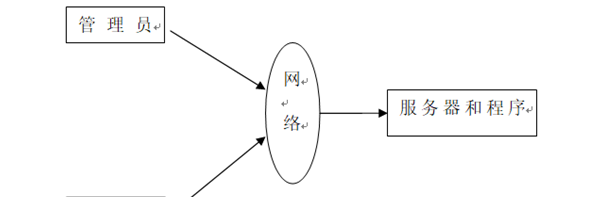

图4-1 系统结构

模块包括首页，个人中心，用户管理，食谱类型管理，食谱信息管理，热量消耗管理，饮食记录管理，结果分析管理，系统管理等进行相应的操作。

登录系统结构图，如图4-2所示：

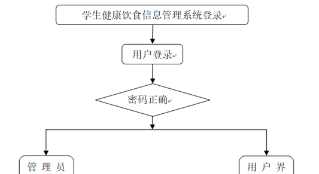

图4-2 登录结构图

这些功能可以充分满足学生健康饮食信息管理系统的需求。此系统功能较为全面如下图系统功能结构如图4-3所示。

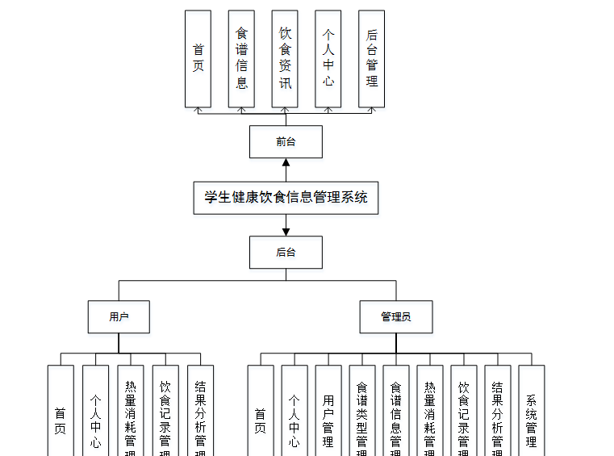

图4-3系统功能结构图

### 4.2数据库设计

本系统使用MYSQL 作为系统的数据库，设计用户注册表、文件上传的表等等。

#### 4.2.1 数据库概念结构设计

概念结构设计是根据用户需求形成的。用最常的E-R方法描述数据模型进行数据库的概念设计，首先设计局部的E-
R模式，最后各局部ER模式综合成一个全局模式。然后再把概念模式转换成逻辑模式。将概念设计从设计过程中独立开来，设计复杂程度降低，不受特定DBMS的限制。所有实体和属性的定义如下所示。

饮食资讯属性图如图4-4所示。

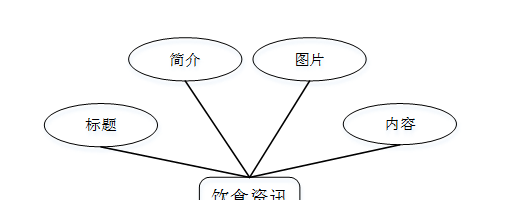

图4-4饮食资讯实体属性图

饮食信息实体属性图如图4-5所示。

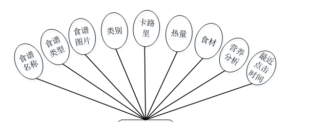

图4-5饮食信息实体属性图

### 系统功能模块

学生健康饮食信息管理系统，在系统首页可以查看首页，食谱信息，饮食资讯，个人中心，后台管理等内容，并进行详细操作；如图5-1所示。

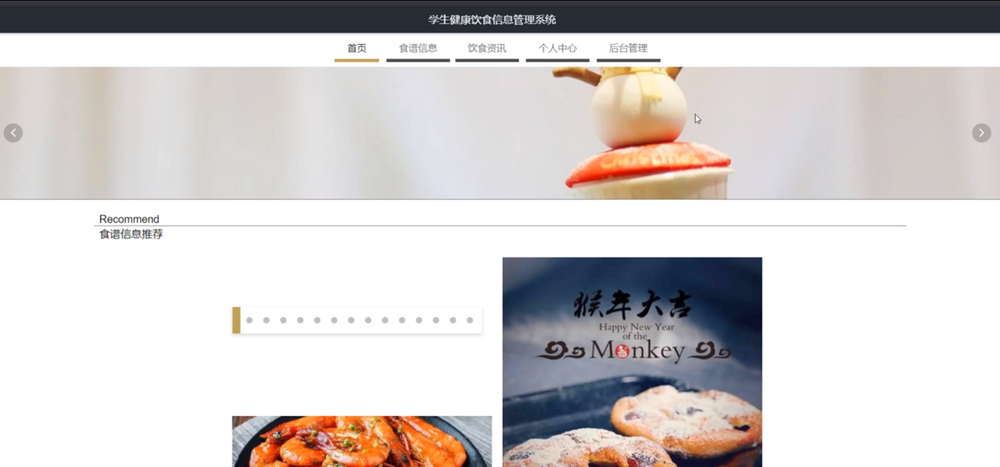

图5-1系统首页界面图

用户注册，在用户注册页面通过填写用户名，密码，再次输入密码，姓名，年龄，身高，体重等信息进行注册操作，如图5-2所示。

图5-2用户注册界面图

食谱信息，在食谱信息页面可以查看食谱类型，类别，卡路里，热量，食材等内容，并进行评论和收藏等操作，如图5-3所示。

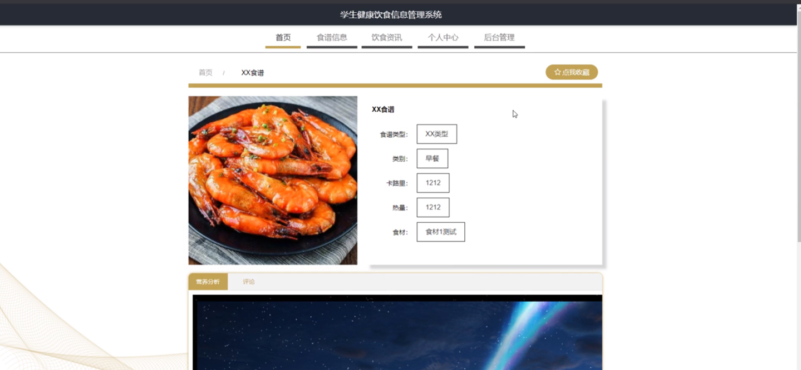

图5-3食谱信息界面图

个人中心，在个人中心页面通过填写用户名，密码，姓名，性别，上传图片，年龄，身高，体重等内容进行更新信息，还可以根据需要对我的收藏进行相对应操作，如图5-4所示。

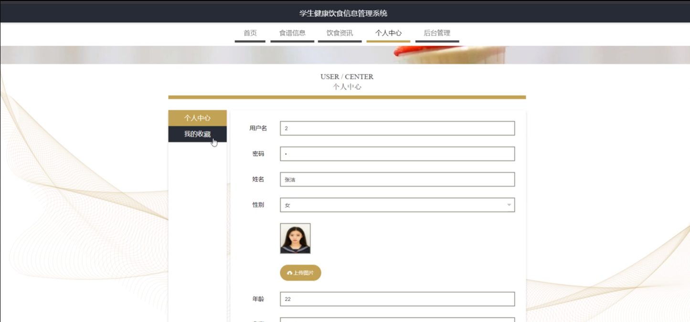

图5-4个人中心界面图

### 5.2管理员功能模块

管理员登录，管理员进入系统前在登录页面根据要求填写用户名和密码，选择角色等信息，点击登录进行登录操作，如图5-5所示。

图5-5管理员登录界面图

管理员登录系统后，可以对首页，个人中心，用户管理，食谱类型管理，食谱信息管理，热量消耗管理，饮食记录管理，结果分析管理，系统管理等功能进行相应的操作管理，如图5-6所示。

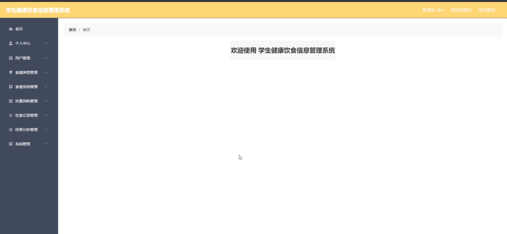

图5-6管理员功能界面图

用户管理，在用户管理页面可以对索引，用户名，姓名，性别，头像，年龄，身高，体重等内容进行详情，修改和删除等操作，如图5-7所示。

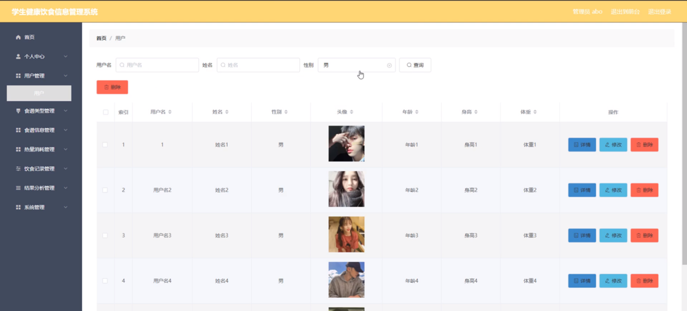

图5-7用户管理界面图

食谱类型管理，在食谱类型管理页面可以对索引，食谱类型进行修改和删除操作，如图5-8所示。

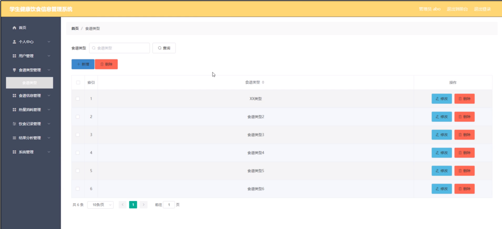

图5-8食谱类型管理界面图

食谱信息管理，在食谱信息管理页面可以对索引，食谱名称，食谱类型，类别，食谱图片，卡路里，热量等内容进行详情，修改，查看评论和删除等操作，如图5-9所示。

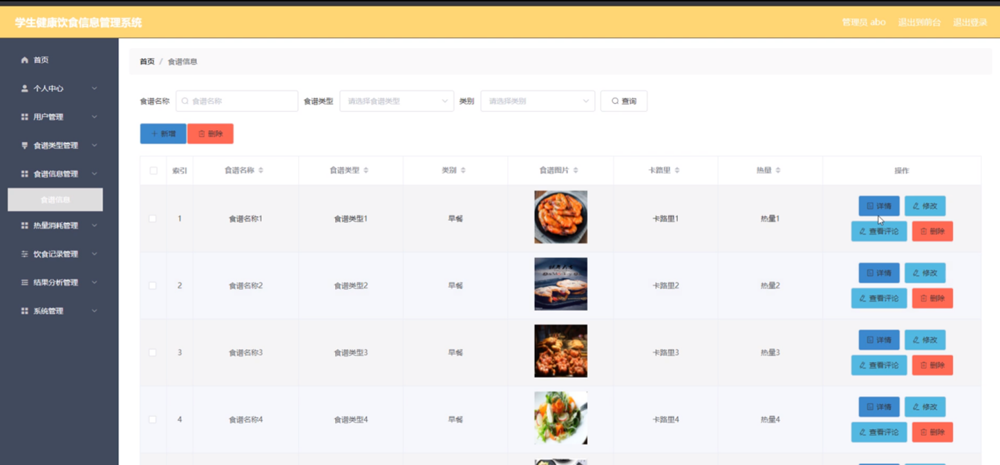

图5-9食谱信息管理界面图

热量消耗管理，在热量消耗管理页面可以对索引，用户名，姓名，身高，体重，bml，发布时间等内容进行详情，修改和删除等操作，如图5-10所示。

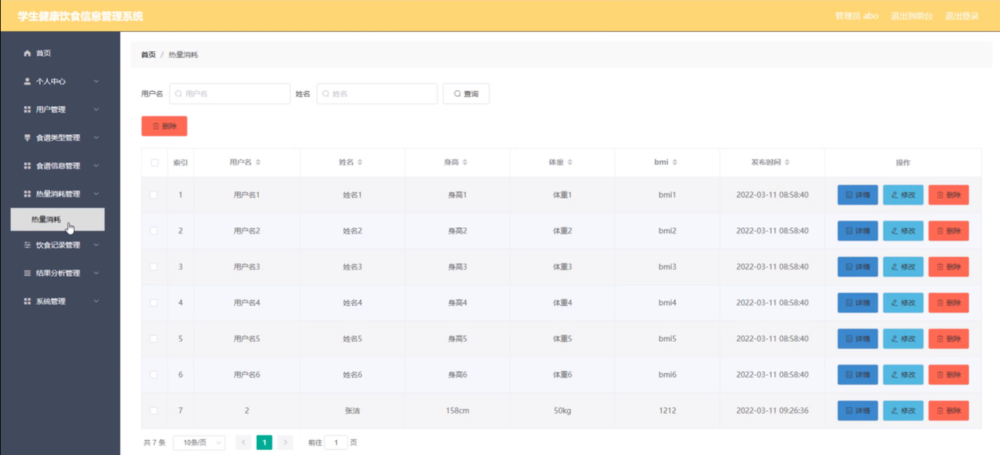

图5-10热量消耗管理界面图

系统管理，在饮食资讯管理页面可以对索引，标题，图片等内容进行详情，修改和删除等操作，还可以对轮播图管理进行详细的操作管理；如图5-11所示。

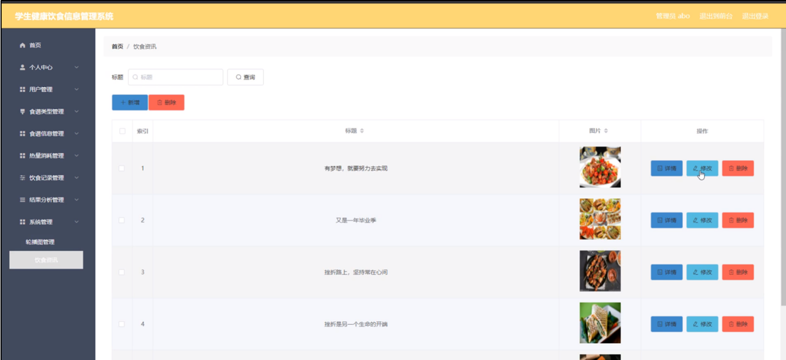

图5-11系统管理界面图

### 5.3用户功能模块

用户登录进入学生健康饮食信息管理系统可以对首页，个人中心，热量消耗管理，饮食记录管理，结果分析管理等功能进行相应操作，如图5-12所示。

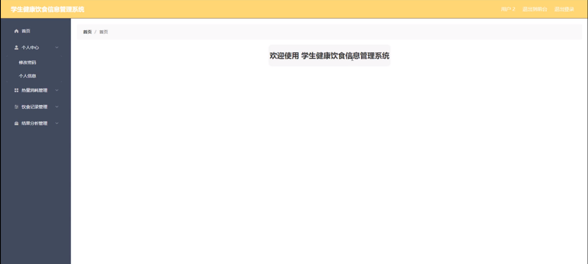

图5-12用户功能界面图

#### **JAVA** **毕设帮助，指导，源码分享，调试部署**

