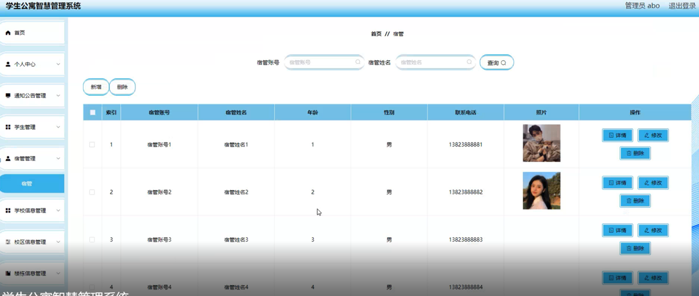

ssm+Vue计算机毕业设计学生公寓智慧管理系统（程序+LW文档）

**项目运行**

**环境配置：**

**Jdk1.8 + Tomcat7.0 + Mysql + HBuilderX** **（Webstorm也行）+ Eclispe（IntelliJ
IDEA,Eclispe,MyEclispe,Sts都支持）。**

**项目技术：**

**SSM + mybatis + Maven + Vue** **等等组成，B/S模式 + Maven管理等等。**

**环境需要**

**1.** **运行环境：最好是java jdk 1.8，我们在这个平台上运行的。其他版本理论上也可以。**

**2.IDE** **环境：IDEA，Eclipse,Myeclipse都可以。推荐IDEA;**

**3.tomcat** **环境：Tomcat 7.x,8.x,9.x版本均可**

**4.** **硬件环境：windows 7/8/10 1G内存以上；或者 Mac OS；**

**5.** **是否Maven项目: 否；查看源码目录中是否包含pom.xml；若包含，则为maven项目，否则为非maven项目**

**6.** **数据库：MySql 5.7/8.0等版本均可；**

**毕设帮助，指导，本源码分享，调试部署** **(** **见文末** **)**

### 功能结构

为了更好的去理清本系统整体思路，对该系统以结构图的形式表达出来，设计实现该学生公寓智慧管理系统的功能结构图如下所示：

图4-1 系统总体结构图

### 4.2 数据库设计

####  4.2.1 数据库E/R图

ER图是由实体及其关系构成的图，通过E/R图可以清楚地描述系统涉及到的实体之间的相互关系。在系统中对一些主要的几个关键实体如下图：

(1) 宿管信息E/R图如下所示：

图4-2宿管信息E/R图

(2) 学生信息E/R图如下所示：

图4-3学生信息E/R图

(3) 宿舍信息E/R图如下所示：

图4-4宿舍信息E/R图

(4) 楼栋信息E/R图如下所示：

图4-5楼栋信息E/R图

### 管理员功能模块

管理员登录，管理员通过登录页面输入用户名、密码，选择角色并点击登录进行系统登录操作，如图5-1所示。

图5-1管理员登录界面图

管理员登录系统后，可以对首页、个人中心、通知公告管理、学生管理、宿管管理、学校信息管理、校区信息管理、楼栋信息管理、宿舍信息管理、宿舍分配管理、门禁记录管理、学生签到管理、学生报修管理等功能进行相应操作，如图5-2所示。

图5-2管理员功能界面图

通知公告管理，在通知公告管理页面可以对标题、发布时间、封面等内容进行详情、修改、删除等操作，如图5-3所示。

图5-3通知公告管理界面图

学生管理，在学生管理页面可以对学号、姓名、年龄、性别、手机、学校、宿舍号、头像等内容进行详情、修改、删除等操作，如图5-4所示。

图5-4学生管理界面图

宿管管理，在宿管管理页面可以对宿管账号、宿管姓名、年龄、性别、联系电话、照片等内容进行详情、修改、删除等操作，如图5-5所示。

图5-5宿管管理界面图

学校信息管理，在学校信息管理页面可以对学校信息进行详情、修改、删除等操作，如图5-6所示。

图5-6学校信息管理界面图

校区信息管理，在校区信息管理页面可以对校区信息进行详情修改、删除等操作，如图5-7所示。

图5-7校区信息管理界面图

楼栋信息管理，在楼栋信息管理页面可以对楼栋编号、楼栋名称、楼栋类型、学校、校区、位置、宿舍数量、床位数量、封面、宿管账号、宿管姓名、备注、登记日期等内容进行详情、修改、删除等操作，如图5-8所示。

图5-8楼栋信息管理界面图

宿舍信息管理，在宿舍信息管理页面可以对楼栋编号、楼栋名称、楼栋类型、学校、小区、宿舍号、楼层、位置、可住人数、备注、宿管账号、宿管姓名等内容进行详情、删除等操作，如图5-9所示。

图5-9宿舍信息管理界面图

宿舍分配管理，在宿舍分配管理页面可以对楼栋编号、楼栋名称、宿舍号、学校、床位号、学号、姓名、状态、登记日期、备注、宿管账号、宿管姓名等内容进行详情、删除等操作，如图5-10所示。

图5-10宿舍分配管理界面图

### 5.2学生功能模块

学生注册，在注册页面填写学号、密码、确认密码、姓名、年龄、手机、宿舍号等详细信息进行注册，如图5-11所示。

图5-11学生注册界面图

学生登录，学生在登录页面通过填写账号、密码信息完成选择角色登录，如图5-12所示。

图5-12学生登录界面图

#### **JAVA** **毕设帮助，指导，源码分享，调试部署**

