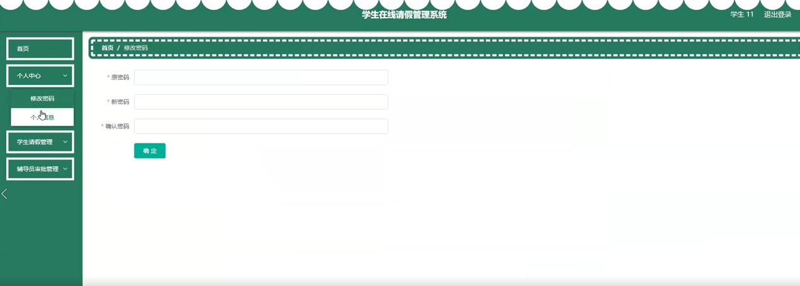

ssm+Vue计算机毕业设计学生在线请假管理系统（程序+LW文档）

**项目运行**

**环境配置：**

**Jdk1.8 + Tomcat7.0 + Mysql + HBuilderX** **（Webstorm也行）+ Eclispe（IntelliJ
IDEA,Eclispe,MyEclispe,Sts都支持）。**

**项目技术：**

**SSM + mybatis + Maven + Vue** **等等组成，B/S模式 + Maven管理等等。**

**环境需要**

**1.** **运行环境：最好是java jdk 1.8，我们在这个平台上运行的。其他版本理论上也可以。**

**2.IDE** **环境：IDEA，Eclipse,Myeclipse都可以。推荐IDEA;**

**3.tomcat** **环境：Tomcat 7.x,8.x,9.x版本均可**

**4.** **硬件环境：windows 7/8/10 1G内存以上；或者 Mac OS；**

**5.** **是否Maven项目: 否；查看源码目录中是否包含pom.xml；若包含，则为maven项目，否则为非maven项目**

**6.** **数据库：MySql 5.7/8.0等版本均可；**

**毕设帮助，指导，本源码分享，调试部署** **(** **见文末** **)**

### 系统体系结构

学生在线请假管理系统采用了结构化开发的方法。这种开发方法的优点是控制性比较强，开发过程中采用了结构化和模块化的设计思想，自顶向下，从总体到部分，合理划分系统的结构和模块。结构化开发时使用模块式开发，各模块之间互不影响，方便系统的开发与管理。

本系统的设计是基于
B/S架构的三层体系结构，也就是浏览器和服务器结构。计算机技术发展的速度非常快，以前的设计结构都以C/S的模式为主，但随着网页技术的发展，越来越多的用户习惯于使用浏览器。现在的网页技术可以在浏览器中实现非常漂亮的效果，以前的单一低调的用户端页面已经无法满足用户的需求。在B/S这种结构下，技术人员可以很轻松的设计出用户所需要的工作界面，页面代码通过浏览器进行解析展示，在浏览器中不做过多的事务逻辑的处理。主要的事务逻辑放在服务端进行处理。这样用户的电脑就不会承载过多的东西，只需要浏览器展示即可。对于开发人员也很方便进行系统的维护和升级。开发人员只需要在服务端进行系统的维护就可以了。使用JSP这样的跨平台性非常好的技术，这样的开发模式更加的方便，高效。本系统合理的进行了模块划分和组合，因此由于各个模块之间基本上是相互独立的，所以每个模块都可以独立的被解释、执行、调试和修改，让繁琐的系统设计工作简单化。

这些功能可以充分满足学生在线请假管理系统的需求。此系统功能较为全面如下图系统功能结构如图4-1所示。

图4-1系统功能结构图

### 4.2 数据库设计

本系统使用MYSQL 作为系统的数据库，用来设计用户注册表的表等等。

#### 4.2.1 数据库概念结构设计

概念结构设计是根据用户需求形成的。用最常的E-R方法描述数据模型进行数据库的概念设计，首先设计局部的E-
R模式，最后各局部ER模式综合成一个全局模式。然后再把概念模式转换成逻辑模式。将概念设计从设计过程中独立开来，设计复杂程度降低，不受特定DBMS的限制。

1.所有实体和属性的定义如下所示。

辅导员信息实体属性图，如图4-2所示。

图4-2 辅导员信息实体属性图

教师信息实体属性图，如图4-3所示：

图4-3教师信息实体属性图

学生信息实体属性图，如图4-4所示：

图4-4学生信息实体属性图

学生请假信息实体属性图，如图4-5所示。

图4-5学生请假信息实体属性图

### 管理员功能模块

管理员进行登录，进入系统前在登录页面根据要求填写用户名和密码，选择角色等信息，点击登录进行登录操作，如图5-1所示。

图5-1管理员登录界面图

管理员登录系统后，可以对首页、个人中心、学生管理、教师管理、辅导员管理、学生请假管理、辅导员审批管理等进行相应的操作管理，如图5-2所示。

图5-2管理员功能界面图

学生管理，在学生管理页面可以对学号、姓名、年龄、性别、手机、班级、照片、教师账号、教师姓名、辅导账号、辅导姓名等内容进行详情、修改和删除等操作，如图5-3所示。

图5-3学生管理界面图

教师管理，在教师管理页面可以对教师账号、教师姓名、年龄、性别、联系电话、照片、辅导账号、辅导姓名等内容进行详情、修改、删除等操作，如图5-4所示。

图5-4教师管理界面图

辅导员管理，在辅导员管理页面可以对辅导账号、辅导姓名、年龄、性别、手机、照片等内容进行详情、修改和删除等操作，如图5-5所示。

图5-5辅导员管理界面图

学生请假管理，在学生请假管理页面可以对学号、姓名、班级、起始时间、结束时间、请假天数、请假条、教师账号、教师姓名、审核回复、审核状态等内容进行详情和删除等操作，如图5-6所示。

图5-6学生请假管理界面图

辅导员审批管理，在辅导员审批管理页面可以对学号、姓名、班级、起始时间、结束时间、请假天数、请假条、提交时间、教师账号、教师姓名、辅导账号、审核回复、审核状态等内容进行详情和删除等操作，如图5-7所示。

图5-7辅导员审批管理界面图

### 5.3学生功能模块

学生注册，在学生注册页面通过填写学号、密码、确认密码、姓名、年龄、手机、班级等信息完成学生注册操作，如图5-8所示。

图5-8学生注册界面图

学生登录，在学生登录页面通过填写账号、密码等信息并选择角色登录操作，如图5-9所示。

图5-9学生登录界面图

学生登录进入系统后可以对首页、个人中心、学生请假管理、辅导员审批管理等进行相应操作，如图5-10所示。

图5-10学生功能界面图

用户在个人中心页面填写学号、姓名、年龄、性别、手机、班级、照片等内容，进行修改，还能修改密码，如图5-11所示。

图5-11个人中心界面图

学生在学生请假管理页面查看学号、姓名、班级、起始时间、结束时间、请假天数、请假条、教师账号、教师姓名、审核回复、审核状态等内容进行详情、修改、删除操作，如图5-12所示。

图5-12学生请假管理界面图

**JAVA** **毕设帮助，指导，源码分享，调试部署**

