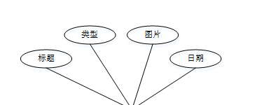
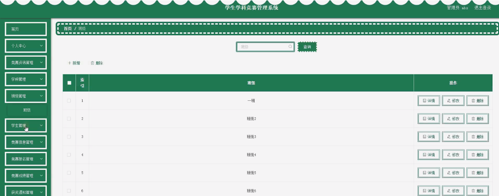
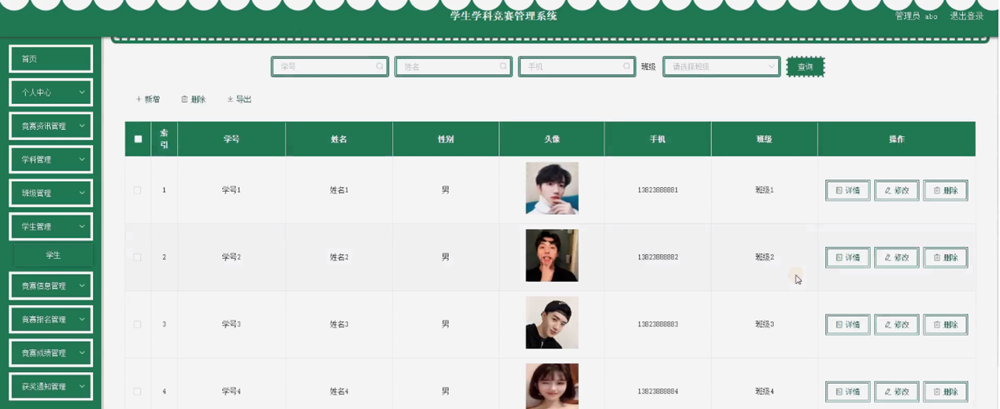

ssm+Vue计算机毕业设计学生学科竞赛管理系统（程序+LW文档）

**项目运行**

**环境配置：**

**Jdk1.8 + Tomcat7.0 + Mysql + HBuilderX** **（Webstorm也行）+ Eclispe（IntelliJ
IDEA,Eclispe,MyEclispe,Sts都支持）。**

**项目技术：**

**SSM + mybatis + Maven + Vue** **等等组成，B/S模式 + Maven管理等等。**

**环境需要**

**1.** **运行环境：最好是java jdk 1.8，我们在这个平台上运行的。其他版本理论上也可以。**

**2.IDE** **环境：IDEA，Eclipse,Myeclipse都可以。推荐IDEA;**

**3.tomcat** **环境：Tomcat 7.x,8.x,9.x版本均可**

**4.** **硬件环境：windows 7/8/10 1G内存以上；或者 Mac OS；**

**5.** **是否Maven项目: 否；查看源码目录中是否包含pom.xml；若包含，则为maven项目，否则为非maven项目**

**6.** **数据库：MySql 5.7/8.0等版本均可；**

**毕设帮助，指导，本源码分享，调试部署** **(** **见文末** **)**

总体设计

根据学生学科竞赛管理系统的功能需求，进行系统设计。

学生进入系统后台可以实现个人中心、竞赛资讯管理、竞赛信息管理、竞赛报名管理、竞赛成绩管理、获奖通知管理等进行操作；

管理员功能包括个人中心、竞赛资讯管理、学科管理、班级管理、学生管理、竞赛信息管理、竞赛报名管理、竞赛成绩管理、获奖通知管理等；

系统对这些功能进行整合，产生的功能结构图如下：

图3-1 系统总体结构图

3.4 数据库设计与实现

在每一个系统中数据库有着非常重要的作用，数据库的设计得好将会增加系统的效率以及系统各逻辑功能的实现。所以数据库的设计我们要从系统的实际需要出发，才能使其更为完美的符合系统功能的实现。

#### 3.4.1 数据库概念结构设计

数据库的E-R图反映了实体、实体的属性和实体之间的联系。下面是各个实体以及实体的属性。

竞赛资讯管理实体属性图如下所示：

图3-2 竞赛资讯管理实体属性图

学生管理实体属性图如下所示：

图3-3学生管理实体属性图

竞赛信息管理实体属性图如下所示：

图3-3竞赛信息管理实体属性图

管理员功能模块

管理员登录，管理员通过输入用户名、密码、角色进行登录，如图4-1所示。。

图4-1管理员登录界面图

管理员通过数量进入系统可查看个人中心、竞赛资讯管理、学科管理、班级管理、学生管理、竞赛信息管理、竞赛报名管理、竞赛成绩管理、获奖通知管理等内容，如图4-2所示。

图4-2管理员功能界面图

竞赛资讯管理，管理员可在竞赛资讯管理页面查看标题、类型、图片、日期等内容，还可进行新增、修改或删除等操作，如图4-3所示。

图4-3竞赛资讯管理界面图

学科管理，管理员可在学科管理页面对学科管理进行查询、新增、修改或删除等操作，如图4-4所示。

图4-4学科管理界面图

班级管理，管理员可在包年级管理页面对班级进行查询、新增、修改或删除等操作，如图4-5所示。

图4-5班级管理界面图

学生管理，管理员可在学生管理页面查看学号、姓名、性别、头像、手机、班级等内容，还可进行新增、导出、修改或删除等操作，如图4-6所示。

图4-6学生管理界面图

竞赛信息管理，管理员可在竞赛信息管理页面查看竞赛名称、学科、竞赛图片、竞赛时间、竞赛地点等内容，还可进行新增、修改、导出、统计或删除等操作，如图4-7所示。

图4-7竞赛信息管理界面图

竞赛报名管理，管理员可在竞赛报名管理页面查看竞赛名称、学科、竞赛时间、竞赛地点、竞赛成绩、报名时间、学号、姓名、班级、手机、审核回复、审核状态等内容，还可进行导出、修改、添加成绩或删除等操作，如图4-8所示。

图4-8竞赛报名管理界面图

竞赛成绩管理，管理员可在竞赛成绩管理页面查看竞赛名称、竞赛成绩、学号、姓名、班级等内容，还可进行新增、修改或删除等操作，如图4-9所示。

图4-9竞赛成绩管理界面图

获奖通知管理，管理员可在获奖通知管理页面查看帖子标题、证书图片、证书文件、获奖名次、通知日期、通知备注、学号、姓名、手机等内容，还可进行新增、修改、导出或删除等操作，如图4-10所示。

图4-10获奖通知管理界面图

4.2学生功能模块

学生注册，学生通过输入学号、密码、姓名、手机等内容进行注册，如图4-11所示。

图4-11学生注册界面图

学生通过登录进入系统可查看个人中心、竞赛资讯管理、竞赛信息管理、竞赛报名管理、竞赛成绩管理、获奖通知管理等内容，如图4-12所示。

图4-12学生功能界面图

#### **JAVA** **毕设帮助，指导，源码分享，调试部署**

