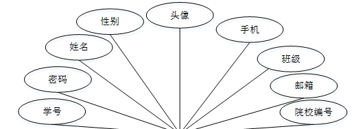

ssm+Vue计算机毕业设计学生实训管理网站（程序+LW文档）

**项目运行**

**环境配置：**

**Jdk1.8 + Tomcat7.0 + Mysql + HBuilderX** **（Webstorm也行）+ Eclispe（IntelliJ
IDEA,Eclispe,MyEclispe,Sts都支持）。**

**项目技术：**

**SSM + mybatis + Maven + Vue** **等等组成，B/S模式 + Maven管理等等。**

**环境需要**

**1.** **运行环境：最好是java jdk 1.8，我们在这个平台上运行的。其他版本理论上也可以。**

**2.IDE** **环境：IDEA，Eclipse,Myeclipse都可以。推荐IDEA;**

**3.tomcat** **环境：Tomcat 7.x,8.x,9.x版本均可**

**4.** **硬件环境：windows 7/8/10 1G内存以上；或者 Mac OS；**

**5.** **是否Maven项目: 否；查看源码目录中是否包含pom.xml；若包含，则为maven项目，否则为非maven项目**

**6.** **数据库：MySql 5.7/8.0等版本均可；**

**毕设帮助，指导，本源码分享，调试部署** **(** **见文末** **)**

### 系统功能

系统功能结构图

系统功能结构图是系统设计阶段，系统功能结构图只是这个阶段一个基础，整个系统的架构决定了系统的整体模式，是系统的根据。学生实训管理网站的整个设计结构如图3-1所示。

图3-1系统功能结构图

### 数据库设计

信息管理系统的效率和实现的效果完全取决于数据库结构设计的好坏。为了保证数据的完整性，提高数据库存储的效率，那么统一合理地设计数据库结构是必要的。数据库设计一般包括如下几个步骤：

（1）根据用户需求，确定数据库信息进行保存

对用户的需求分析是数据库设计的第一阶段，用户的需求调研，熟悉企业运作流程，系统要求，这些都是以概念模型为基础的。

（2）设计数据的概念模型

概念模型与数据建模用户的观点一致，用于信息世界的建模工具。通过E-R图可以清楚地描述系统涉及到的实体之间的相互关系。

学生信息实体图如图4-1所示：

图4-1学生信息实体图

院校信息实体图如图4-2所示：

图4-2院校信息实体图

实训项目信息实体图如图4-3所示：

图4-3实训项目信息实体图

### 系统功能模块

学生实训管理网站，在系统首页可以查看首页、实训项目、公告信息、个人中心、后台管理等内容进行详细操作，如图5-1所示。

图5-1系统首页界面图

学生注册，在学生注册页面通过填写学号、密码、再次输入密码、姓名、手机、邮箱等信息完成学生注册；点击登录，输入学号和密码，点击登录即可进入到系统前台进行相关操作，如图5-2所示。

图5-2学生注册及登录界面图

点击实训项目，学生可以查看项目名称、图片、项目类型、实习地点、开始时间、结束时间、项目要求、院校编号、院校名称、项目附件、项目内容等进行收藏、评论、参与实训、下载项目附件等操作，如图5-3所示。

图5-3实训项目界面图

在实训项目页面，点击参与实训，学生通过输入项目名称、项目类型、项目图片、实习地点、开始时间、结束时间、参与人数、院校编号、院校名称、报名时间、报名内容、学号、姓名、班级、手机等内容，点击提交进行参与实训的申请；如图5-4所示。

图5-4参与实训界面图

个人中心，在个人中心页面通过填写学号、密码、姓名、性别、图片、手机、班级、邮箱、院校编号等信息进行更新信息，根据需要对我的收藏进行相对应操作，如图5-5所示。

图5-5个人中心界面图

### 5.2管理员功能模块

管理员登录系统，管理员通过输入用户名、密码，选择角色并点击登录进行系统登录操作，如图5-6所示。

图5-6管理员登录界面图

管理员登录系统后，可以对个人中心、院校管理、班级管理、学生管理、实训项目管理、实训记录管理、系统管理等功能模块进行相应操作，如图5-7所示。

图5-7管理员功能界图面

院校管理，在院校管理页面可以对院校编号、院校名称、院校图片、学校名称、咨询电话、院校邮箱等进行查看、修改或删除、新增等操作，如图5-8所示。

图5-8院校管理界面图

班级管理，在班级管理页面可以对索引、班级等内容进行详情、修改或删除、新增等操作，如图5-9所示。

图5-9班级管理界面图

学生管理，在学生管理页面可以对学号、姓名、性别、头像、手机、班级、邮箱、院校编号等内容进行查看、修改或删除、新增等操作，如图5-10所示。

图5-10学生管理界面图

实训项目管理，在实训项目管理页面可以对项目名称、项目类型、项目图片、实习地点、开始时间、结束时间、项目附件、院校编号、院校名称等内容进行查看、修改或删除等操作，还能下载项目附件，如图5-11所示。

图5-11实训项目管理界面图

实训记录管理，在实训记录管理页面可以对项目名称、项目类型、项目图片、实习地点、开始时间、参与人数、院校编号、院校名称、报名时间、报名内容、学号、姓名、班级、手机、审核回复、审核状态等内容进行详情、修改或删除、查看统计报表等操作，如图5-12所示。

图5-12实训记录管理界面图

**JAVA** **毕设帮助，指导，源码分享，调试部署**

