ssm+Vue计算机毕业设计学生实验报告管理系统（程序+LW文档）

**项目运行**

**环境配置：**

**Jdk1.8 + Tomcat7.0 + Mysql + HBuilderX** **（Webstorm也行）+ Eclispe（IntelliJ
IDEA,Eclispe,MyEclispe,Sts都支持）。**

**项目技术：**

**SSM + mybatis + Maven + Vue** **等等组成，B/S模式 + Maven管理等等。**

**环境需要**

**1.** **运行环境：最好是java jdk 1.8，我们在这个平台上运行的。其他版本理论上也可以。**

**2.IDE** **环境：IDEA，Eclipse,Myeclipse都可以。推荐IDEA;**

**3.tomcat** **环境：Tomcat 7.x,8.x,9.x版本均可**

**4.** **硬件环境：windows 7/8/10 1G内存以上；或者 Mac OS；**

**5.** **是否Maven项目: 否；查看源码目录中是否包含pom.xml；若包含，则为maven项目，否则为非maven项目**

**6.** **数据库：MySql 5.7/8.0等版本均可；**

**毕设帮助，指导，本源码分享，调试部署** **(** **见文末** **)**

总体设计

根据学生实验报告管理系统的功能需求，进行系统设计。

学生功能：学生进入系统可以实现首页、个人中心、实验项目管理、实验报告管理等进行操作；

后台主要是管理员，管理员功能包括首页、个人中心、学生管理、教师管理、实验项目管理、实验报告管理等；

系统对这些功能进行整合，产生的功能结构图如下：

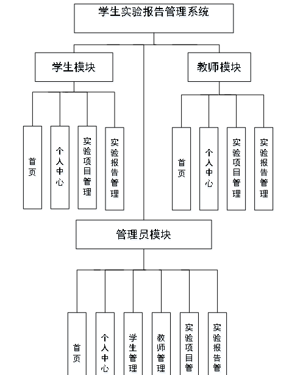

图3-7系统总体结构图

3.5 数据库设计与实现

在每一个系统中数据库有着非常重要的作用，数据库的设计得好将会增加系统的效率以及系统各逻辑功能的实现。所以数据库的设计我们要从系统的实际需要出发，才能使其更为完美的符合系统功能的实现。

#### **3.5.1** **数据库概念结构设计**

数据库的E-R图反映了实体、实体的属性和实体之间的联系。下面是各个实体以及实体的属性。

管理员信息实体属性图如下所示：

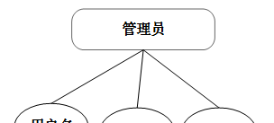

图3-8管理员信息实体属性图

学生信息实体属性图如下所示：

图3-9学生信息实体属性图

实验项目信息实体属性图如下所示：

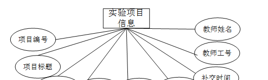

图3-10实验项目信息实体属性图

实验报告信息实体属性图如下所示：

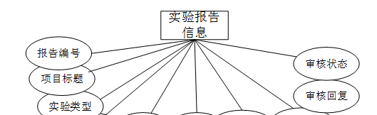

图3-11实验报告信息实体属性图

### 教师功能模块

教师注册，在注册页面填写教师工号、密码、确认密码、教师姓名、教师电话等内容，进行注册，如图4-1所示。

图4-1教师注册界面图

教师登录，在登录页面填写用户名、密码、选择角色等内容，进行登录，如图4-2所示。

图4-2教师登录界面图

教师登录进入学生实验报告管理系统后台可以查看首页、个人中心、实验项目管理、实验报告管理等内容，如图4-3所示。

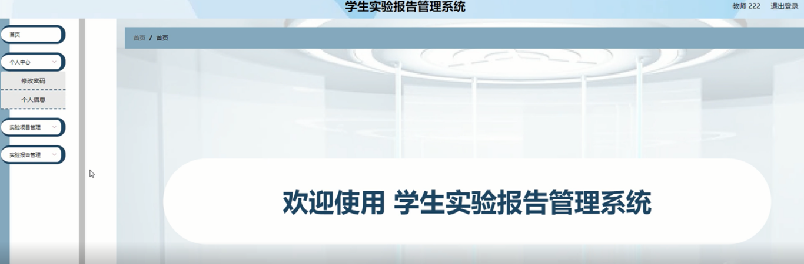

图4-3教师功能界面图

个人中心，教师在个人中心页面填写教师工号、教师姓名、性别、教师电话、头像等信息进行个人信息修改、并且修改密码等操作，如图4-4所示

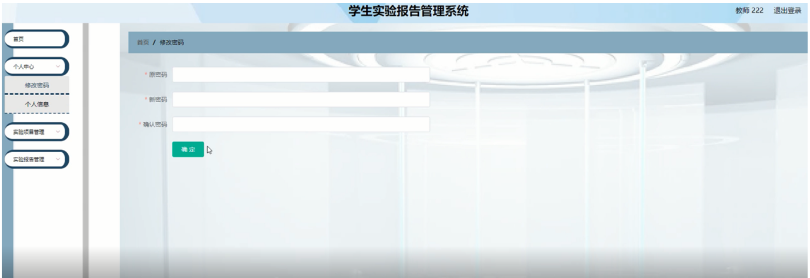

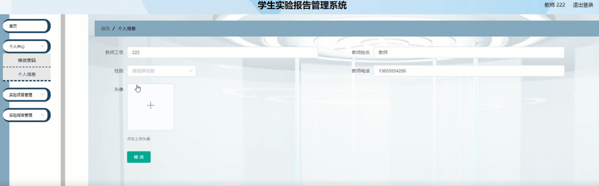

图4-4个人中心界面图

实验项目管理，在实验项目管理页面查看项目编号、项目标题、实验类型、实验要求、发布时间、提交截止、补交时间、教师工号、教师姓名等信息进行详情、修改、删除等操作，如图4-5所示。

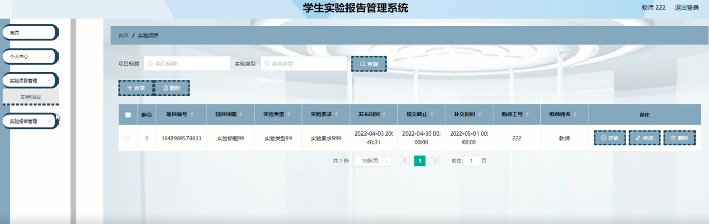

图4-5实验项目管理界面图

实验报告管理，在实验报告管理页面查看报告编号、项目标题、实验类型、提交时间、学号、姓名、教师工号、教师姓名、审核回复、审核状态、审核等信息进行详情等操作，如图4-6所示。

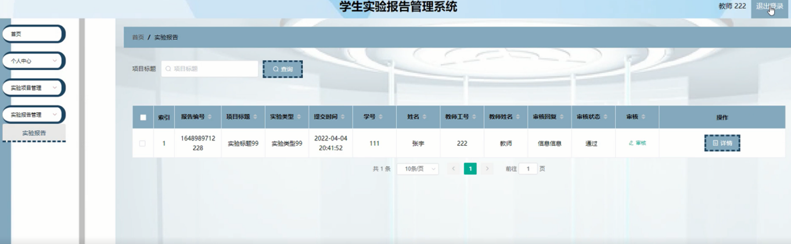

图4-6实验报告管理界面图

### 4.2 管理员功能模块

管理员登录，通过登录页面输入用户名、密码、选择角色等信息进行登录操作，如图4-7所示。

图4-7管理员登录界面图

管理员登录进入学生实验报告管理系统可以查看首页、个人中心、学生管理、教师管理、实验项目管理、实验报告管理等信息进行详细操作，如图4-8所示。

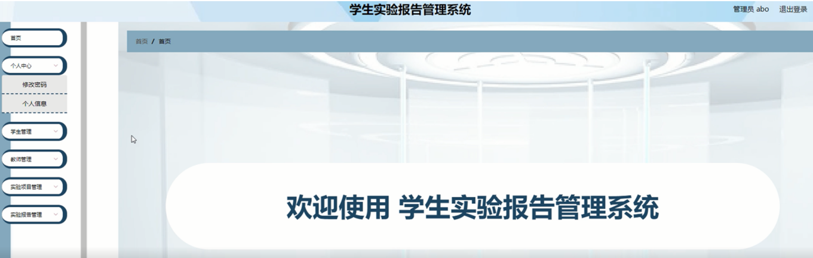

图4-8管理员功能界面图

管理员对个人中心进行操作填写原密码、新密码、确认密码并进行添加、删除、修改以及查看。修改密码，管理员对修改密码进行操作填写原密码、新密码、确认密码并进行添加、删除、修改以及查看，如图4-9所示。

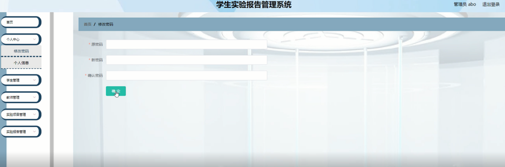

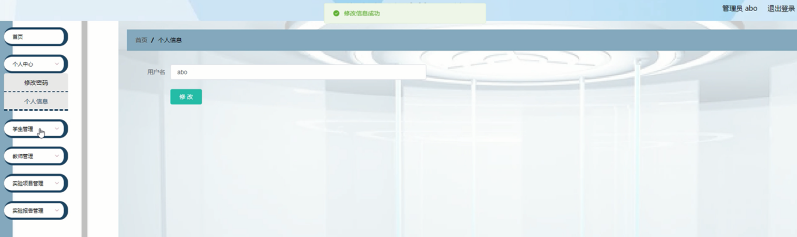

图4-9个人中心界面图

学生管理；在学生管理页面中可以查看学号、姓名、性别、学生电话、头像等内容，并进行详情，修改和删除等操作；如图4-10所示。

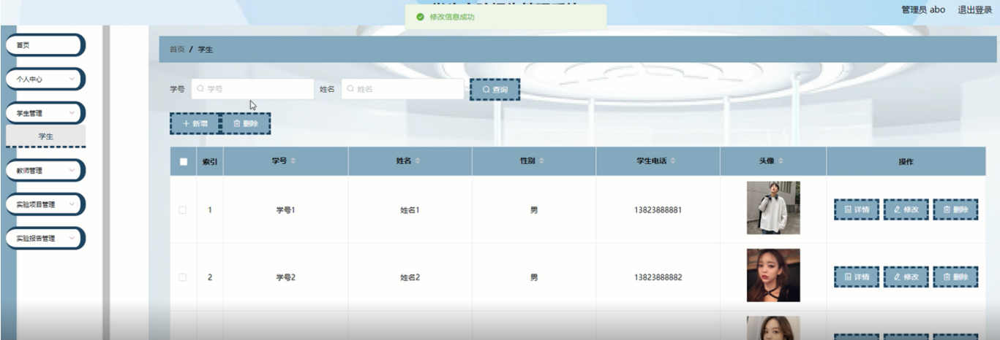

图4-10学生管理界面图

#### **JAVA** **毕设帮助，指导，源码分享，调试部署**

