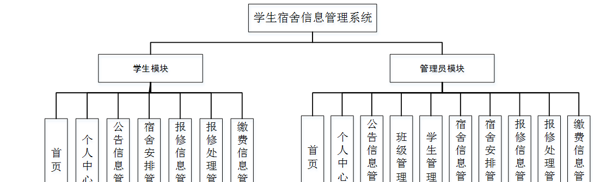

ssm+Vue计算机毕业设计学生宿舍信息管理系统（程序+LW文档）

**项目运行**

**环境配置：**

**Jdk1.8 + Tomcat7.0 + Mysql + HBuilderX** **（Webstorm也行）+ Eclispe（IntelliJ
IDEA,Eclispe,MyEclispe,Sts都支持）。**

**项目技术：**

**SSM + mybatis + Maven + Vue** **等等组成，B/S模式 + Maven管理等等。**

**环境需要**

**1.** **运行环境：最好是java jdk 1.8，我们在这个平台上运行的。其他版本理论上也可以。**

**2.IDE** **环境：IDEA，Eclipse,Myeclipse都可以。推荐IDEA;**

**3.tomcat** **环境：Tomcat 7.x,8.x,9.x版本均可**

**4.** **硬件环境：windows 7/8/10 1G内存以上；或者 Mac OS；**

**5.** **是否Maven项目: 否；查看源码目录中是否包含pom.xml；若包含，则为maven项目，否则为非maven项目**

**6.** **数据库：MySql 5.7/8.0等版本均可；**

**毕设帮助，指导，本源码分享，调试部署** **(** **见文末** **)**

### 系统的功能结构图

经过系统需求分析，该学生宿舍信息管理系统的设计与实现功能结构图如图4-1所示：

图4-1 系统功能结构图

### 4.2 数据库概念结构设计

####  4.2.1 数据库E-R图

概念设计主要是通过数据库的概念结构和模式进行建立数据库嗯逻辑结构，然后利用数据库的DBMS进行完成，它不需要计算机系统的支持。通过系统的整体来看，主要是对数据库进行管理、整理、更新等操作。数据库的功能是非常强大的，每个系统的开发肯定离不开数据库，通过数据库可以看得出整个系统的质量和效率，根据以上的系统分析，对系统中的主要实体进行规划。以下是几个关键实体的实体关系图：

(1) 宿舍信息管理实体E-R图如图4-2所示：

图4-2宿舍信息管理E-R图

(2) 报修信息管理E-R图如图4-3所示：

图4-3报修信息管理E-R图

### 管理员功能模块

管理员登录，通过填写注册时输入的用户名、密码、选择角色进行登录，如图5-1所示。

图5-1管理员登录界面图

管理员登录进入系统可以查看首页、个人中心、公告信息管理、班级管理、学生管理、宿舍信息管理、宿舍安排管理、报修信息管理、报修处理管理、缴费信息管理等信息进行详细操作，如图5-2所示。

图5-2管理员功能界面图

公告信息管理，在公告信息管理页面可以对索引、公告标题、图片、发布日期等内容进行详情，修改或删除等操作，如图5-3所示。

图5-3公告信息管理界面图

班级管理，在班级管理页面可以对索引、班级等内容进行详情，修改或删除等操作，如图5-4所示。

图5-4班级管理界面图

学生管理，在学生管理页面可以对索引、学号、学生姓名、性别、头像、班级、邮箱、手机、宿舍号等内容进行详情、添加缴费、修改或删除等操作，如图5-5所示。

图5-5学生管理界面图

宿舍信息管理，在宿舍信息管理页面可以对索引、宿舍号、宿舍类型、图片、位置、可住人数、备注等内容进行详情、安排、修改或删除等操作，如图5-6所示。

图5-6宿舍信息管理界面图

报修信息管理，在报修信息管理页面可以对索引、报修设备、类型、图片、报修内容、报修日期、学号、学生姓名、班级、宿舍号、手机、审核回复、审核状态等内容进行详情、处理、修改或删除等操作，如图5-7所示。

图5-7报修信息管理界面图

报修处理管理，在报修处理管理页面可以对索引、报修设备、类型、报修日期、维修反馈、维修进度、更新日期、学号、学生姓名、宿舍号、班级等内容进行详情，修改或删除等操作，如图5-8所示。

图5-8报修处理管理界面图

缴费信息管理，在缴费信息管理页面可以对索引、学号、学生姓名、班级、宿舍号、缴费名称、缴费类型、缴费金额、登记日期、是否支付等内容进行详情，修改或删除等操作，如图5-9所示。

图5-9缴费信息管理界面图

### 5.2学生功能模块

学生注册，在学生注册页面中通过填写学号、密码、学生姓名、邮箱、手机、宿舍号等信息进行注册，如图5-10所示。

图5-10学生注册界面图

学生登录进入系统可以查看首页、个人中心、公告信息管理、宿舍安排管理、报修信息管理、报修处理管理、缴费信息管理等内容进行详细操作，如图5-11所示。

图5-11学生功能界面图

个人中心，在个人中心页面中通过填写学号、学生姓名、性别、头像、班级、邮箱、手机、宿舍号等信息进行个人信息修改，如图5-12所示。

图5-12个人中心界面图

**JAVA** **毕设帮助，指导，源码分享，调试部署**

