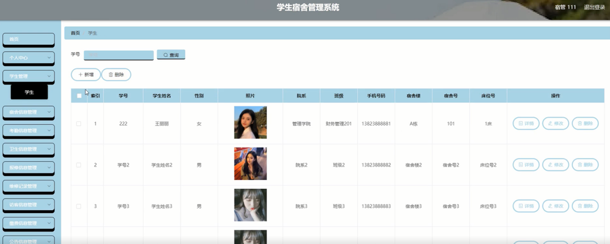
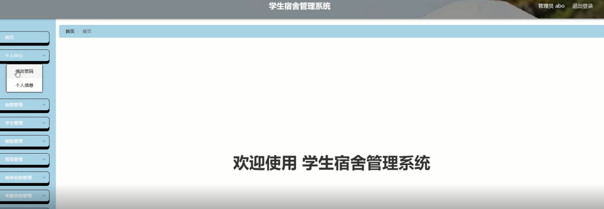

ssm+Vue计算机毕业设计学生宿舍管理系统 （程序+LW文档）

**项目运行**

**环境配置：**

**Jdk1.8 + Tomcat7.0 + Mysql + HBuilderX** **（Webstorm也行）+ Eclispe（IntelliJ
IDEA,Eclispe,MyEclispe,Sts都支持）。**

**项目技术：**

**SSM + mybatis + Maven + Vue** **等等组成，B/S模式 + Maven管理等等。**

**环境需要**

**1.** **运行环境：最好是java jdk 1.8，我们在这个平台上运行的。其他版本理论上也可以。**

**2.IDE** **环境：IDEA，Eclipse,Myeclipse都可以。推荐IDEA;**

**3.tomcat** **环境：Tomcat 7.x,8.x,9.x版本均可**

**4.** **硬件环境：windows 7/8/10 1G内存以上；或者 Mac OS；**

**5.** **是否Maven项目: 否；查看源码目录中是否包含pom.xml；若包含，则为maven项目，否则为非maven项目**

**6.** **数据库：MySql 5.7/8.0等版本均可；**

**毕设帮助，指导，本源码分享，调试部署** **(** **见文末** **)**

总体设计

根据学生宿舍管理系统的功能需求，进行系统设计。

后台主要是管理员，管理员功能包括首页、个人中心、宿管管理、学生管理、楼栋管理、班级管理、宿舍信息管理、考勤信息管理、卫生信息管理、报修信息管理、维修记录管理、访客信息管理、缴费信息管理、公告信息管理、申请管理等；

系统对这些功能进行整合，产生的功能结构图如下：

图3-6 系统总体结构图

3.5 数据库设计与实现

在每一个系统中数据库有着非常重要的作用，数据库的设计得好将会增加系统的效率以及系统各逻辑功能的实现。所以数据库的设计我们要从系统的实际需要出发，才能使其更为完美的符合系统功能的实现。

#### **3.5.1** **数据库概念结构设计**

数据库的E-R图反映了实体、实体的属性和实体之间的联系。下面是各个实体以及实体的属性。

管理员信息实体属性图如下所示：

图3-7 管理员信息实体属性图

报修信息实体属性图如下所示：

图3-8报修信息实体属性图

申请管理信息实体属性图如下所示：

图3-9申请管理信息实体属性图

宿舍信息实体属性图如下所示：

图3-10宿舍信息实体属性图

### 宿管后台功能模块

宿管登录，通过登录页面输入用户名、密码、选择角色等信息进行登录操作，如图4-1所示。

图4-1宿管登录界面图

宿管登录进入学生宿舍管理系统可以查看首页、个人中心、学生管理、宿舍信息管理、考勤信息管理、卫生信息管理、报修信息管理、维修记录管理、访客信息管理、缴费信息管理、公告信息管理、申请管理等信息进行详细操作，如图4-2所示。

图4-2宿管功能界面图

学生管理，在学生管理页面查看学号、学生姓名、性别、照片、院系、班级、手机号码、宿舍楼、宿舍号、床位号等信息进行修改、删除等操作，如图4-3所示。

图4-3学生管理界面图

宿舍信息管理，在宿舍信息管理页面查看楼栋号、宿舍号、院系、班级、宿舍人数、宿舍床位、剩余床位、宿舍长、学号、更新时间等信息进行修改、删除等操作，如图4-4所示。

图4-4宿舍信息管理界面图

报修信息管理，在报修信息管理查看宿舍楼、宿舍号、学号、学生姓名、手机号码、报修内容、状态、报修时间等信息进行修改、删除等操作，如图4-5所示。

图4-5报修信息管理界面图

公告信息管理，在公告信息管理页面查看标题、发布人、发布时间等信息进行修改、删除等操作，如图4-6所示。

图4-6公告信息管理界面图

申请管理，在申请管理页面查看学生姓名、学号、宿舍号、楼栋号、申请类型、申请说明、申请时间、审核回复、审核状态、审核等信息进行详情等操作，如图4-7所示。

图4-7申请管理界面图

### 4.2 管理员功能模块

管理员登录，通过登录页面输入用户名、密码、选择角色等信息进行登录操作，如图4-8所示。

图4-8管理员登录界面图

管理员登录进入学生宿舍管理系统可以查看首页、个人中心、宿管管理、学生管理、楼栋管理、班级管理、宿舍信息管理、考勤信息管理、卫生信息管理、报修信息管理、维修记录管理、访客信息管理、缴费信息管理、公告信息管理、申请管理等信息进行详细操作，如图4-9所示。

图4-9管理员功能界面图

宿管管理；在宿管管理页面中可以查看宿管账号、宿管姓名、照片、生日、手机号码、入职时间、负责楼栋等内容，并进行详情，修改和删除等操作；如图4-10所示。

图4-10宿管管理界面图

学生管理：在学生管理页面中可以查看学号、学生姓名、性别、照片、院系、班级、手机号码、宿舍楼、宿舍号、床位号等内容，并进行修改和删除等操作，如图4-11所示。

图4-11学生管理界面图

宿舍信息管理；在宿舍信息管理页面中可以查看楼栋号、宿舍号、院系、班级、宿舍人数、宿舍床位、剩余床位、宿舍长、学号、更新时间等内容，并进行修改和删除等操作；如图4-12所示。

图4-12宿舍信息管理界面图

**JAVA** **毕设帮助，指导，源码分享，调试部署**

