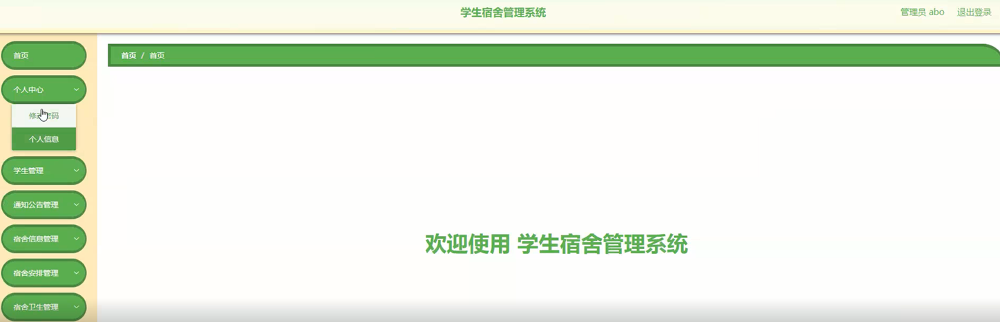

ssm+Vue计算机毕业设计学生宿舍管理系统（程序+LW文档）

**项目运行**

**环境配置：**

**Jdk1.8 + Tomcat7.0 + Mysql + HBuilderX** **（Webstorm也行）+ Eclispe（IntelliJ
IDEA,Eclispe,MyEclispe,Sts都支持）。**

**项目技术：**

**SSM + mybatis + Maven + Vue** **等等组成，B/S模式 + Maven管理等等。**

**环境需要**

**1.** **运行环境：最好是java jdk 1.8，我们在这个平台上运行的。其他版本理论上也可以。**

**2.IDE** **环境：IDEA，Eclipse,Myeclipse都可以。推荐IDEA;**

**3.tomcat** **环境：Tomcat 7.x,8.x,9.x版本均可**

**4.** **硬件环境：windows 7/8/10 1G内存以上；或者 Mac OS；**

**5.** **是否Maven项目: 否；查看源码目录中是否包含pom.xml；若包含，则为maven项目，否则为非maven项目**

**6.** **数据库：MySql 5.7/8.0等版本均可；**

**毕设帮助，指导，本源码分享，调试部署** **(** **见文末** **)**

### 功能结构

为了更好的去理清本系统整体思路，对该系统以结构图的形式表达出来，设计实现该学生宿舍管理系统的功能结构图如下所示：

图4-1 系统总体结构图

### 4.2 数据库设计

####  4.2.1 数据库E/R图

ER图是由实体及其关系构成的图，通过E/R图可以清楚地描述系统涉及到的实体之间的相互关系。在系统中对一些主要的几个关键实体如下图：

(1) 学生信息E/R图如下所示：

图4-2学生信息E/R图

(2) 宿舍信息E/R图如下所示：

图4-3宿舍信息E/R图

(3) 宿舍安排信息E/R图如下所示：

图4-4宿舍安排信息E/R图

(4) 外出申请信息E/R图如下所示：

图4-5外出申请信息E/R图

### 管理员功能模块

管理员登录，管理员通过登录页面输入用户名、密码，选择角色并点击登录进行系统登录操作，如图5-1所示。

图5-1管理员登录界面图

管理员登录系统后，可以对首页、个人中心、学生管理、通知公告管理、宿舍信息管理、宿舍安排管理、宿舍卫生管理、外出申请管理、缴费通知管理、学生报修管理、外来登记管理等功能进行相应操作，如图5-2所示。

图5-2管理员功能界图面

学生管理，在学生管理页面可以对学号、姓名、年龄、性别、手机、宿舍号、照片等内容进行详情、修改、删除等操作，如图5-3所示。

图5-3学生管理界面图

通知公告管理，在通知公告管理页面可以对标题、发布时间、封面等内容进行修改、删除等操作，如图5-4所示。

图5-4通知公告管理界面图

宿舍信息管理，在宿舍信息管理页面可以对宿舍号、宿舍类型、图片、楼层、位置、可住人数、备注等内容进行修改、删除等操作，如图5-5所示。

图5-5宿舍信息管理界面图

宿舍安排管理，在宿舍安排管理页面可以对宿舍号、宿舍类型、楼层、学号、姓名、状态、登记日期、备注等内容进行修改、删除等操作，如图5-6所示。

图5-6宿舍安排管理界面图

宿舍卫生管理，在宿舍卫生管理页面可以对宿舍号、宿舍类型、卫生情况、卫生评分、卫生排名、登记日期、备注等内容进行修改、删除等操作，如图5-7所示。

图5-7宿舍卫生管理界面图

外出申请管理，在外出申请管理页面可以对学号、姓名、手机、宿舍号、目的地、申请时间、归来时间、审核回复、审核状态、审核等内容进行详情、删除等操作，如图5-8所示。

图5-8外出申请管理界面图

缴费通知管理，在缴费通知管理页面可以对学号、姓名、宿舍号、费用类型、费用、通知时间、是否支付等内容进行修改、删除等操作，如图5-9所示。

图5-9缴费通知管理界面图

学生报修管理，在学生报修管理页面可以对报修编号、报修名称、故障图片、报修日期、学号、姓名、手机、宿舍号、审核回复、审核状态、审核等内容进行详情、删除等操作，如图5-10所示。

图5-10学生报修管理界面图

外来登记管理，在外来登记管理页面可以对登记编号、姓名、年龄、性别、手机、来访时间、体温、健康码、来访目的、离开时间、备注等内容进行修改、删除等操作，如图5-11所示。

图5-11外来登记管理界面图

### 5.2学生功能模块

学生注册，在注册页面填写学号、密码、确认密码、姓名、年龄、宿舍号等内容进行注册，如图5-12所示。

图5-12学生注册界面图

#### **JAVA** **毕设帮助，指导，源码分享，调试部署**

