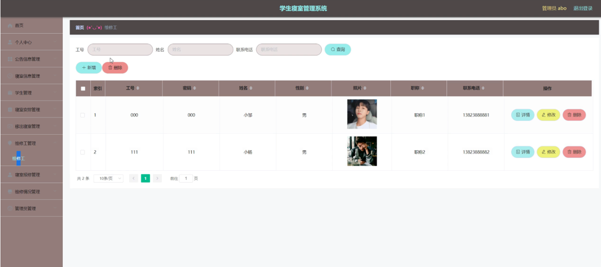
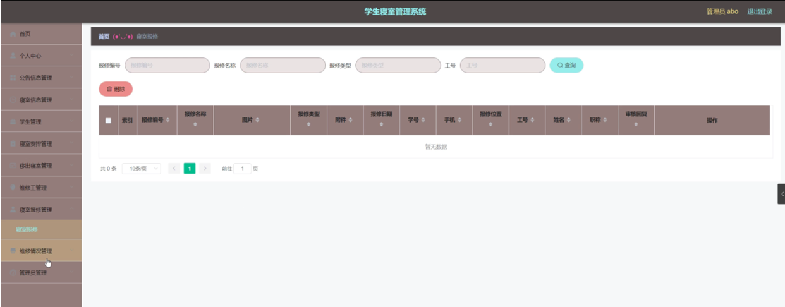

ssm+Vue计算机毕业设计学生寝室管理系统（程序+LW文档）

**项目运行**

**环境配置：**

**Jdk1.8 + Tomcat7.0 + Mysql + HBuilderX** **（Webstorm也行）+ Eclispe（IntelliJ
IDEA,Eclispe,MyEclispe,Sts都支持）。**

**项目技术：**

**SSM + mybatis + Maven + Vue** **等等组成，B/S模式 + Maven管理等等。**

**环境需要**

**1.** **运行环境：最好是java jdk 1.8，我们在这个平台上运行的。其他版本理论上也可以。**

**2.IDE** **环境：IDEA，Eclipse,Myeclipse都可以。推荐IDEA;**

**3.tomcat** **环境：Tomcat 7.x,8.x,9.x版本均可**

**4.** **硬件环境：windows 7/8/10 1G内存以上；或者 Mac OS；**

**5.** **是否Maven项目: 否；查看源码目录中是否包含pom.xml；若包含，则为maven项目，否则为非maven项目**

**6.** **数据库：MySql 5.7/8.0等版本均可；**

**毕设帮助，指导，本源码分享，调试部署** **(** **见文末** **)**

### 系统结构

本系统架构网站系统，本系统的具体功能如下：

图4-2系统功能结构图

管理员功能结构图，如图4-3所示：

图4-3 管理员功能结构图

学生功能结构图，如图4-4所示：

图4-4学生功能结构图

维修工功能结构图，如图4-5所示：

图4-5维修工功能结构图

### 4.3. 数据库设计

4.3.1 数据库实体

管理员信息结构图，如图4-6所示：

图4-6 管理员信息实体结构图

学生信息实体属性图，如图4-7所示：

图4-7学生信息实体属性图

寝室信息管理实体属性图，如图4-8所示：

图4-8寝室信息管理实体属性图

### 管理员功能模块

管理员登录，管理员通过输入用户名、密码、角色等信息即可进行系统登录，如图5-1所示。

图5-1管理员登录界面图

管理员登录进入学生寝室管理系统设计可以查看首页、个人中心、公告信息管理、寝室信息管理、学生管理、寝室安排管理、移出寝室管理、维修工管理、寝室报修管理、维修情况管理、管理员管理等内容，如图5-2所示。

图5-2管理员功能界面图

公告信息管理，在公告信息管理页面可以查看索引、公告标题、公告类型、图片、发布日期等信息，并可根据需要进行修改或删除等详细操作，如图5-3所示。

图5-3公告信息管理界面图

寝室信息管理，在寝室信息管理页面可以查看索引、寝室编号、寝室名称、寝室类型、图片、楼号、楼层、房号、可住人数、空余床位、寝室状态等信息，并可根据需要进行寝室安排，修改或删除等详细操作，如图5-4所示。

图5-4寝室信息管理界面图

学生管理，在学生管理页面可以查看索引、学号、密码、学生姓名、性别、头像、专业、班级、手机、邮箱等信息，并可根据需要进行修改或删除等详细操作，如图5-5所示。

图5-5学生管理界面图

寝室安排管理，在寝室安排管理页面可以查看索引、寝室编号、寝室名称、寝室类型、图片、楼号、楼层、房号、可住人数、空余床位、寝室状态、安排日期、学号、学生姓名、性别、专业、班级、手机等信息，并可根据需要进行修改或删除等详细操作，如图5-6所示。

图5-6寝室安排管理界面图

移出寝室管理，在移出寝室管理页面可以查看索引、寝室编号、寝室名称、寝室类型、楼号、楼层、房号、日期、备注、学号、学生姓名、性别、专业、班级、手机等信息，并可根据需要进行修改或删除等详细操作，如图5-
7所示。

图5-7移出寝室管理界面图

维修工管理，在维修工管理页面可以查看索引、工号、密码、姓名、性别、照片、职称、联系电话等信息，并可根据需要进行修改或删除等详细操作，如图5- 8所示。

图5-8维修工管理界面图

寝室报修管理，在寝室报修管理页面可以查看索引、报修编号、报修名称、图片、报修类型、附件、报修日期、学号、手机、报修位置、工号、姓名、职称、审核回复等信息，如图5-
9所示。

图5-9寝室报修管理界面图

维修情况管理，在维修情况管理页面可以查看索引、报修编号、报修名称、图片、维修进度、备注、维修费用、更新日期、学号、工号、姓名、职称、联系电话、是否支付等信息，如图5-
10所示。

图5-10维修情况管理界面图

管理员管理，在管理员管理页面可以查看用户名、密码、角色等信息，如图5- 11所示。

图5-11管理员管理界面图

### 5.2学生功能模块

学生登录进入学生寝室管理系统可以查看首页、个人中心、公告信息管理、寝室安排管理、移出寝室管理、寝室报修管理、维修情况管理等内容，如图5-12所示。

图5-12学生功能界面图

#### **JAVA** **毕设帮助，指导，源码分享，调试部署**

