ssm+Vue计算机毕业设计学生日常事务管理系统（程序+LW文档）

**项目运行**

**环境配置：**

**Jdk1.8 + Tomcat7.0 + Mysql + HBuilderX** **（Webstorm也行）+ Eclispe（IntelliJ
IDEA,Eclispe,MyEclispe,Sts都支持）。**

**项目技术：**

**SSM + mybatis + Maven + Vue** **等等组成，B/S模式 + Maven管理等等。**

**环境需要**

**1.** **运行环境：最好是java jdk 1.8，我们在这个平台上运行的。其他版本理论上也可以。**

**2.IDE** **环境：IDEA，Eclipse,Myeclipse都可以。推荐IDEA;**

**3.tomcat** **环境：Tomcat 7.x,8.x,9.x版本均可**

**4.** **硬件环境：windows 7/8/10 1G内存以上；或者 Mac OS；**

**5.** **是否Maven项目: 否；查看源码目录中是否包含pom.xml；若包含，则为maven项目，否则为非maven项目**

**6.** **数据库：MySql 5.7/8.0等版本均可；**

**毕设帮助，指导，本源码分享，调试部署** **(** **见文末** **)**

### 系统结构设计

整个系统是由多个功能模块组合而成的，要将所有的功能模块都一一列举出来，然后进行逐个的功能设计，使得每一个模块都有相对应的功能设计，然后进行系统整体的设计。

本学生日常事务管理系统结构图如图3-2所示。

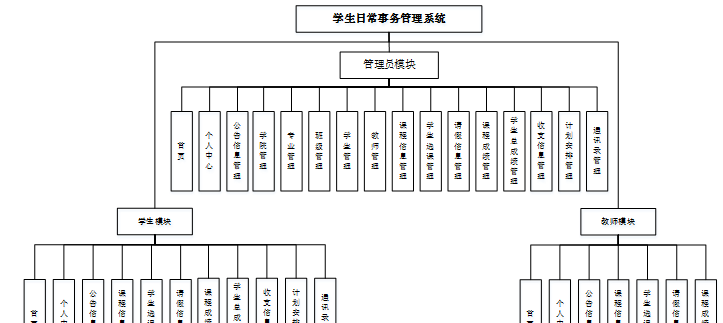

图3-2 学生日常事务管理系统结构图

### 3.3 数据库设计

数据库可以说是所有软件的根本，如果数据库存在缺陷，那么会导致系统开发的不顺利、维护困难、用户使用不顺畅等一系列问题，严重时将会直接损害企业的利益，同时在开发完成后，数据库缺陷也更加难以解决。所以必须要对数据库设计重点把握，做到认真细致。因此，数据库设计是这个在线学生日常事务管理购票系统的重点要素。

#### 3.3.1概念结构设计

(1) 公告信息管理实体属性图如下图3-3所示

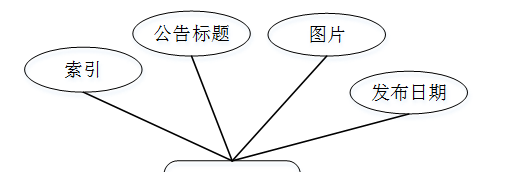

图3-3公告信息管理实体属性图

(2) 课程信息管理实体属性如下图3-4所示

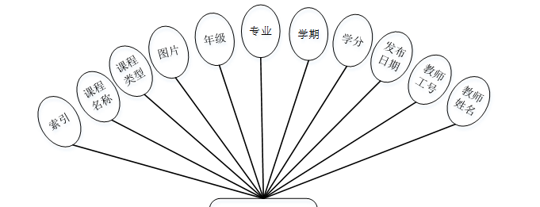

图3-4课程信息管理实体属性图

### 管理员功能模块

管理员登录，通过填写注册时输入的用户名、密码、选择角色进行登录，如图4-1所示。

图4-1管理员登录界面图

管理员登录进入学生日常事务管理系统可以查看首页、个人中心、公告信息管理、学院管理、专业管理、班级管理、学生管理、教师管理、课程信息管理、学生选课管理、请假信息管理、课程成绩管理、学生总成绩管理、收支信息管理、计划安排管理、通讯录管理等信息进行详细操作，如图4-2所示。

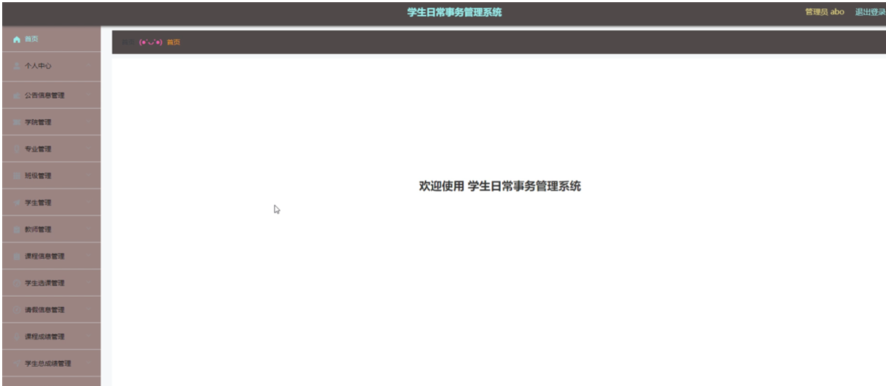

图4-2管理员功能界面图

公告信息管理，在公告信息管理页面中可以对索引、公告标题、图片、发布日期等信息进行详情、修改或删除等操作，如图4-3所示。

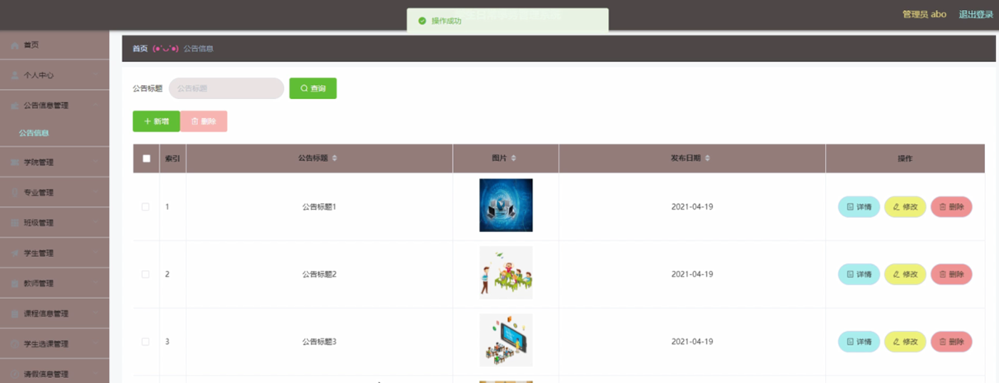

图4-3公告信息管理界面图

学生管理，在学生管理页面中可以对索引、学号、学生姓名、性别、头像、学院、专业、班级、手机、邮箱等信息进行详情、总成绩、修改或删除等操作，如图4-4所示。

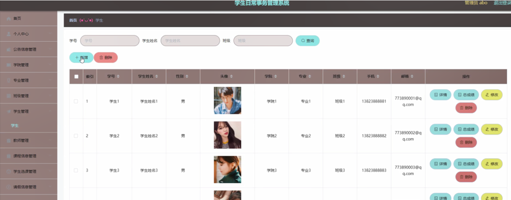

图4-4学生管理界面图

教师管理，在教师管理页面中可以对索引、教师工号、教师姓名、性别、照片、职称、联系电话等信息进行详情、修改或删除等操作，如图4-5所示。

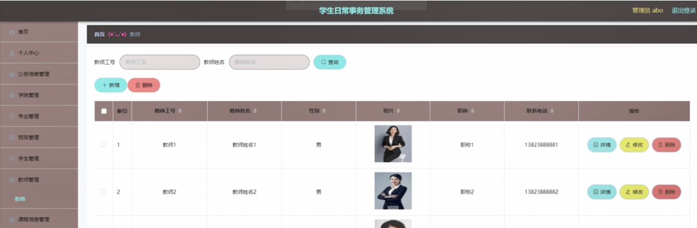

图4-5教师管理界面图

课程信息管理，在课程信息管理页面中可以对索引、课程名称、课程类型、图片、年级、专业、学期、学分、发布日期、教师工号、教师姓名等信息进行详情，修改或删除等操作，如图4-6所示。

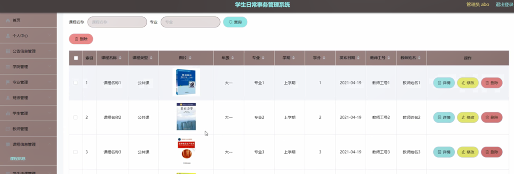

图4-6课程信息管理界面图

学生选课管理，在学生选课管理页面中可以对索引、课程名称、课程类型、年级、学期、专业、选课日期、教师工号、教师姓名、学号、学生姓名、班级、审核回复、审核状态等信息进行详情、修改或删除等操作，如图4-7所示。

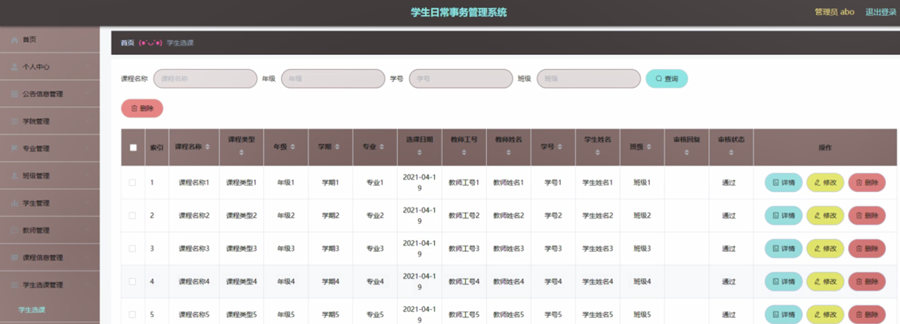

图4-7学生选课管理界面图

请假信息管理，在请假信息管理页面中可以对索引、课程名称、年级、专业、学期、教师工号、教师姓名、请假原因、请假内容、开始时间、结束时间、学号、学生姓名、班级、审核回复、审核状态等信息进行详情、修改或删除等操作，如图4-8所示。

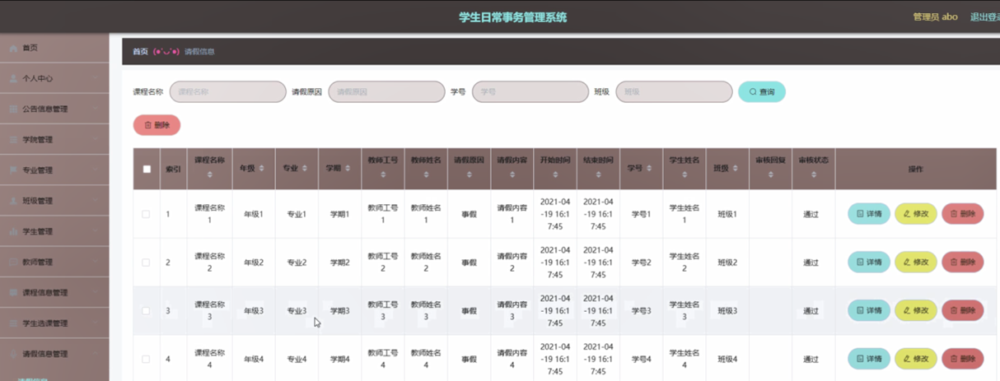

图4-8请假信息管理界面图

课程成绩管理，在课程成绩管理页面中可以对索引、课程名称、课程类型、年级、学期、考核成绩、评语、登记时间、教师工号、教师姓名、学号、学生姓名、班级等信息进行详情，修改或删除等操作；如图4-9所示。

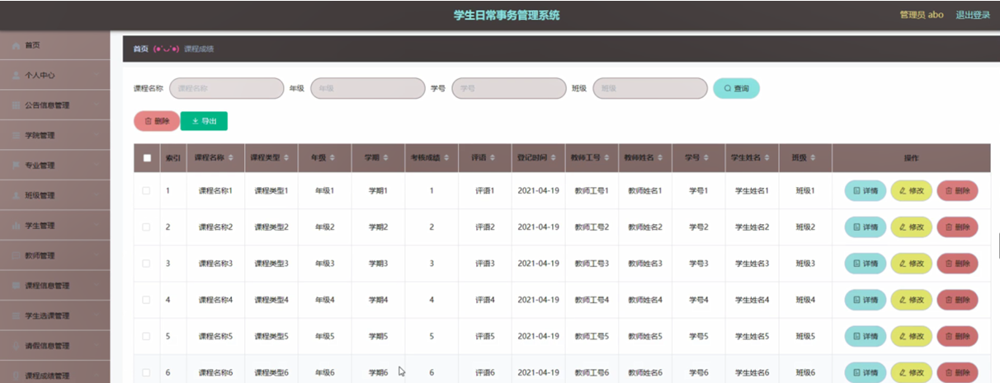

图4-9课程成绩管理界面图

学生总成绩管理，在学生总成绩管理页面中可以对索引、学号、学生姓名、学院、专业、班级、年级、学期、总成绩、学分绩点、学期评语、登记日期等信息进行详情，修改或删除等操作；如图4-10所示。

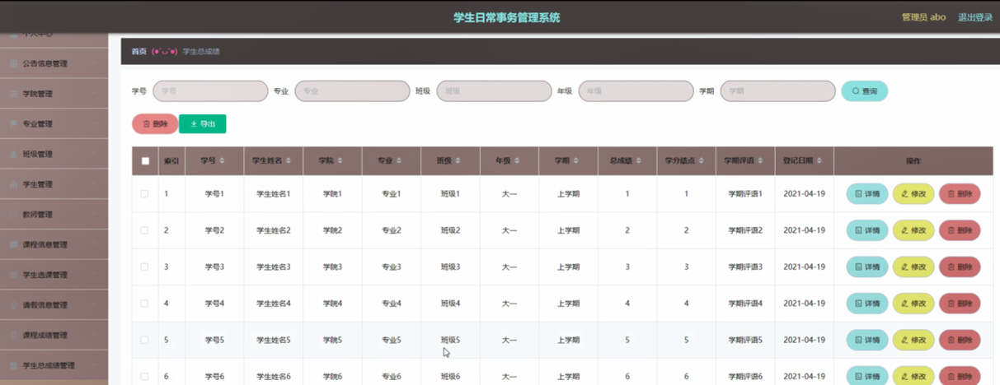

图4-10学生总成绩管理界面图

收支信息管理，在收支信息管理页面中可以对类型、金额、费用说明、登记时间、学号、学生姓名等信息进行详情，修改或删除等操作；如图4-11所示。

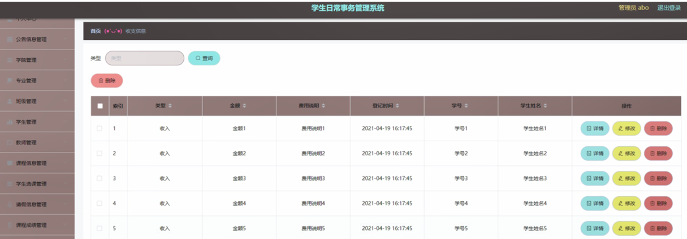

图4-11收支信息管理界面图

计划安排管理，在计划安排管理页面中可以对索引、事项名称、计划完成时间、进度、更新时间、学号、学生姓名等信息进行详情，修改或删除等操作；如图4-12所示。

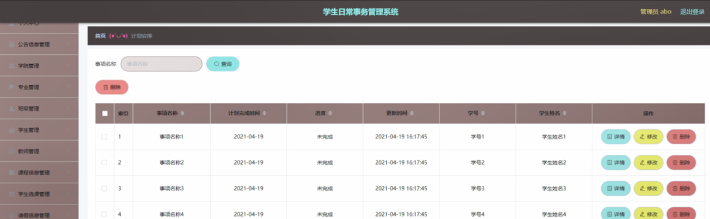

图4-12计划安排管理界面图

**JAVA** **毕设帮助，指导，源码分享，调试部署**

