ssm+Vue计算机毕业设计学生档案管理系统（程序+LW文档）

**项目运行**

**环境配置：**

**Jdk1.8 + Tomcat7.0 + Mysql + HBuilderX** **（Webstorm也行）+ Eclispe（IntelliJ
IDEA,Eclispe,MyEclispe,Sts都支持）。**

**项目技术：**

**SSM + mybatis + Maven + Vue** **等等组成，B/S模式 + Maven管理等等。**

**环境需要**

**1.** **运行环境：最好是java jdk 1.8，我们在这个平台上运行的。其他版本理论上也可以。**

**2.IDE** **环境：IDEA，Eclipse,Myeclipse都可以。推荐IDEA;**

**3.tomcat** **环境：Tomcat 7.x,8.x,9.x版本均可**

**4.** **硬件环境：windows 7/8/10 1G内存以上；或者 Mac OS；**

**5.** **是否Maven项目: 否；查看源码目录中是否包含pom.xml；若包含，则为maven项目，否则为非maven项目**

**6.** **数据库：MySql 5.7/8.0等版本均可；**

**毕设帮助，指导，本源码分享，调试部署** **(** **见文末** **)**

**系统结构**

本系统架构网站系统，本系统的具体功能如下：

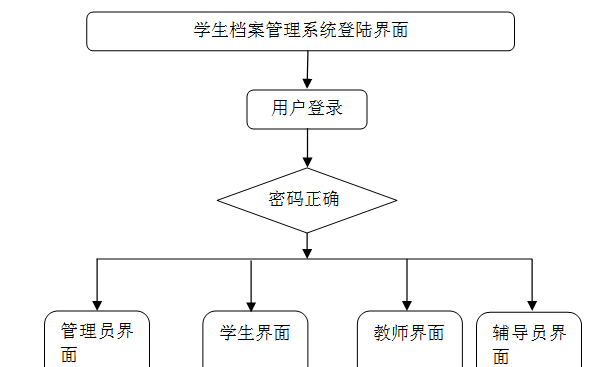

图4-2系统功能结构图

管理员功能结构图，如图4-3所示：

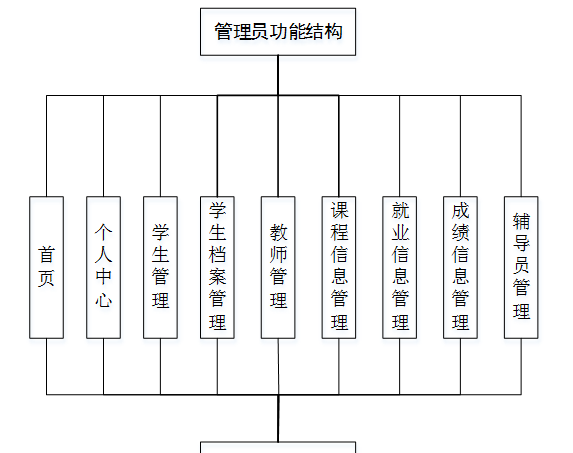

图4-3 管理员功能结构图

学生功能结构图，如图4-4所示：

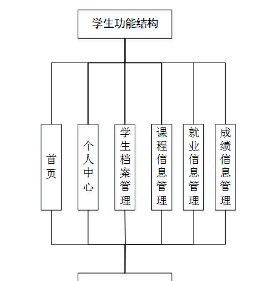

图4-4 学生功能结构图

教师功能结构图，如图4-5所示：

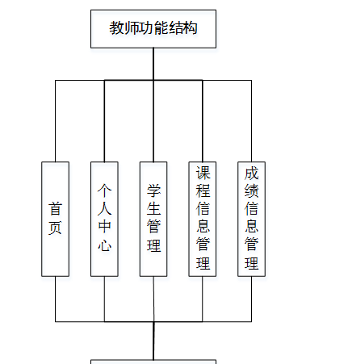

图4-5教师功能结构图

辅导员功能结构图，如图4-6所示：

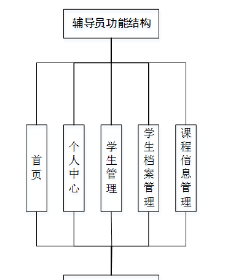

图4-6辅导员功能结构图

**数据库设计**

**4.3.1** **数据库实体**

管理员信息结构图，如图4-7所示：

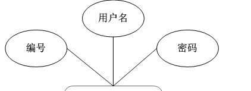

图4-7 管理员信息实体结构图

管理员功能实体属性图，如图4-8所示：

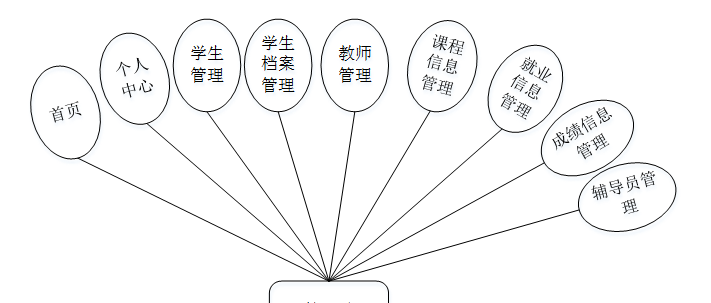

图4-8管理员功能实体属性图

学生信息实体属性图，如图4-9所示：

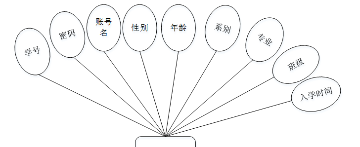

图4-9学生信息实体属性图

**管理员功能模块**

管理员登录，管理员通过输入用户名、密码、角色等信息即可进行系统登录，如图5-1所示。

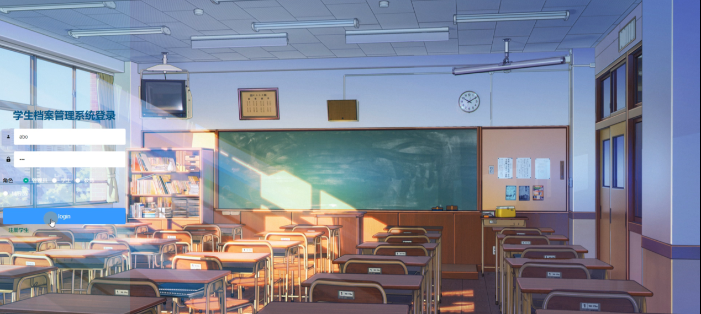

图5-1管理员登录界面图

管理员登录进入学生档案管理系统可以查看首页、个人中心、学生管理、学生档案管理、教师管理、课程信息管理、就业信息管理、成绩信息管理、辅导员管理等内容，如图5-2所示。

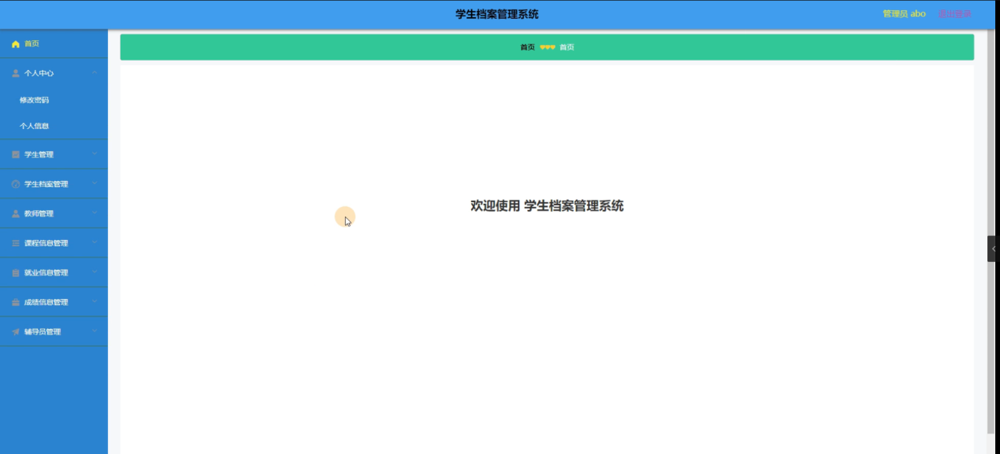

图5-2管理员功能界面图

学生管理，在学生管理页面可以查看学号、密码、账号名、性别、年龄、系别、专业、班级、入学时间等信息，并可根据需要进行修改或删除等详细操作，如图5-3所示。

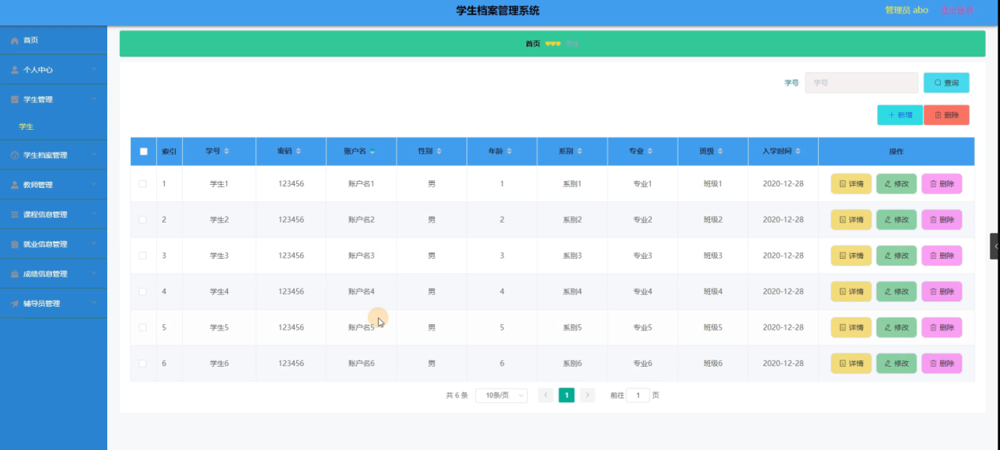

图5-3学生管理界面图

学生档案管理，在学生档案管理页面可以查看姓名、性别、身份证号、出生日期、父亲姓名、父亲联系电话、母亲姓名、母亲联系电话、审核回复、审核等内容，并可根据需要进行修改或删除等详细操作，如图5-4所示。

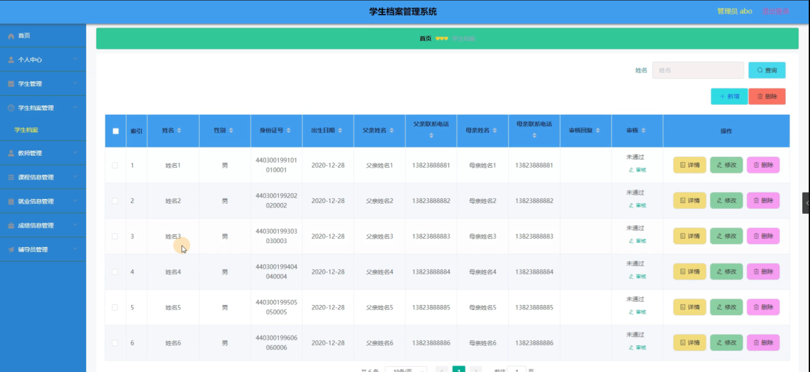

图5-4学生档案管理界面图

教师管理，在教师管理页面可以查看用户名、密码、性别、系别等信息，并可根据需要进行修改或删除等详细操作，如图5-5所示。

图5-5教师管理界面图

课程信息管理，在课程信息管理页面可以查看课程号、课程名称、类型、系别等信息，并可根据需要进行修改或删除等详细操作，如图5-6所示。

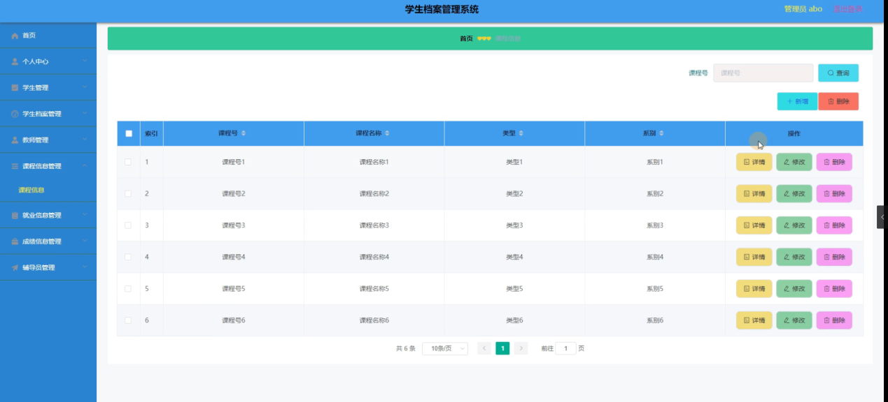

图5-6课程信息管理界面图

就业信息管理，在就业信息管理页面可以查看学号、姓名、就业单位、就业时间、自我评价等信息，并可根据需要进行修改或删除等详细操作，如图5- 7所示。

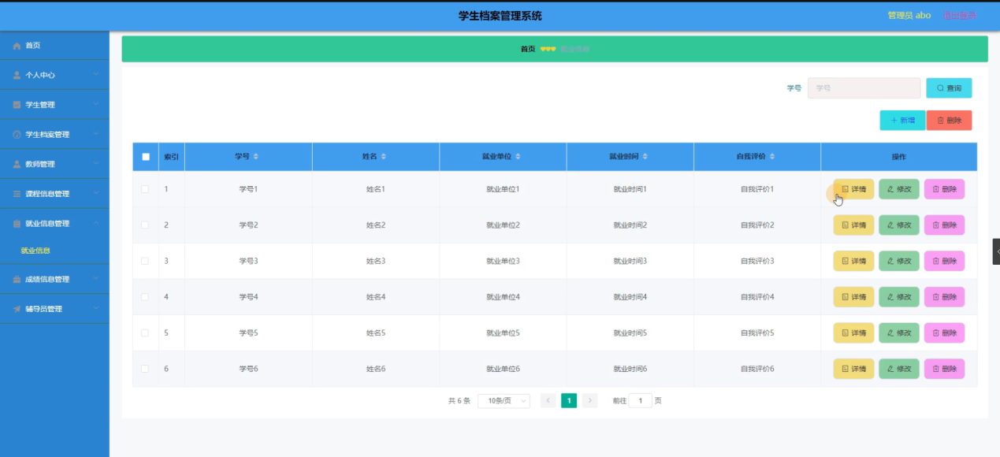

图5-7就业信息管理界面图

成绩信息管理，在成绩信息管理页面可以查看学号、课程、成绩等信息，并可根据需要进行修改或删除等详细操作，如图5- 8所示。

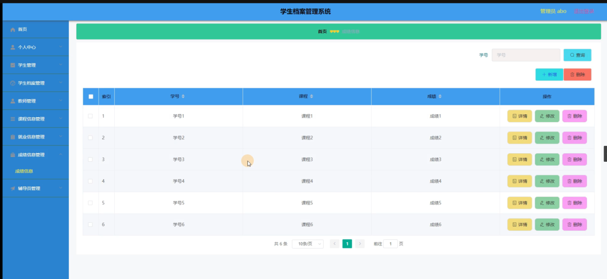

图5-8成绩信息管理界面图

辅导员管理，在辅导员管理页面可以查看用户名、密码、性别、系别等信息，并可根据需要进行修改或删除等详细操作，如图5- 9所示。

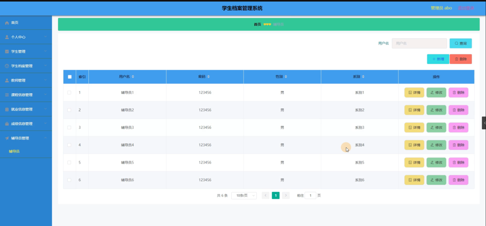

图5-9辅导员管理界面图

**5.2** **学生功能模块**

学生登录进入学生档案管理系统可以查看首页、个人中心、学生档案管理、课程信息管理、就业信息管理、成绩信息管理等内容，如图5-10所示。

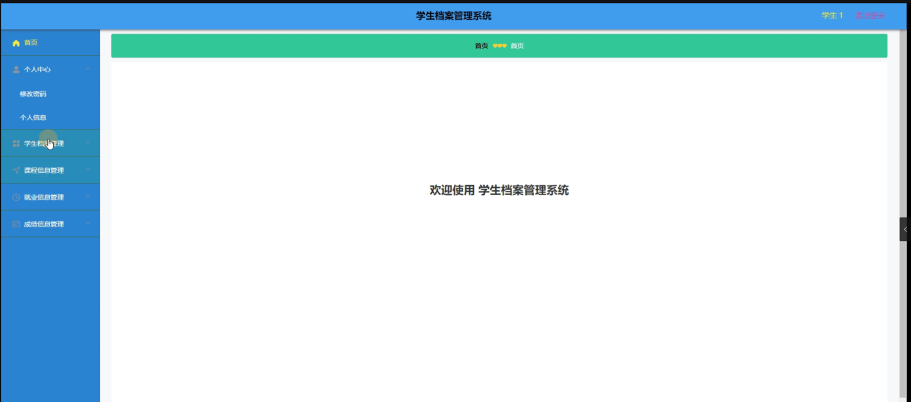

图5-10学生功能界面图

个人中心，在个人信息页面通过填写学号、密码、账号名、性别、年龄、系别、专业、班级、入学时间等内容，并可根据需要对个人信息进行修改，如图5-11所示。

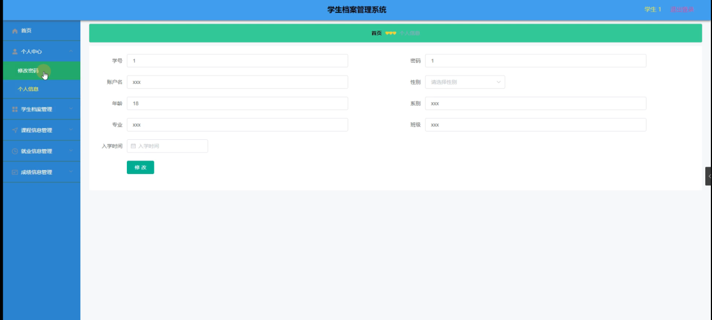

图5-11个人中心界面图

学生档案管理，在学生档案管理页面通过填写姓名、性别、身份证号、出生日期、父亲姓名、父亲联系电话、母亲姓名、母亲联系电话等信息并提交，如图5-12所示。

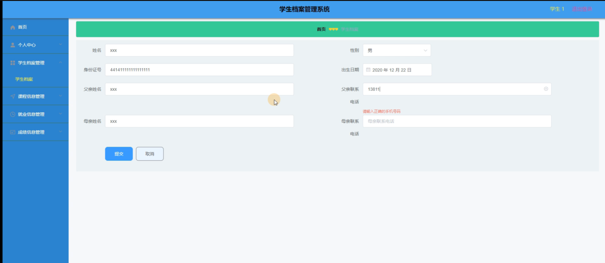

图5-12学生档案管理界面图

#### **JAVA** **毕设帮助，指导，源码分享，调试部署**

