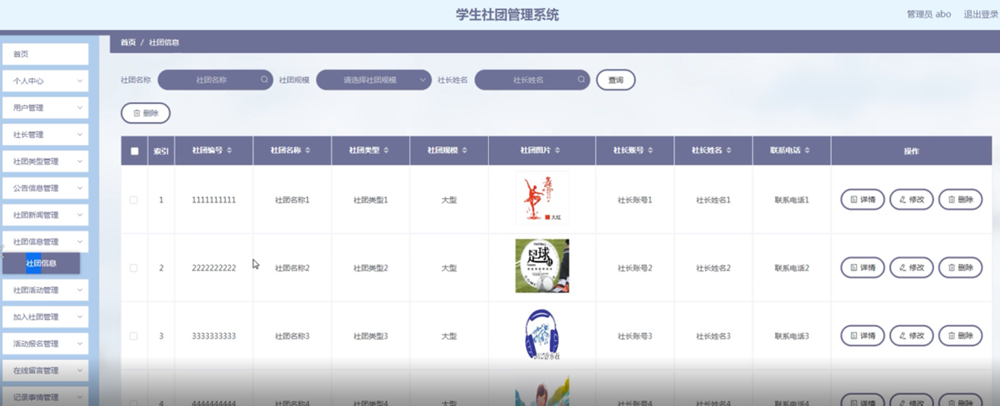

ssm+Vue计算机毕业设计学生社团管理系统（程序+LW文档）

**项目运行**

**环境配置：**

**Jdk1.8 + Tomcat7.0 + Mysql + HBuilderX** **（Webstorm也行）+ Eclispe（IntelliJ
IDEA,Eclispe,MyEclispe,Sts都支持）。**

**项目技术：**

**SSM + mybatis + Maven + Vue** **等等组成，B/S模式 + Maven管理等等。**

**环境需要**

**1.** **运行环境：最好是java jdk 1.8，我们在这个平台上运行的。其他版本理论上也可以。**

**2.IDE** **环境：IDEA，Eclipse,Myeclipse都可以。推荐IDEA;**

**3.tomcat** **环境：Tomcat 7.x,8.x,9.x版本均可**

**4.** **硬件环境：windows 7/8/10 1G内存以上；或者 Mac OS；**

**5.** **是否Maven项目: 否；查看源码目录中是否包含pom.xml；若包含，则为maven项目，否则为非maven项目**

**6.** **数据库：MySql 5.7/8.0等版本均可；**

**毕设帮助，指导，本源码分享，调试部署** **(** **见文末** **)**

### 软件功能模块设计

网站整功能如下图所示：

图 4-1 学生社团管理系统总体功能模块图

### 4.2 数据库设计与实现

在每一个系统中数据库有着非常重要的作用，数据库的设计得好将会增加系统的效率以及系统各逻辑功能的实现。所以数据库的设计我们要从系统的实际需要出发，才能使其更为完美的符合系统功能的实现。

#### 4.2.1 概念模型设计

概念模型是对现实中的问题出现的事物的进行描述，ER图是由实体及其关系构成的图，通过E-R图可以清楚地描述系统涉及到的实体之间的相互关系。

用户信息实体图如图4-2所示：

图4-2用户信息实体图

社长信息实体图如图4-3所示：

图4-3社长信息实体图

公告信息实体图如图4-4所示：

图4-4公告信息实体图

社团新闻信息实体图如图4-5所示：

图4-5社团新闻信息实体图

### 管理员功能模块

管理员登录，管理员通过登录页面输入用户名、密码，选择角色并点击登录进行系统登录操作，如图5-1所示。

图5-1管理员登录界面图

管理员登录系统后，可以对首页、个人中心、用户管理、社长管理、社团类型管理、公告信息管理、社团新闻管理、社团信息管理、社团活动管理、加入社团管理、活动报名管理、在线留言管理、记录事情管理、交流论坛、系统管理等功能进行相应操作，如图5-2所示。

图5-2管理员功能界图面

用户管理，在用户管理页面可以对用户账号、用户姓名、性别、联系方式、头像等内容进行详情、修改、删除等操作，如图5-3所示。

图5-3用户管理界面图

社长管理，在社长管理页面可以对社长账号、社长姓名、社团名称、性别、头像、联系电话等内容进行详情、修改、删除等操作，如图5-4所示。

图5-4社长管理界面图

社团类型管理，在社团类型管理页面可以对社团类型内容进行详情、修改、删除等操作，如图5-5所示。

图5-5社团类型管理界面图

公告信息管理；管理员在公告信息管理页面查看公告标题、封面、公告时间、社长账号、社长姓名、社团名称等内容，还可以对公告信息进行详情、修改、删除操作，如图5-6所示。

图5-6公告信息管理界面图

社团新闻管理，在社团新闻管理页面可以对标题、图片、日期、社长账号、社长姓名、社团名称内容进行详情、修改、删除等操作，如图5-7所示。

图5-7社团新闻管理界面图

社团信息管理，在社团信息管理页面可以对社团编号、社团名称、社团类型、社团规模、社团图片、社长账号、社长姓名、联系电话等内容进行详情、修改、删除等操作，如图5-8所示。

图5-8社团信息管理界面图

社团活动管理，在社团活动管理页面可以对活动编号、活动名称、社团名称、开始时间、结束时间、报名日期、封面、活动地点、社长账号、社长姓名、联系电话等内容进行详情、修改、删除等操作，如图5-9所示。

图5-9社团活动管理界面图

### 5.2用户功能模块

用户登录到学生社团管理系统后台后，可以对首页、个人中心、加入社团管理、活动报名管理、在线留言管理等功能进行相应操作，如图5-10所示。

图5-10用户功能界面图

加入社团管理，在加入社团管理页面可以对社团编号、社团名称、社团类型、社长账号、社长姓名、申请时间、用户账号、用户姓名、审核回复、审核状态等内容进行详情、删除等操作，如图5-11所示。

图5-11加入社团管理界面图

活动报名管理，在活动报名管理页面可以对活动编号、活动名称、社团名称、、社长账号、社长姓名、活动地点、报名时间、用户账号、用户姓名、审核回复、审核状态等内容进行详情、删除等操作，如图5-12所示。

图5-12活动报名管理界面图

#### **JAVA** **毕设帮助，指导，源码分享，调试部署**

