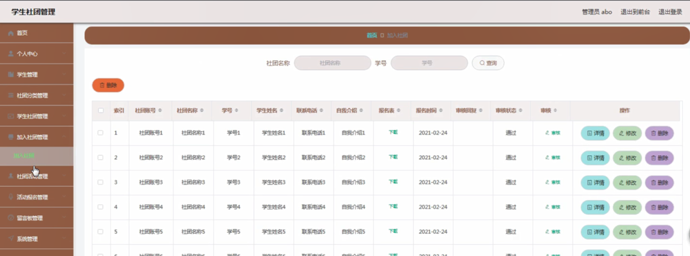

ssm+Vue计算机毕业设计学生社团管理（程序+LW文档）

**项目运行**

**环境配置：**

**Jdk1.8 + Tomcat7.0 + Mysql + HBuilderX** **（Webstorm也行）+ Eclispe（IntelliJ
IDEA,Eclispe,MyEclispe,Sts都支持）。**

**项目技术：**

**SSM + mybatis + Maven + Vue** **等等组成，B/S模式 + Maven管理等等。**

**环境需要**

**1.** **运行环境：最好是java jdk 1.8，我们在这个平台上运行的。其他版本理论上也可以。**

**2.IDE** **环境：IDEA，Eclipse,Myeclipse都可以。推荐IDEA;**

**3.tomcat** **环境：Tomcat 7.x,8.x,9.x版本均可**

**4.** **硬件环境：windows 7/8/10 1G内存以上；或者 Mac OS；**

**5.** **是否Maven项目: 否；查看源码目录中是否包含pom.xml；若包含，则为maven项目，否则为非maven项目**

**6.** **数据库：MySql 5.7/8.0等版本均可；**

**毕设帮助，指导，本源码分享，调试部署** **(** **见文末** **)**

### 系统的结构划分

本网站可以分为:学生使用的功能、学生社团使用的功能和管理员进行管理的功能。

学生使用功能：登陆、注册验证，首页、个人中心、加入社团管理、社团活动管理、我的收藏管理等。

学生社团使用功能：登陆、注册验证，首页、个人中心、加入社团管理、社团活动管理、活动报名管理等。

管理员管理功能：登陆验证，首页、学生社团、社团活动、社团新闻、留言反馈、个人中心、后台管理等。

学生社团管理系统的结构图3-1所示：

图3-1 系统结构

登录系统结构图，如图3-2所示：

图3-2 登录结构图

这些功能可以充分满足学生社团管理系统的需求。此系统功能较为全面如下图系统功能结构如图3-3所示。

图3-3系统功能结构图

### 数据库设计

#### 3.3.1 数据库实体

学生管理实体属性图，如图3-7所示：

图3-7学生管理实体属性图

学生社团管理实体属性图如图3-8所示。

图3-8学生社团管理实体属性图

### 系统实现

#### 4.2.1系统功能模块

学生社团管理系统，在系统首页可以查看首页、学生社团、社团活动、社团新闻、留言反馈、个人中心、后台管理等内容进行详细操作，如图4-1所示。

图4-1系统首页界面图

学生社团，在学生社团页面可以查看社团账号、社团名称、社团图片、成立时间、社团类型、社团人数、创建者姓名、社团介绍等详细内容进行加入、评论或收藏，如图4-2所示。

图4-2学生社团界面图

社团活动，在社团活动页面可以查看社团账号、社团名称、活动名称、活动图片、开始时间、结束时间、报名要求、活动地点、活动详情等详细内容进行报名、评论或收藏，如图4-3所示。

图4-3社团活动界面图

学生注册，在学生注册页面通过填写用户名，密码，姓名，性别，出生年月，QQ，邮箱，电话，身份证，头像，地址，备注等信息完成注册，如图4-4所示。在个人中心页面通过填写学号、密码、学生姓名、性别、出生日期、联系电话等信息进行信息更新操作，还可以根据需要对我的收藏进行详细操作；如图4-5所示。

图4-4学生注册界面图

图4-5个人中心界面图

#### 4.2.2管理员功能模块

管理员登录，通过填写注册时输入的用户名、密码、选择角色进行登录，如图4-6所示。

图4-6管理员登录界面图

管理员登录进入学生社团管理系统可以查看首页、个人中心、学生管理、社团分类管理、学生社团管理、加入社团管理、社团活动管理、活动报名管理、留言板管理、系统管理等信息进行详细操作，如图4-7所示。

图4-7管理员功能界面图

学生管理，在学生管理页面中可以查看索引、学号、密码、学生姓名、性别、出生日期、联系电话等信息，并可根据需要进行详情，修改或删除等操作，如图4-8所示。

图4-8学生管理界面图

社团分类管理，在社团分类管理页面中可以查看索引、社团类型等信息，并可根据需要进行修改或删除等操作，如图4-9所示。

图4-9社团分类管理界面图

学生社团管理，在学生社团管理页面中可以查看索引、社团账号、密码、社团名称、社团图片、成立时间、社团类型、社团人数、创建者姓名等信息，并可根据需要进行详情，修改、查看评论或删除等操作，如图4-10所示。

图4-10学生社团管理界面图

加入社团管理，在加入社团管理页面中可以查看索引、社团账号、社团名称、学号、学生姓名、联系电话、自我介绍、报名表、报名时间、审核回复、审核状态、审核等信息，并可根据需要进行详情，修改或删除等操作，如图4-11所示。

图4-11加入社团管理界面图

社团活动管理，在社团活动管理页面中可以查看索引、社团账号、社团名称、活动名称、活动图片、开始时间、结束时间、报名要求、活动地点、审核回复、审核状态、审核等信息，并可根据需要进行详情，修改、查看评论或删除等操作，如图4-12所示。

图4-12社团活动管理界面图

#### **JAVA** **毕设帮助，指导，源码分享，调试部署**

