ssm+Vue计算机毕业设计学生综合测评系统（程序+LW文档）

**项目运行**

**环境配置：**

**Jdk1.8 + Tomcat7.0 + Mysql + HBuilderX** **（Webstorm也行）+ Eclispe（IntelliJ
IDEA,Eclispe,MyEclispe,Sts都支持）。**

**项目技术：**

**SSM + mybatis + Maven + Vue** **等等组成，B/S模式 + Maven管理等等。**

**环境需要**

**1.** **运行环境：最好是java jdk 1.8，我们在这个平台上运行的。其他版本理论上也可以。**

**2.IDE** **环境：IDEA，Eclipse,Myeclipse都可以。推荐IDEA;**

**3.tomcat** **环境：Tomcat 7.x,8.x,9.x版本均可**

**4.** **硬件环境：windows 7/8/10 1G内存以上；或者 Mac OS；**

**5.** **是否Maven项目: 否；查看源码目录中是否包含pom.xml；若包含，则为maven项目，否则为非maven项目**

**6.** **数据库：MySql 5.7/8.0等版本均可；**

**毕设帮助，指导，本源码分享，调试部署** **(** **见文末** **)**

### 系统结构

本系统架构网站系统，本系统的具体功能如下：

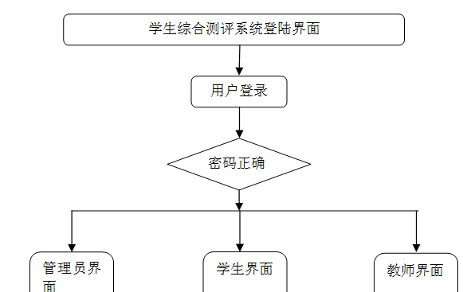

图4-2系统功能结构图

管理员功能结构图，如图4-3所示：

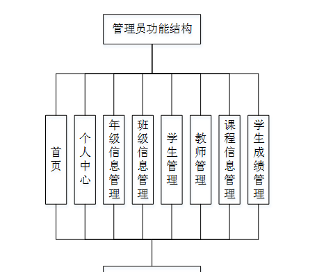

图4-3 管理员功能结构图

教师功能结构图，如图4-4所示：

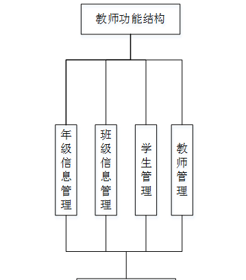

图4-4 教师功能结构图

学生功能结构图，如图4-5所示：

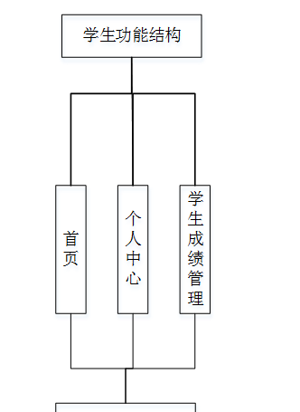

图4-5 学生功能结构图

#### 数据库实体

管理员信息结构图，如图4-6所示：

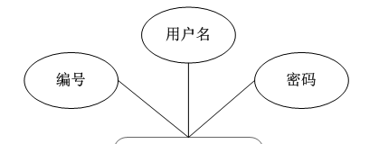

图4-6 管理员信息实体结构图

学生成绩管理实体属性图，如图4-7所示：

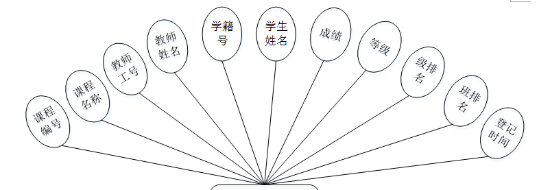 图4-7学生成绩管理实体属性图

学生信息实体属性图，如图4-8所示：

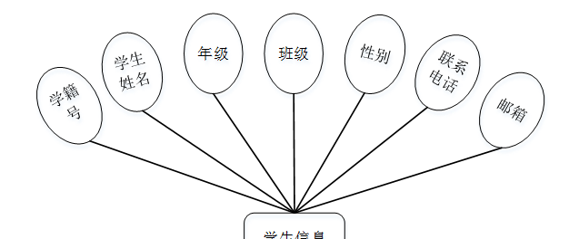

图4-8学生信息实体属性图

### 登录注册

登录，用户通过输入账号，密码，选择角色等信息即可进行系统登录，如图5-1所示。

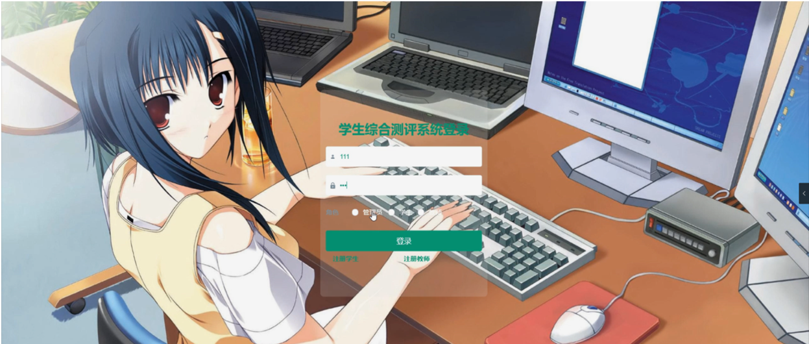

图5-1管理员登录界面图

学生注册，在学生注册页面通过填写学籍号、学生姓名、密码、联系电话、邮箱等信息进行学生注册，如图5-2所示。

图5-2学生注册界面图

### 5.2管理员功能模块

管理员登录进入学生综合测评系统可以查看首页、个人中心、年级信息管理、班级信息管理、学生管理、教师管理、课程信息管理、学生成绩管理等内容进行详细操作，如图5-3所示。

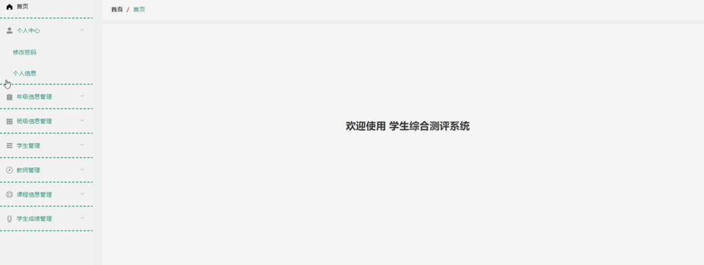

图5-3管理员功能界面图

年级信息管理，在年级信息管理页面可以查看年级等信息，并可根据需要进行详情，修改或删除等操作，如图5-4所示。

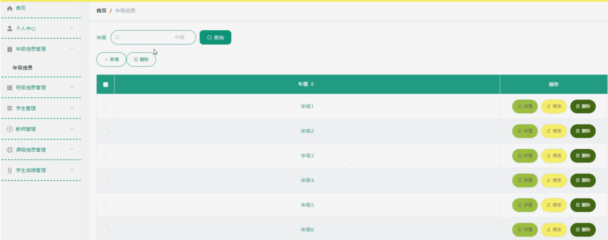

图5-4年级信息管理界面图

班级信息管理，在班级信息管理页面可以查看班级等信息，并可根据需要进行详情，修改或删除等操作，如图5-5所示。

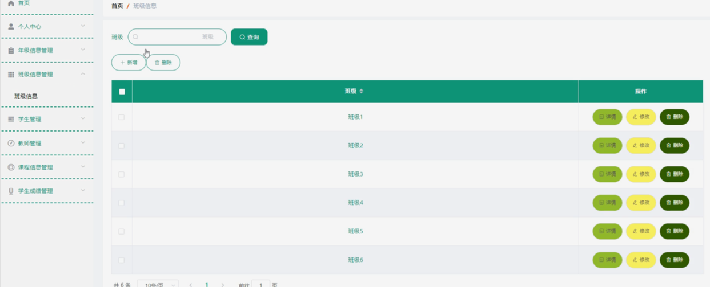

图5-5班级信息管理界面图

学生管理，在学生管理页面可以查看学籍号、学生姓名、年级、班级、性别、联系电话、邮箱等信息，并可根据需要进行详情，修改或删除等操作，如图5-6所示。

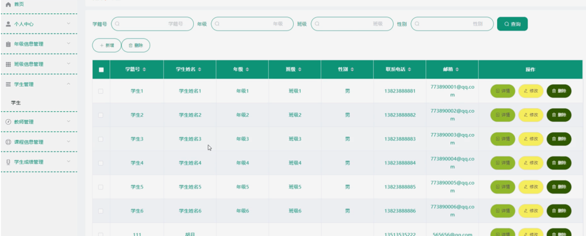

图5-6学生管理界面图

教师管理，在教师管理页面可以查看教师工号、教师姓名、性别、职称、联系电话、教师邮箱等信息，并可根据需要进行详情，修改或删除等操作，如图5-7所示。

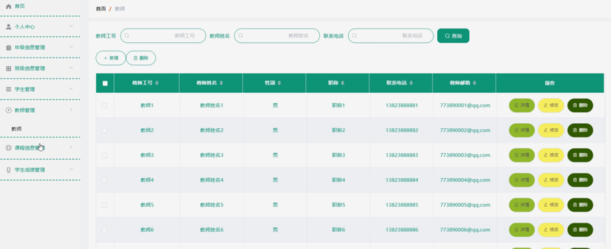

图5-7教师管理界面图

课程信息管理，在课程信息管理页面可以查看课程编号、课程名称、教师工号、教师姓名等信息，并可根据需要进行详情，修改或删除等操作，如图5-8所示。

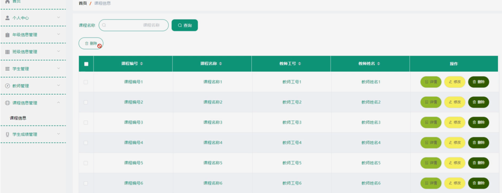

图5-8课程信息管理界面图

学生成绩管理，在学生成绩管理页面可以查看课程编号、课程名称、教师工号、教师姓名、学籍号、学生姓名、成绩、等级、级排名、班排名、登记时间等信息，并可根据需要进行详情，修改或删除等操作，如图5-9所示。

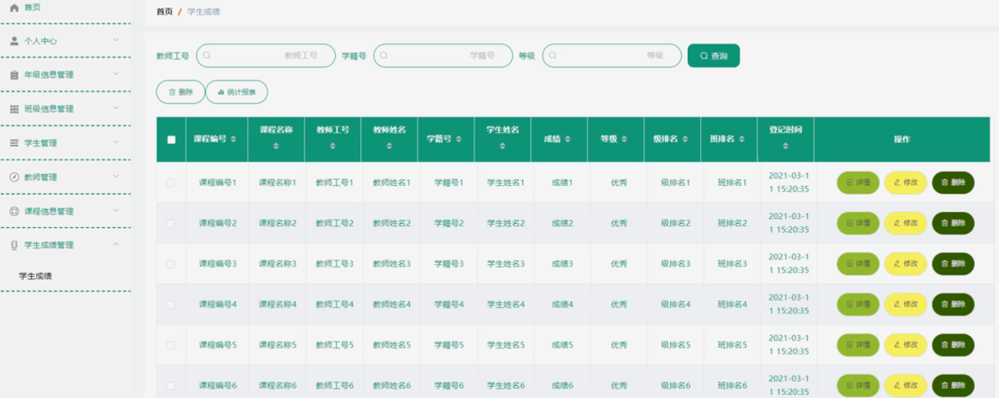

图5-9学生成绩管理界面图

### 5.3学生功能模块

学生登录进入学生综合测评系统可以查看首页、个人中心、学生成绩管理等内容进行详细操作，如图5-10所示。

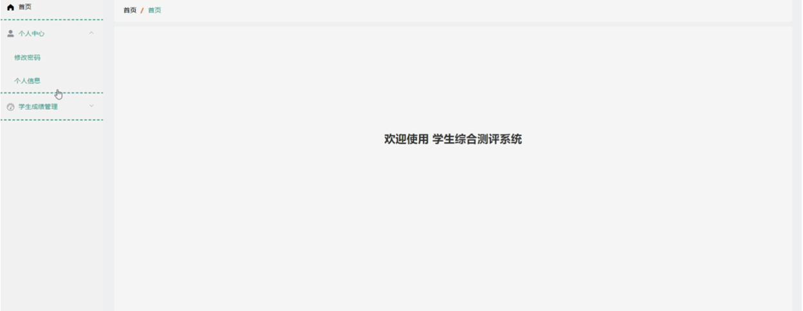

图5-10学生功能界面图

个人中心，在个人中心页面通过填写学籍号、学生姓名、年级、班级、性别、联系电话、邮箱等信息对个人信息进行修改，如图5-11所示。

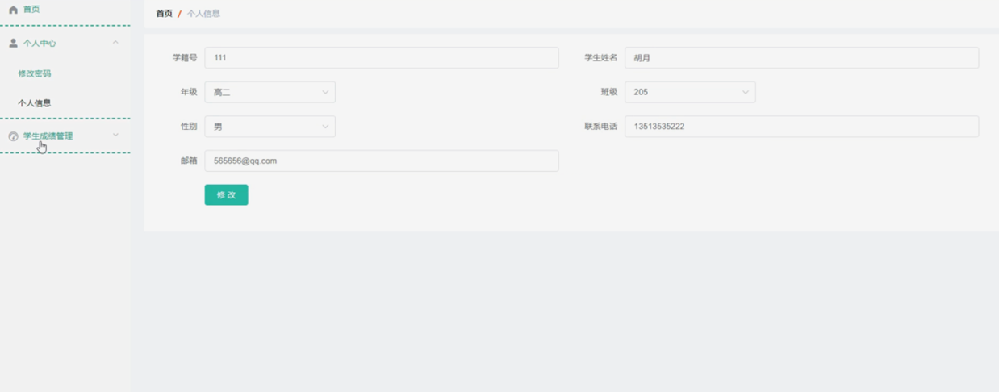

图5-11个人中心界面图

### 5.4教师功能模块

教师登录进入学生综合测评系统可以查看首页、个人中心、课程信息管理、学生成绩管理等内容进行详细操作，如图5-12所示。

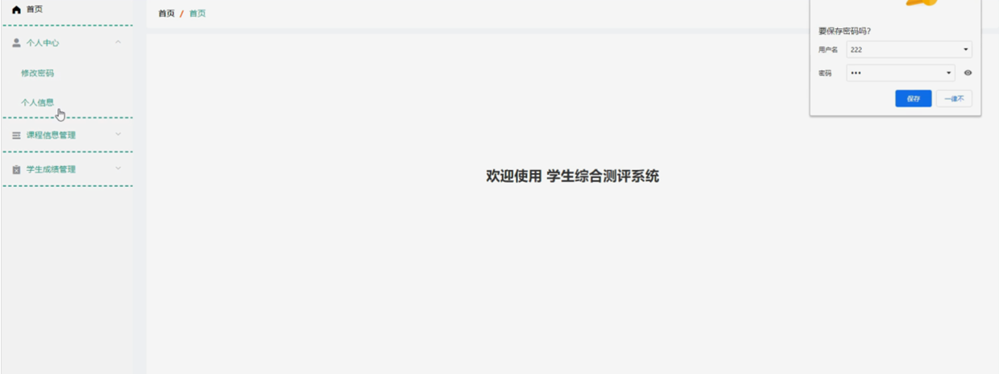

图5-12教师功能界面图

#### **JAVA** **毕设帮助，指导，源码分享，调试部署**

