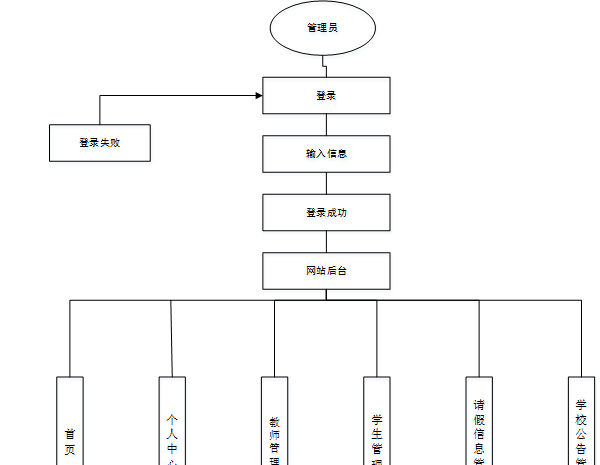

ssm+Vue计算机毕业设计学生网上请假系统（程序+LW文档）

**项目运行**

**环境配置：**

**Jdk1.8 + Tomcat7.0 + Mysql + HBuilderX** **（Webstorm也行）+ Eclispe（IntelliJ
IDEA,Eclispe,MyEclispe,Sts都支持）。**

**项目技术：**

**SSM + mybatis + Maven + Vue** **等等组成，B/S模式 + Maven管理等等。**

**环境需要**

**1.** **运行环境：最好是java jdk 1.8，我们在这个平台上运行的。其他版本理论上也可以。**

**2.IDE** **环境：IDEA，Eclipse,Myeclipse都可以。推荐IDEA;**

**3.tomcat** **环境：Tomcat 7.x,8.x,9.x版本均可**

**4.** **硬件环境：windows 7/8/10 1G内存以上；或者 Mac OS；**

**5.** **是否Maven项目: 否；查看源码目录中是否包含pom.xml；若包含，则为maven项目，否则为非maven项目**

**6.** **数据库：MySql 5.7/8.0等版本均可；**

**毕设帮助，指导，本源码分享，调试部署** **(** **见文末** **)**

### 系统体系结构

学生网上请假系统的结构图4-1所示：

图4-1 系统结构

登录系统结构图，如图4-2所示：

图4-2 登录结构图

管理员结构图，如图4-3所示。

图4-3 管理员结构图

###

### 4.3 数据库设计原则

学习编程，我们都知道数据库设计是基于需要设计的系统功能，我们需要建立一个数据库关系模型，用于存储数据信息，这样当我们在程序中时，就没有必要为程序页面添加数据，从而提高系统的效率。数据库存储了很多信息，可以说是信息管理系统的核心和基础，数据库还提供了添加、删除、修改和检查，使系统能够快速找到自己想要的信息，而不是在程序代码中找到。数据库中信息表的每个部分根据一定的关系精确地组合，排列和组合成数据表。

通过学生网上请假系统的功能进行规划分成几个实体信息，实体信息将通过ER图进行说明，本系统的主要实体图如下：

管理员信息属性图如图4-5所示。

图4-5 管理员信息实体属性图

请假信息管理实体属性图如图4-6所示。

图4-6请假信息管理属性图

教师功能实体属性图如图4-7所示。

图4-7教师功能实体属性图

### 管理员功能模块

管理员登录，通过填写注册时输入的用户名、密码、权限、验证码进行登录，如图5-1所示。

图5-1管理员登录界面图

管理员登录进入学生网上请假系统可以查看首页、个人中心、教师管理、学生管理、请假信息管理、学校公告管理等信息进行相应操作，如图5-2所示。

图5-2管理员功能界面图

教师管理，在教师管理页面中可以对索引、工号、密码、姓名、性别、班级、手机、邮箱、照片等信息进行详情或删除等操作，如图5-3所示。

图5-3教师管理界面图

学生管理，在学生管理页面中可以对索引、学号、密码、姓名、性别、班级、手机、邮箱、照片等信息进行详情或删除等操作，如图5-4所示。

图5-4学生管理界面图

请假信息管理，在请假信息管理页面中可以对索引、学号、姓名、班级、请假开始时间、请假结束时间、请假原因、审核回复、审核状态等信息进行详情或删除等操作，如图5-5所示。

图5-5请假信息管理界面图

学校公告管理，在学校公告管理页面中可以对索引、标题等信息进行详情、修改或删除等操作，如图5-6所示。

图5-6学校公告管理界面图

### 5.2学生功能模块

学生注册，在学生注册页面中通过填写学号、密码、姓名、班级、手机、邮箱等信息进行注册操作，如图5-7所示。

图5-7学生注册界面图

学生登录进入系统可以查看首页、个人中心、请假信息管理、学校公告管理等内容进行相应操作，如图5-8所示。

图5-8学生功能界面图

个人中心，在个人中心页面中通过填写学号、姓名、性别、班级、手机、邮箱、照片等信息进行修改，如图5-9所示。

图5-9个人中心界面图

请假信息管理，在请假信息管理页面中可以对索引、学号、姓名、班级、请假开始时间、请假结束时间、请假原因、审核回复、审核状态等信息进行详情操作，如图5-10所示。

图5-10请假信息管理界面图

学校公告管理，在学校公告管理页面中可以对索引、标题等内容进行详情操作，如图5-11所示。

图5-11学校公告管理界面图

### 5.3教师功能模块

教师登录进入系统可以查看首页、个人中心、教师管理、学生管理、请假信息管理、学校公告管理等内容进行相应操作，如图5-12所示。

图5-12教师功能界面图

#### **JAVA** **毕设帮助，指导，源码分享，调试部署**

