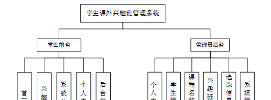

ssm+Vue计算机毕业设计学生课外兴趣班管理系统（程序+LW文档）

**项目运行**

**环境配置：**

**Jdk1.8 + Tomcat7.0 + Mysql + HBuilderX（Webstorm也行）+ Eclispe（IntelliJ
IDEA,Eclispe,MyEclispe,Sts都支持）。**

**项目技术：**

**SSM + mybatis + Maven + Vue 等等组成，B/S模式 + Maven管理等等。**

**环境需要**

**1.运行环境：最好是java jdk 1.8，我们在这个平台上运行的。其他版本理论上也可以。**

**2.IDE环境：IDEA，Eclipse,Myeclipse都可以。推荐IDEA;**

**3.tomcat环境：Tomcat 7.x,8.x,9.x版本均可**

**4.硬件环境：windows 7/8/10 1G内存以上；或者 Mac OS；**

**5.是否Maven项目: 否；查看源码目录中是否包含pom.xml；若包含，则为maven项目，否则为非maven项目**

**6.数据库：MySql 5.7/8.0等版本均可；**

**毕设帮助，指导，本源码分享，调试部署(** **见文末)**

系统功能结构图

系统功能结构图是系统设计阶段，系统功能结构图只是这个阶段一个基础，整个系统的架构决定了系统的整体模式，是系统的根据。学生课外兴趣班管理系统的整个设计结构如图3-1所示。

图3-1系统功能结构图

### 数据库设计

信息管理系统的效率和实现的效果完全取决于数据库结构设计的好坏。为了保证数据的完整性，提高数据库存储的效率，那么统一合理地设计数据库结构是必要的。数据库设计一般包括如下几个步骤：

（1）根据用户需求，确定数据库信息进行保存

对用户的需求分析是数据库设计的第一阶段，用户的需求调研，熟悉企业运作流程，系统要求，这些都是以概念模型为基础的。

（2）设计数据的概念模型

概念模型与数据建模用户的观点一致，用于信息世界的建模工具。通过E-R图可以清楚地描述系统涉及到的实体之间的相互关系。

学生信息实体图如图4-1所示：

图4-1学生信息实体图

课程信息实体图如图4-2所示：

图4-2课程信息实体图

### 管理员功能模块

管理员登录系统，管理员通过输入用户名、密码，选择角色并点击登录进行系统登录操作，如图5-1所示。

图5-1管理员登录界面图

管理员登录系统后，可以对个人中心、学生管理、课程名称管理、兴趣班管理、选课信息管理、系统管理等功能模块进行相应操作，如图5-2所示。

图5-2管理员功能界图面

个人中心，在个人中心页面，管理员可以修改登录密码和个人信息，个人中心页面如图5-3所示。

图5-3个人中心界面图

学生管理，在学生管理页面可以对学生学号、学生姓名、性别、专业、电话等内容进行查看详情、修改或删除、新增等操作，如图5-4所示。

图5-4学生管理界面图

课程名称管理，在课程名称管理页面可以对课程名称进行查看详情、修改或删除或新增等操作，如图5-5所示。

图5-5课程名称管理界面图

兴趣班管理，在兴趣班管理页面管理员可以对课程编号、课程名称、课程类型、课时、上课地点、图片等兴趣班信息进行查看详情、修改或删除、新增等操作，兴趣班管理页面如图5-6所示。

图5-6兴趣班管理界面图

在选课信息管理页面，管理员可以查看课程编号、课程名称、课程类型、课时、上课地点、图片、学生学号、学生姓名、选课时间等信息，并进行修改、删除或查询等操作，选课信息管理页面如图5-7所示。

图5-7选课信息管理界面图

### 5.2前台功能模块

学生登录进入系统前台，可以查看首页、兴趣班、系统公告、个人中心、后台管理等内容，并进行相应操作，系统前台页面如图5-8所示。

图5-8系统前台界面图

点击个人中心，学生可以修改学生学号、学生姓名、密码、性别、专业、电话等个人信息，个人中心操作页面如图5-9所示。

图5-9个人中心界面图

点击兴趣班，学生可以查看管理员在后台发布的兴趣班信息，包括课程名称、课程图片、课程编号、课程类型、课时、上课地点、点击次数、课程详情，学生可以进行选课的操作；点击选课，学生通过填写课程编号、课程名称、课程类型、课时、上课地点、图片、学生学号、学生姓名、选课时间等信息，点击提交进行选课的操作，如图5-10所示。

图5-10兴趣班界面图

点击后台管理，学生可以对个人中心和选课信息进行管理，后台管理页面如图5-11所示。

图5-11后台管理界面图

点击选课信息管理，学生可以查看课程编号、课程名称、课程类型、课时、上课地点、图片、学生学号、学生姓名、选课时间等信息，并进行详情、修改、删除等操作，如图5-12所示。

图5-12选课信息管理界面图

#### **JAVA毕设帮助，指导，源码分享，调试部署**

