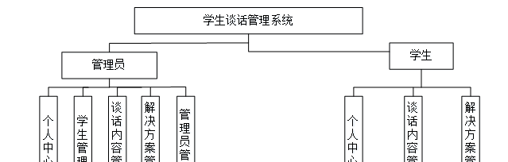
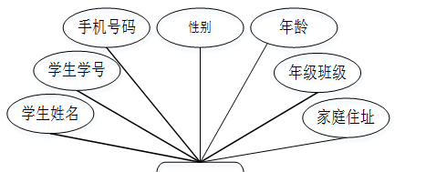
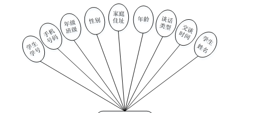
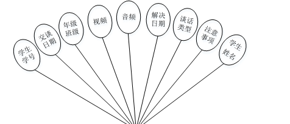
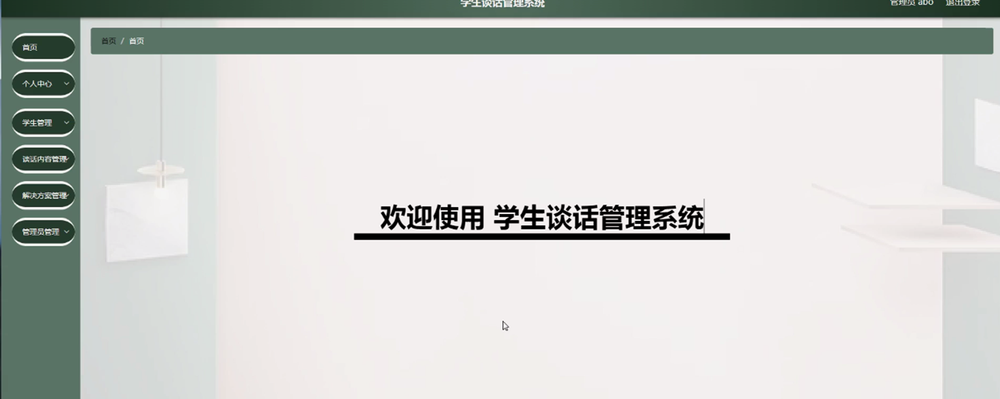
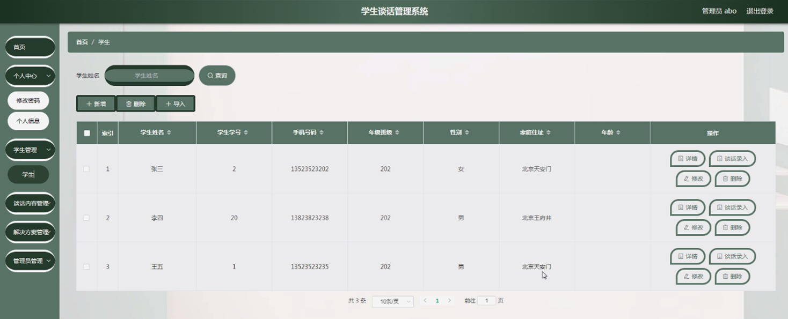
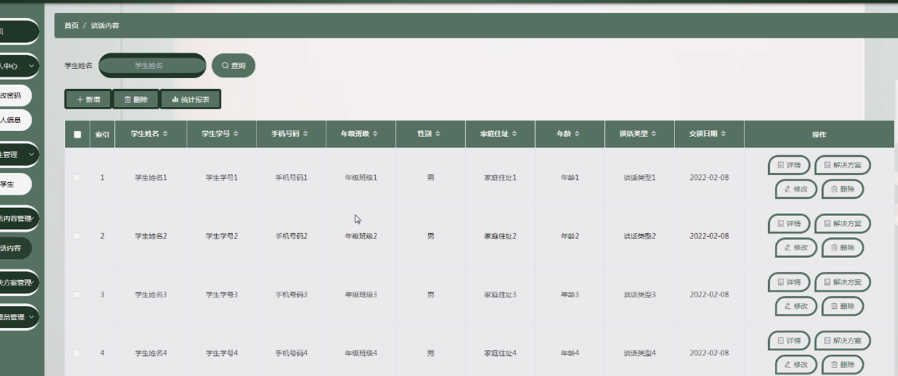
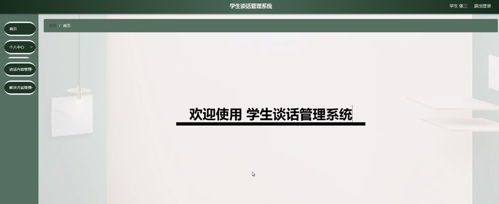
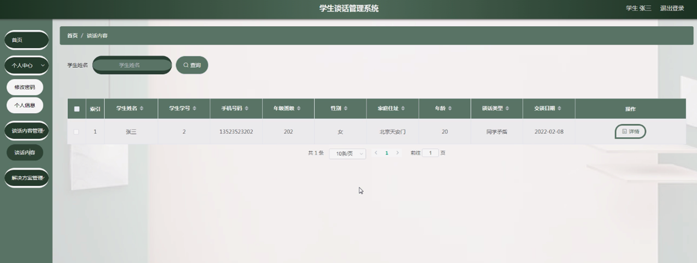
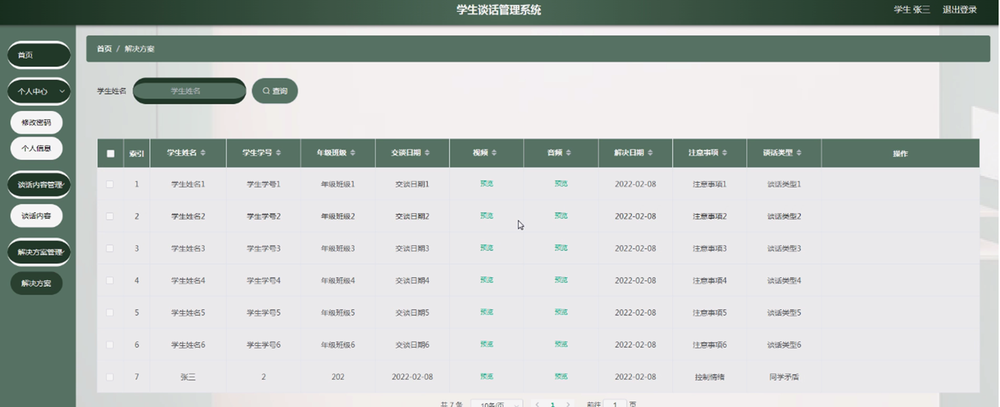

ssm+Vue计算机毕业设计学生谈话管理系统（程序+LW文档）

**项目运行**

**环境配置：**

**Jdk1.8 + Tomcat7.0 + Mysql + HBuilderX** **（Webstorm也行）+ Eclispe（IntelliJ
IDEA,Eclispe,MyEclispe,Sts都支持）。**

**项目技术：**

**SSM + mybatis + Maven + Vue** **等等组成，B/S模式 + Maven管理等等。**

**环境需要**

**1.** **运行环境：最好是java jdk 1.8，我们在这个平台上运行的。其他版本理论上也可以。**

**2.IDE** **环境：IDEA，Eclipse,Myeclipse都可以。推荐IDEA;**

**3.tomcat** **环境：Tomcat 7.x,8.x,9.x版本均可**

**4.** **硬件环境：windows 7/8/10 1G内存以上；或者 Mac OS；**

**5.** **是否Maven项目: 否；查看源码目录中是否包含pom.xml；若包含，则为maven项目，否则为非maven项目**

**6.** **数据库：MySql 5.7/8.0等版本均可；**

**毕设帮助，指导，本源码分享，调试部署** **(** **见文末** **)**

### 功能结构

为了更好的去理清本系统整体思路，对该系统以结构图的形式表达出来，设计实现该学生谈话管理系统的功能结构图如下所示：

图4-1 系统总体结构图

### 4.2 数据库设计

####  4.2.1 数据库E/R图

ER图是由实体及其关系构成的图，通过E/R图可以清楚地描述系统涉及到的实体之间的相互关系。在系统中对一些主要的几个关键实体如下图：

(1) 学生管理E/R图如下所示：

图4-2学生管理E/R图

(2) 谈话内容管理E/R图如下所示：

图4-3谈话内容管理E/R图

(3) 解决方案管理E/R图如下所示：

图4-4解决方案管理E/R图

### 管理员功能模块

管理员通过输入用户名、密码、角色进行登录，如图5-1所示。

图5-1管理员登录界面图

管理员通过登录进入学生谈话管理系统可查看个人中心、学生管理、谈话内容管理、解决方案管理、管理员管理等内容，如图5-2所示。

图5-2管理员功能界图面

学生管理，管理员可在学生管理页面查看学生姓名、学生学号、手机号码、年级班级、性别、家庭住址、年龄等内容，还可进行新增、导入、谈话录入、修改或删除等操作，如图5-3所示。

图5-3学生管理界面图

谈话内容管理，管理员可在谈话内容管理页面查看学生姓名、学生学号、手机号码、年级班级、性别、家庭住址、年龄、谈话类型、交谈时间等内容，还可进行新增、统计、修改或删除等操作，如图5-4所示。

图5-4谈话内容管理界面图

5.2学生功能模块

学生通过输入用户名、密码、角色进行登录，如图5-5所示。

图5-5学生登录界面图

学生通过登录进入学生谈话管理系统可查看个人中心、谈话内容管理、解决方案管理等内容，如图5-6所示。

图5-6学生功能界面图

谈话内容管理，学生可在谈话内容管理页面查看学生姓名、学生学号、手机号码、年级班级、性别、家庭住址、年龄、谈话类型、交谈时间等内容，如图5-7所示。

图5-7谈话内容管理界面图

解决方案管理，学生可在解决方案管理页面查看学生姓名、学生学号、年级班级、交谈日期、视频、音频、解决日期、注意事项、谈话类型等内容，如图5-8所示。

图5-8解决方案管理界图面

**JAVA** **毕设帮助，指导，源码分享，调试部署**

